# Atlas AI Operating System

**Atlas** is an AI Operating System — a structured framework that gives an artificial intelligence a persistent identity, a governed set of principles, organized memory, curated knowledge, reusable workflows, and a controlled library of tools.

Atlas is not a single model or a chatbot. It is the *operating layer* through which an AI agent perceives, remembers, reasons, and acts with continuity across sessions and tasks.

---

## Purpose

Most AI interactions are stateless: each conversation begins from nothing, and everything learned is forgotten when the session ends. Atlas solves this by providing:

- **Identity** — a stable sense of who Atlas is and how it operates.
- **Principles** — the rules and values that govern every decision.
- **Memory** — a structured record of past work, decisions, and context.
- **Knowledge** — a curated, retrievable library of reference material.
- **Workflows** — repeatable processes for common tasks.
- **Tools** — a controlled set of capabilities Atlas can invoke.

Together, these form a coherent operating environment in which an AI can work with the consistency, accountability, and depth of a real system.


## Repository Structure

```
atlas/
├── mcp/           # MCP Layer (universal communication backbone, 17 connectors)
│   ├── manager.py       # MCPManager top-level orchestrator
│   ├── base.py          # BaseConnector abstract contract
│   ├── registry.py      # MCPRegistry catalog with capability lookup
│   ├── router.py        # Capability-based request routing
│   ├── session.py       # MCPSession lifecycle management
│   ├── health.py        # MCPHealthMonitor aggregate health
│   ├── heartbeat.py     # HeartbeatMonitor connector availability
│   ├── discovery.py     # ConnectorDiscovery (filesystem/manual/network)
│   ├── permissions.py   # PermissionLevel + PermissionValidator
│   ├── protocol.py      # Handshake, versioning, capability negotiation
│   ├── transport.py     # 5 transports (in_process/stdio/http/websocket/named_pipe)
│   ├── server.py        # MCPServerInstance
│   ├── client.py        # MCPClientInstance
│   ├── models.py        # Frozen dataclasses (14 models)
│   ├── exceptions.py    # 13-exception hierarchy
│   └── connectors/      # 17 deterministic placeholder connectors
│       ├── filesystem.py    ├── ollama.py        ├── photoshop.py
│       ├── github.py        ├── openrouter.py    ├── canva.py
│       ├── browser.py       ├── surpac.py        ├── google_forms.py
│       ├── playwright.py    ├── autocad.py       ├── excel.py
│       ├── blender.py       ├── qgis.py          ├── word.py
│       └── windows.py                               └── powerpoint.py
├── execution/     # Execution Engine (goal -> plan -> dispatch -> execute -> review -> report)
│   ├── engine.py        # ExecutionEngine pipeline orchestrator
│   ├── planner.py       # Goal -> ExecutionPlan (deterministic templates, AI-ready)
│   ├── dispatcher.py    # Capability-based agent/provider/tool/workflow resolution
│   ├── executor.py      # DI-based task executor with retry + skip + memory recording
│   ├── reviewer.py      # Evaluates results: status, quality score, retry recommendation
│   ├── reporter.py      # Assembles professional ExecutionReport
│   ├── models.py        # Frozen dataclasses: Plan, Task, Result, Report, Context, Metrics
│   └── strategy.py      # 8 execution strategies (Sequential/Parallel/Priority/Retry/...)
├── integration/   # Integration Layer (DI container + lifecycle + orchestrator)
│   ├── orchestrator.py  # User-facing façade: initialize/start/stop/restart/run/health
│   ├── bootstrap.py     # Load config -> build container -> wire -> start -> health
│   ├── container.py     # DIContainer with singleton/transient scopes + cycle detection
│   ├── wiring.py        # Registers every Atlas subsystem into the container
│   ├── startup.py       # Ordered startup in canonical LifecyclePhase order
│   ├── shutdown.py      # Graceful shutdown in reverse dependency order
│   ├── health.py        # HealthMonitor aggregates per-subsystem health
│   ├── diagnostics.py   # DiagnosticsCollector captures startup/uptime/loaded resources
│   ├── registry.py      # UnifiedRegistry facade over all subsystem registries
│   ├── service_locator.py  # Typed lazy accessor over the container
│   └── dependency.py    # ServiceDescriptor, ServiceScope, LifecyclePhase
├── core/          # Kernel architecture + identity & principles
│   ├── kernel.py      # Orchestrates every request end-to-end
│   ├── planner.py     # Converts goals into executable tasks
│   ├── router.py      # Selects the correct agent for each task
│   ├── state.py       # Represents the current execution state
│   ├── context.py     # Bundles request + memory + knowledge + config
│   └── session.py     # Tracks one execution from start to finish
├── runtime/       # Runtime Engine (execution heart of Atlas)
│   ├── runtime.py     # Top-level Runtime orchestrator (handle/submit/pause/retry)
│   ├── dispatcher.py  # Pulls requests off the queue and runs pipelines
│   ├── pipeline.py    # Ordered stages: Planning -> Dispatch -> Execution -> Review -> Complete
│   ├── executor.py    # PlaceholderExecutor with deterministic built-in actions
│   ├── lifecycle.py   # RuntimeState lifecycle enum and transition table
│   ├── events.py      # EventBus + 22 lifecycle event types
│   ├── hooks.py       # Pre/post stage hooks with short-circuit and abort
│   ├── telemetry.py   # TelemetryCollector (per-execution metrics)
│   ├── monitor.py     # SystemMonitor (health snapshots)
│   ├── recovery.py    # RecoveryManager (retry + compensation)
│   ├── scheduler.py   # RuntimeScheduler (one_time / interval / cron)
│   └── queue.py       # Priority-ordered ExecutionQueue
├── agents/        # Agent definitions and role configurations
├── providers/     # Provider Layer (LLM abstraction + routing + 9 providers)
│   ├── manager.py     # High-level facade: generate/chat/complete/health
│   ├── router.py      # Selects provider (auto/manual/fallback/round_robin)
│   ├── registry.py    # Catalog of providers with duplicate detection
│   ├── base.py        # Abstract BaseProvider contract
│   ├── models.py      # ProviderRequest, ProviderResponse, ProviderInfo
│   ├── openai.py      # OpenAI placeholder
│   ├── anthropic.py   # Anthropic placeholder
│   ├── gemini.py      # Google Gemini placeholder
│   ├── groq.py        # Groq placeholder
│   ├── nvidia.py      # NVIDIA NIM placeholder
│   ├── openrouter.py  # OpenRouter placeholder
│   ├── ollama.py      # Ollama (local) placeholder
│   ├── lmstudio.py    # LM Studio (local) placeholder
│   └── zai.py         # ZAI (built-in) placeholder
├── memory/        # Memory Engine (5 stores + engine + storage interface)
│   ├── engine.py      # Orchestrates all memory stores
│   ├── base.py        # Abstract BaseMemory contract
│   ├── models.py      # MemoryEntry, MemoryQuery, MemoryCategory, MemoryPriority
│   ├── storage.py     # Abstract persistence backend interface
│   ├── working.py     # Short-lived task-scoped scratch space
│   ├── episodic.py    # Chronological log of past experiences
│   ├── semantic.py    # Long-term knowledge and factual recall
│   ├── procedural.py  # Procedures, workflows, and methods
│   └── reflection.py  # Self-assessment and meta-cognition
├── knowledge/     # Knowledge Engine (ingest, chunk, embed, retrieve)
│   ├── engine.py      # Orchestrates ingestion & retrieval pipeline
│   ├── base.py        # Abstract KnowledgeStore contract
│   ├── models.py      # KnowledgeDocument, KnowledgeChunk, KnowledgeQuery, KnowledgeResult
│   ├── storage.py     # Abstract persistence backend interface
│   ├── store.py       # InMemoryKnowledgeStore (concrete)
│   ├── loader.py      # Document loader (TXT, Markdown, PDF placeholder)
│   ├── parser.py      # Text extractor (plain, Markdown, future PDF/HTML)
│   ├── chunker.py     # Text chunker with configurable size & overlap
│   ├── embeddings.py  # Embedding model + HashingEmbedder placeholder
│   ├── vectorstore.py # InMemoryVectorStore (brute-force cosine search)
│   └── retriever.py   # Query → Embed → Search → Top-K pipeline
├── workflows/     # Workflow Engine (definitions, runs, scheduling, templates)
│   ├── engine.py      # Orchestrates registration, runs, schedules, and templates
│   ├── base.py        # Abstract BaseExecutor and BaseScheduler contracts
│   ├── models.py      # WorkflowStep, WorkflowDefinition, WorkflowRun, WorkflowSchedule
│   ├── state.py       # WorkflowState lifecycle enum and transition table
│   ├── validator.py   # Definition validation with cycle detection
│   ├── registry.py    # Workflow definition catalog with duplicate detection
│   ├── history.py     # Append-only run snapshot store
│   ├── executor.py    # PlaceholderExecutor with deterministic built-in actions
│   ├── scheduler.py   # InMemoryScheduler (one_time / interval / cron)
│   └── templates.py   # Reusable workflow templates and TemplateRegistry
├── prompts/       # Reusable prompt templates
├── tools/         # Tool System (registry, manager, permissions, adapters, services)
│   ├── base.py        # Abstract BaseTool contract
│   ├── registry.py    # Tool catalog with lookup by name
│   ├── manager.py     # Permission-gated dispatch gateway
│   ├── permissions.py # DENY/USE/CONFIGURE/ADMIN permission model
│   ├── result.py      # ToolResult dataclass (success/error/metadata)
│   ├── adapters/      # Connectors to external systems
│   │   ├── github.py      # GitHub API adapter
│   │   ├── filesystem.py  # Filesystem adapter
│   │   ├── browser.py     # Browser automation adapter
│   │   └── blender.py     # Blender 3D adapter
│   └── services/      # Domain logic wrappers
│       ├── github.py      # GitHub domain service
│       ├── filesystem.py  # Filesystem domain service
│       ├── browser.py     # Browser domain service
│       └── blender.py     # Blender domain service
└── configs/       # System configuration files

docs/              # Architecture and design documentation
tests/             # Validation and behavioral tests
```


## Architecture Overview

Atlas is built around a **Kernel** that orchestrates every request through a clean, stage-based pipeline. Each component has a single responsibility, and a shared **Context** object flows through the system so no component reaches into global state.

### The request pipeline

A user request enters the system and is routed through the following stages:

1. **Kernel** — the orchestrator. It receives the raw request, builds a `Context`, opens a `Session`, and drives the pipeline.
2. **Planner** — decomposes the goal into an ordered list of executable `Task` objects.
3. **Router** — examines each task and selects the agent best suited to execute it.
4. **Agent** — carries out the assigned task using its specialized capabilities.
5. **Tool Manager** — the controlled gateway through which agents invoke external capabilities (filesystem, web, code execution, etc.).
6. **MCP Servers** — the external services that fulfill tool calls (Model Context Protocol servers, APIs, databases, etc.).

Two cross-cutting concerns support every stage:
- **Context** — bundles the user request, configuration, memory, and knowledge handles into one object passed through the system.
- **State** — tracks the lifecycle phase of the request (`pending → planning → routing → executing → reviewing → completed`).

### Pipeline diagram


### Kernel components at a glance

| Component | Responsibility |
|-----------|----------------|
| `Kernel` | Orchestrates every request from intake to completion. |
| `Planner` | Converts a goal into a sequence of executable `Task` objects. |
| `Router` | Chooses the correct agent for each task. |
| `State` | Represents the current execution phase and history. |
| `Context` | Carries request + memory + knowledge + config through the pipeline. |
| `Session` | Tracks one execution from start to finish. |


## Atlas Integration Layer

The Integration Layer is the dependency wiring heart that connects every Atlas subsystem into one coherent AI Operating System. It owns a dependency injection container, ordered startup and shutdown managers, a unified health monitor, a diagnostics collector, a unified registry, and a single user-facing `Orchestrator` façade. The Integration Layer **does not implement business logic** — its sole purpose is dependency wiring, lifecycle management, startup, shutdown, dependency injection, configuration loading, and subsystem orchestration.

It is **provider-agnostic**, **tool-agnostic**, **agent-agnostic**, **workflow-agnostic**, and **runtime-agnostic**. It is designed so future modules (Dashboard, MCP Layer, Desktop App, Social Media Automation, Vision, Voice, Blender, Surpac, QGIS, AutoCAD, Remotion, Hyperframes, Ollama) plug in without modifying existing code.

### Architecture

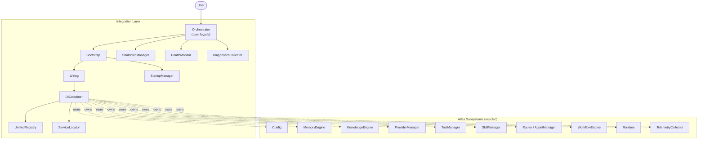

### Dependency graph

The Integration Layer has zero circular imports. Modules form a strict acyclic dependency graph:

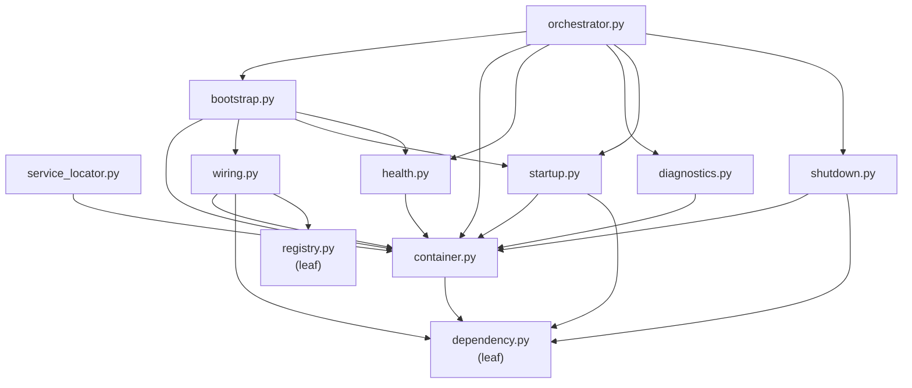

### Container architecture

The `DIContainer` is the single place where every Atlas subsystem is constructed. Services are registered as `ServiceDescriptor` records (name + factory + scope + phase). Resolution is lazy by default: a service is not constructed until the first time it is requested. Singletons are cached on first resolution; transients are rebuilt every time. Circular dependencies are detected and raise `CircularDependencyError`.

The container supports two lookup styles:

- **By name** — `container.get("memory")` returns the service registered under that exact name.
- **By interface** — `container.get_typed(SomeClass)` returns any service whose descriptor declares `SomeClass` in its `interfaces` tuple.

Every service belongs to a `LifecyclePhase`. The startup manager walks phases in canonical order; the shutdown manager walks them in reverse.

### Startup sequence

The `StartupManager` walks every registered service in canonical `LifecyclePhase` order and force-instantiates each one. This guarantees that every singleton is constructed exactly once and the construction order matches the dependency order.

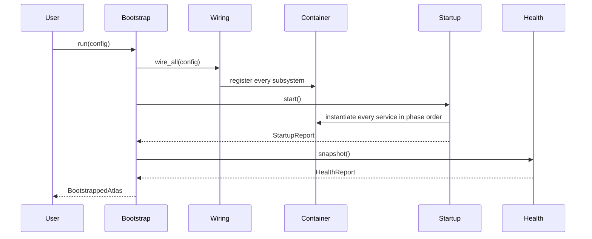

Canonical startup order:

```
Config → Logger → Memory → Knowledge → Providers → Tools → Skills →
Agents → Workflows → Runtime → Telemetry → Dashboard → Health → Ready
```

### Shutdown sequence

The `ShutdownManager` walks every initialized service in reverse canonical order and invokes its `shutdown()` method if it has one. Services that do not implement `shutdown()` are skipped silently. The container is cleared after shutdown so it cannot be reused.

Canonical shutdown order (reverse of startup, excluding `READY`):

```
Health → Dashboard → Telemetry → Runtime → Workflows → Agents → Skills →
Tools → Providers → Knowledge → Memory → Logger → Config
```

### Health architecture

The `HealthMonitor` aggregates per-subsystem health signals into a single `HealthReport`. Each subsystem contributes a `SubsystemHealth` record with a `name`, `status`, `detail`, and `metrics`. The overall status rolls up by severity: if any subsystem is `unhealthy` the overall is `unhealthy`; if any is `degraded` the overall is `degraded`; otherwise it is `healthy`.

Example health report:

| Subsystem | Status | Detail |
|-----------|--------|--------|
| config | healthy | loaded |
| memory | healthy | 5 stores |
| knowledge | healthy | 0 documents |
| providers | healthy | 9 online |
| tools | degraded | 0 loaded |
| agents | degraded | 0 ready |
| skills | degraded | 0 installed |
| workflows | healthy | ready |
| runtime | healthy | running |
| telemetry | healthy | 0 executions observed |
| **overall** | **degraded** | |

### Subsystem wiring

The `Wiring` class is the single place that knows how to construct every Atlas subsystem. Each `register_*` method adds a `ServiceDescriptor` to the container. The `wire_all()` method registers every subsystem with sensible deterministic defaults.

| Service name | Phase | Factory produces |
|--------------|-------|------------------|
| `config` | `CONFIG` | `Config` (from path / dict / default) |
| `logger` | `LOGGER` | Root `atlas` logger |
| `memory` | `MEMORY` | `MemoryEngine` (in-memory storage) |
| `knowledge` | `KNOWLEDGE` | `KnowledgeEngine` (hashing embedder) |
| `providers` | `PROVIDERS` | `ProviderManager` with 9 built-in providers |
| `tools` | `TOOLS` | `ToolManager` (empty registry) |
| `skills` | `SKILLS` | `SkillManager` (empty registry) |
| `agents` | `AGENTS` | `Router` (empty) |
| `workflows` | `WORKFLOWS` | `WorkflowEngine` (placeholder executor) |
| `runtime` | `RUNTIME` | `Runtime` (single execution entry point) |
| `telemetry` | `TELEMETRY` | `TelemetryCollector` (pulled from runtime) |
| `health` | `HEALTH` | `HealthMonitor` |
| `registry` | `HEALTH` | `UnifiedRegistry` facade |
| `diagnostics` | `HEALTH` | `DiagnosticsCollector` |
| `locator` | `READY` | `ServiceLocator` |

### Component responsibilities

| Component | Responsibility |
|-----------|----------------|
| `Orchestrator` | User-facing façade. Methods: `initialize()`, `start()`, `stop()`, `restart()`, `status()`, `health()`, `run(request)`. The only object users should interact with. |
| `Bootstrap` | Turns a config into a running Atlas: load config → build container → wire → start → health check → return `BootstrappedAtlas`. |
| `DIContainer` | Dependency injection container. Owns every subsystem. Singleton/transient scopes. Lazy resolution. Cycle detection. Lookup by name or interface. |
| `Wiring` | Registers every Atlas subsystem into the container with stable names, factories, scopes, and phases. |
| `StartupManager` | Walks every service in canonical phase order and instantiates each one. Records timing and failures. |
| `ShutdownManager` | Walks every initialized service in reverse phase order and invokes `shutdown()` if present. Clears the container. |
| `HealthMonitor` | Aggregates per-subsystem health into a `HealthReport` with overall roll-up. |
| `DiagnosticsCollector` | Captures startup time, uptime, loaded resources, memory/knowledge/runtime statistics, config summary, container inventory. |
| `UnifiedRegistry` | Read-only facade over every per-subsystem registry. Query by kind and name. |
| `ServiceLocator` | Typed lazy accessor over the container (``locator.runtime``, ``locator.memory``, etc.). |
| `ServiceDescriptor` | Immutable registration record: name, factory, scope, phase, interfaces, tags. |
| `LifecyclePhase` | 16 phases governing startup/shutdown order. |

### Execution examples

**Minimal end-to-end:**

```python
from atlas.integration import Orchestrator

orch = Orchestrator()
orch.initialize()
ctx = orch.run("hello world")
print(ctx.state.value)    # "completed"
print(ctx.response)       # "noop"
orch.stop()
```

**Inspecting health:**

```python
orch = Orchestrator()
orch.initialize()
report = orch.health()
print(report.overall.value)          # "degraded" (no tools/agents registered)
for name, sub in report.subsystems.items():
    print(f"  {name:12s} {sub.status.value:10s} {sub.detail}")
orch.stop()
```

**Inspecting diagnostics:**

```python
orch = Orchestrator()
orch.initialize()
diag = orch.diagnostics()
print(f"Providers: {diag.providers}")
print(f"Uptime:    {diag.uptime_seconds:.1f}s")
print(f"Startup:   {diag.startup_time_seconds:.3f}s")
orch.stop()
```

**Using the unified registry:**

```python
orch = Orchestrator()
orch.initialize()
registry = orch.container.get("registry")
print(registry.count("providers"))     # 9
print(registry.names("providers"))     # ["anthropic", "gemini", ...]
orch.stop()
```

**Using the service locator:**

```python
orch = Orchestrator()
orch.initialize()
locator = orch.container.get("locator")
runtime = locator.runtime
memory = locator.memory
providers = locator.providers
orch.stop()
```

See [`docs/integration_layer.md`](docs/integration_layer.md) for the full architecture document, including the container explanation, boot sequence, health system, diagnostics, and extension guide.


## Atlas Execution Engine

The Execution Engine is the heart of the Atlas AI Operating System. It converts a natural-language goal into an ordered, executable plan, dispatches each task to the appropriate agent / provider / tool / workflow, executes the tasks, reviews the outcomes, and produces a professional execution report. The engine is **personal** — optimized for one operator, not SaaS, not multi-tenant. It is **provider-agnostic**, **agent-agnostic**, **tool-agnostic**, **workflow-agnostic**, **MCP-ready**, and **fully offline compatible**.

### Architecture

```mermaid
flowchart TB
    Goal([Natural Language Goal]) --> Engine

    subgraph Engine["ExecutionEngine"]
        Planner["ExecutionPlanner<br/>(goal → plan)"]
        Dispatcher["ExecutionDispatcher<br/>(plan → resolutions)"]
        Executor["ExecutionExecutor<br/>(resolutions → results)"]
        Reviewer["ExecutionReviewer<br/>(results → review)"]
        Reporter["ExecutionReporter<br/>(review → report)"]
    end

    subgraph Subsystems["Injected Subsystems (DI)"]
        Providers["ProviderManager"]
        Tools["ToolManager"]
        Workflows["WorkflowEngine"]
        Skills["SkillManager"]
        Memory["MemoryEngine"]
        Knowledge["KnowledgeEngine"]
    end

    Engine --> Planner
    Planner -->|ExecutionPlan| Dispatcher
    Dispatcher -->|TaskResolution[]| Executor
    Executor -->|ExecutionResult[]| Reviewer
    Reviewer -->|ExecutionReview| Reporter
    Reporter -->|ExecutionReport| Result([ExecutionReport])

    Executor -.->|uses| Providers
    Executor -.->|uses| Tools
    Executor -.->|uses| Workflows
    Executor -.->|uses| Skills
    Executor -.->|uses| Memory
    Executor -.->|uses| Knowledge
    Reporter -.->|reads| Memory
    Reporter -.->|reads| Knowledge
```

### Execution pipeline

The engine runs a fixed five-stage pipeline. Every stage is dependency-injected and replaceable.

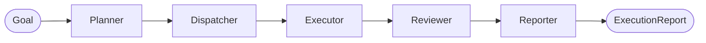

1. **Planner** — Converts the goal into an `ExecutionPlan` (ordered `ExecutionTask` items with dependencies, priority, retry policy, optional flags).
2. **Dispatcher** — Resolves each task to a `TaskResolution` (agent, provider, tool, workflow, skill) using capability-based matching against injected registries.
3. **Executor** — Runs each task via the appropriate subsystem. Honors retry policies, optional skips, and dependency failures.
4. **Reviewer** — Evaluates results: overall status, per-task warnings, missing outputs, retry recommendation, quality score.
5. **Reporter** — Assembles a professional `ExecutionReport`.

### Component table

| Component | Responsibility |
|-----------|----------------|
| `ExecutionEngine` | Top-level orchestrator. Public API: `run(goal)`, `execute_goal(goal)`, `get_history()`, `status()`. |
| `ExecutionPlanner` | Goal → `ExecutionPlan`. Deterministic templates for "create website", "research", "generate code", "deploy". AI-ready. |
| `ExecutionDispatcher` | Capability-based resolver. No hardcoded names — queries injected registries and matches on `TaskKind` capability tags. |
| `ExecutionExecutor` | Runs one task at a time. Dispatches to tools / workflows / skills / providers / knowledge / built-in actions. Retry + skip + memory recording. |
| `ExecutionReviewer` | Evaluates outcomes: overall status, per-task warnings, missing outputs, retry recommendation, 0.0–1.0 quality score. |
| `ExecutionReporter` | Assembles `ExecutionReport` with duration, providers/agents/tools/workflows used, memory usage, knowledge hits, files, git commits, token usage, estimated cost, warnings, errors. |
| `ExecutionPlan` | Frozen: id, goal, tasks, strategy, created_at, metadata. |
| `ExecutionTask` | Frozen: id, name, kind, action, params, dependencies, priority, optional, retry_policy. |
| `ExecutionResult` | Frozen: task_id, status, output, error, timing, attempts, provider/agent/tool/workflow, token_usage, cost. |
| `ExecutionReport` | Frozen: the full professional report. |
| `ExecutionContext` | Frozen: goal, plan, results, artifacts. Updated immutably via `with_plan` / `with_result` / `with_artifact`. |
| `ExecutionStrategy` | 8 values: SEQUENTIAL, PARALLEL, PRIORITY, DEPENDENCY, RETRY, FALLBACK, MANUAL, AUTOMATIC. |
| `TaskKind` | 7 values: RESEARCH, GENERATE, TEST, DEPLOY, GIT, REVIEW, CUSTOM. |
| `RetryPolicy` | Frozen: max_attempts, backoff_seconds, max_backoff_seconds, retryable_errors. |

### Example

```python
from atlas.execution import ExecutionEngine

engine = ExecutionEngine()
report = engine.run("Create website for my portfolio")
print(report.status.value)         # "completed"
print(report.metrics.total_tasks)  # 6
print(report.metrics.completed_tasks)  # 6
print(report.quality_score)        # 1.0
print(report.duration_seconds)     # 0.001

for task_id, result in report.results.items():
    print(f"  {task_id}: {result.status.value} (attempts={result.attempts})")
```

### Future roadmap

1. **AI-driven planning** — Replace the deterministic planner with an LLM-backed implementation.
2. **LLM-backed review** — Subclass `ExecutionReviewer` for LLM quality scoring.
3. **Parallel execution** — Implement the `PARALLEL` strategy with a thread pool.
4. **MCP integration** — Inject an MCP connector as a tool; no code changes required.
5. **Persistent history** — Wrap `ExecutionHistory` in a SQLite / filesystem adapter.
6. **Operator approval** — Implement the `MANUAL` strategy with an approval callback.
7. **Cost tracking** — Inject real provider cost rates for accurate `estimated_cost`.
8. **File tracking** — Wire the reporter to a filesystem watcher.

See [`docs/execution_engine.md`](docs/execution_engine.md) for the full architecture document, including the dependency graph, planner templates, dispatcher capability matching, executor dispatch order, and 7 usage examples.


## Atlas MCP Layer

The MCP (Model Context Protocol) Layer is the universal communication backbone of the Atlas AI Operating System. It exposes a single, capability-based API through which Atlas can talk to filesystems, browsers, GitHub, Blender, Ollama, Windows, OpenRouter, Surpac, AutoCAD, QGIS, Photoshop, Canva, Google Forms, Excel, Word, and PowerPoint — and any future connector — without changing the architecture. The layer is **personal** (one operator), **offline-first** (every default is deterministic), **provider-agnostic**, **tool-agnostic**, **agent-agnostic**, **workflow-agnostic**, and **runtime-agnostic**.

### Architecture

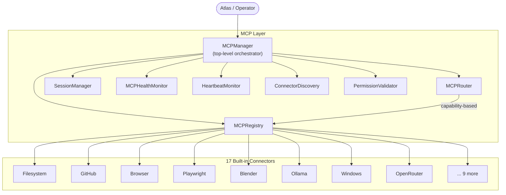

### Component table

| Component | Responsibility |
|-----------|----------------|
| `MCPManager` | Top-level orchestrator. Public API: `register_connector`, `open_session`, `execute`, `execute_capability`, `health`, `heartbeat`, `reconnect`, `statistics`. |
| `BaseConnector` | Abstract contract: `connect`, `disconnect`, `health`, `capabilities`, `execute`, `discover`. Handles state transitions + error wrapping. |
| `MCPRegistry` | In-memory catalog of registered connectors. Lookup by name, capability, tag, or predicate. |
| `MCPRouter` | Capability-based request routing. No hardcoded connector names. |
| `SessionManager` | Owns open `MCPSession` instances. Lifecycle (open, close, timeout, retry, reconnect). |
| `MCPHealthMonitor` | Aggregates per-connector health into a single roll-up (healthy/warning/critical/offline). |
| `HeartbeatMonitor` | Periodically probes every connector. Records latency, recommends reconnect. |
| `ConnectorDiscovery` | Discovers connectors from filesystem / manual registration / future network. |
| `PermissionValidator` | Validates that a session's permissions satisfy a connector's required level. |
| `MCPRegistry` | Catalog with `register`, `unregister`, `find_by_capability`, `find_by_tag`, `statistics`. |
| `MCPServerInstance` | Server-side MCP protocol: handshake, handle requests, dispatch to handler. |
| `MCPClientInstance` | Client-side MCP protocol: connect, send, call. |
| `BaseTransport` | Abstract transport contract. 5 implementations (in_process/stdio/http/websocket/named_pipe). |
| `MCPStatus` | 7-value enum: DISCONNECTED, CONNECTING, CONNECTED, DEGRADED, DISCONNECTING, FAILED, UNKNOWN. |
| `HealthLevel` | 5-value enum: HEALTHY, WARNING, CRITICAL, OFFLINE, UNKNOWN. |
| `TransportKind` | 5-value enum: STDIO, HTTP, WEBSOCKET, NAMED_PIPE, IN_PROCESS. |

### Connector table

| Connector | Capabilities | Required permission |
|-----------|-------------|---------------------|
| `FilesystemConnector` | file.read/write/list/delete | READ |
| `GitHubConnector` | repo.list/get, issue.list/create, pr.create, git.commit/push | READ |
| `BrowserConnector` | browser.navigate/click/extract/screenshot/fill | EXECUTE |
| `PlaywrightConnector` | playwright.launch/goto/click/type/pdf/screenshot/evaluate | EXECUTE |
| `BlenderConnector` | blender.scene.new, object.add/transform, render, export | EXECUTE |
| `OllamaConnector` | ollama.generate/chat/embed/models/pull | READ |
| `WindowsConnector` | windows.app.open/close, shell, registry, clipboard | EXECUTE |
| `OpenRouterConnector` | openrouter.generate/chat/models | READ |
| `SurpacConnector` | surpac.blockmodel.load/query, drillhole, surface, export | EXECUTE |
| `AutoCADConnector` | autocad.drawing.new/open, layer, entity, dimension, export | EXECUTE |
| `QGISConnector` | qgis.project, layer, analysis, map.export, plugin | EXECUTE |
| `PhotoshopConnector` | photoshop.doc, layer, filter, adjustment, export | EXECUTE |
| `CanvaConnector` | canva.design.create, template.list, element, text, export | READ |
| `GoogleFormsConnector` | forms.create/list, question, responses | READ |
| `ExcelConnector` | excel.workbook, sheet, cell, formula, export | READ |
| `WordConnector` | word.doc, paragraph, heading, style, table, export | READ |
| `PowerPointConnector` | ppt.presentation, slide, text, image, template, export | READ |

### Lifecycle

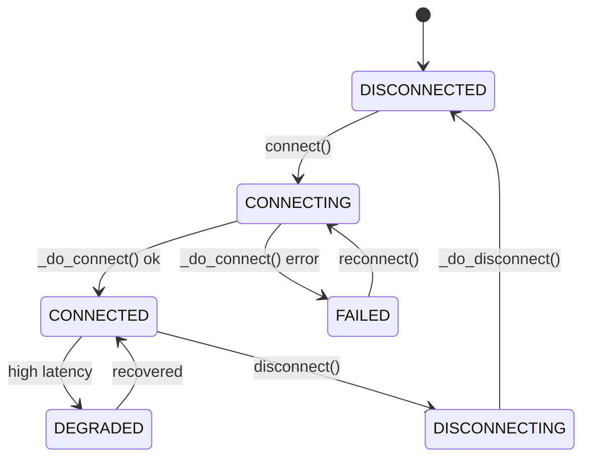

### Examples

**Register all 17 connectors:**

```python
from atlas.mcp import MCPManager, instantiate_all

manager = MCPManager()
for connector in instantiate_all():
    manager.register_connector(connector)
print(f"Registered {len(manager.list_connectors())} connectors")
print(f"Overall health: {manager.overall_health().value}")
```

**Execute a request:**

```python
from atlas.mcp import MCPManager, FilesystemConnector

manager = MCPManager()
manager.register_connector(FilesystemConnector())
session = manager.open_session("filesystem", permissions=["read"])
response = manager.execute_capability(
    "file.read",
    {"path": "/tmp/test.txt"},
    connector="filesystem",
    session_id=session.id,
)
print(response.success, response.output)
```

**Health monitoring:**

```python
manager = MCPManager()
for c in instantiate_all():
    manager.register_connector(c)
health = manager.health()
for name, h in health.items():
    print(f"  {name}: {h.level.value} ({h.latency_ms}ms)")
```

### Future roadmap

The MCP Layer is designed so future connectors (Slack, Notion, Linear, Figma, VS Code, Terminal, Database, Kubernetes, Docker, AWS/GCP/Azure) plug in without modifying existing code. To add a connector: create a file in `atlas/mcp/connectors/`, inherit `BaseConnector`, implement the four `_do_*` methods, and add the class to `__init__.py`.

See [`docs/mcp_layer.md`](docs/mcp_layer.md) for the full architecture document, including connector lifecycle, transport architecture, capability routing, permission flow, health monitoring, dependency graph, and 5 usage examples.


## Atlas Real Connectors

The Real Connectors stage replaces the placeholder connector implementations from the MCP Layer with real working integrations. **The MCP architecture is unchanged** — every connector still inherits `BaseConnector` and exposes the same `_do_connect` / `_do_disconnect` / `_do_health` / `_do_execute` contract. Only the internal logic has been replaced.

### Architecture

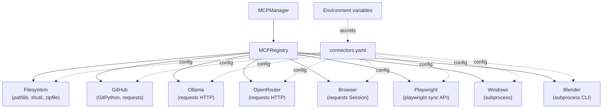

### Configuration

All connector configuration lives in `atlas/configs/connectors.yaml`. Secrets (API keys, tokens) are read from environment variables — the YAML only holds non-secret defaults and the names of the env vars to read.

| Connector | Env var | Purpose |
|-----------|---------|---------|
| Filesystem | `ATLAS_FILESYSTEM_ROOT` | Override root directory |
| Ollama | `OLLAMA_BASE_URL` | Override Ollama server URL |
| GitHub | `GITHUB_TOKEN` | REST API authentication |
| OpenRouter | `OPENROUTER_API_KEY` | API authentication |

### Connector table

| Connector | Implementation | Capabilities | External dependency |
|-----------|---------------|-------------|---------------------|
| `FilesystemConnector` | `pathlib`, `shutil`, `zipfile` | 15 (read, write, append, copy, move, rename, delete, exists, search, list, mkdir, watch, zip, extract, path) | None |
| `GitHubConnector` | GitPython + `requests` | 17 (clone, status, branch, checkout, commit, push, pull, fetch, log, diff, tag, remote, repo.list/get, issue.list/create, pr.create) | `git` CLI (optional token for REST) |
| `OllamaConnector` | `requests` HTTP | 8 (health, models, pull, delete, generate, chat, embed, stream) | Ollama server running locally |
| `OpenRouterConnector` | `requests` HTTP | 5 (health, models, chat, generate, usage) | OpenRouter API key |
| `BrowserConnector` | `requests.Session` | 6 (navigate, download, html, cookies, headers, session) | None |
| `PlaywrightConnector` | `playwright` sync API | 11 (launch, goto, click, type, upload, download, wait, screenshot, pdf, close, evaluate) | `playwright` package + browser install |
| `WindowsConnector` | `subprocess` | 8 (shell, powershell, env.get/set, process.list/kill, app.launch, clipboard) | PowerShell (optional) |
| `BlenderConnector` | `subprocess` CLI | 10 (launch, script, open, save, render, render_animation, execute, scene.new, object.add, export) | Blender executable |

### Examples

**Filesystem — write and read a file:**

```python
from atlas.mcp import MCPManager, FilesystemConnector

manager = MCPManager()
manager.register_connector(FilesystemConnector(root="/tmp/atlas"))
session = manager.open_session("filesystem", permissions=["read", "write"])
manager.execute_capability("file.write", {"path": "test.txt", "content": "hello"},
                           connector="filesystem", session_id=session.id)
resp = manager.execute_capability("file.read", {"path": "test.txt"},
                                  connector="filesystem", session_id=session.id)
print(resp.output["content"])  # "hello"
```

**GitHub — local git status (no token needed):**

```python
from atlas.mcp import MCPManager, GitHubConnector

manager = MCPManager()
manager.register_connector(GitHubConnector())
session = manager.open_session("github", permissions=["read"])
resp = manager.execute_capability("git.status", {"path": "/path/to/repo"},
                                  connector="github", session_id=session.id)
print(resp.output["active_branch"], resp.output["is_dirty"])
```

**Ollama — generate text:**

```python
from atlas.mcp import MCPManager, OllamaConnector

manager = MCPManager()
manager.register_connector(OllamaConnector())
session = manager.open_session("ollama", permissions=["read"])
resp = manager.execute_capability(
    "ollama.generate", {"prompt": "Write a haiku", "model": "llama3"},
    connector="ollama", session_id=session.id,
)
print(resp.output["response"])
```

**OpenRouter — chat completion:**

```python
import os
os.environ["OPENROUTER_API_KEY"] = "sk-or-xxxxx"
from atlas.mcp import MCPManager, OpenRouterConnector

manager = MCPManager()
manager.register_connector(OpenRouterConnector())
session = manager.open_session("openrouter", permissions=["read"])
resp = manager.execute_capability(
    "openrouter.chat",
    {"messages": [{"role": "user", "content": "Hello!"}]},
    connector="openrouter", session_id=session.id,
)
print(resp.output["message"]["content"])
```

### Troubleshooting

| Problem | Solution |
|---------|----------|
| "git CLI not available" | Install git: `apt install git` |
| "Blender is not installed" | Install Blender, ensure it's on `PATH` |
| "Playwright is not installed" | `pip install playwright && playwright install` |
| "OpenRouter API key required" | `export OPENROUTER_API_KEY="sk-or-xxxxx"` |
| "Ollama connection refused" | Start Ollama: `ollama serve` |
| "PowerShell is not available" | Install PowerShell Core (`pwsh`) |

See [`docs/real_connectors.md`](docs/real_connectors.md) for the full architecture document, configuration reference, every connector's capabilities, and troubleshooting guide.


## Atlas Runtime Engine

The Runtime Engine is the execution heart of the Atlas AI Operating System. It accepts user requests, builds an execution context, opens a session, dispatches workflows and agents, executes steps, selects providers, invokes tools, emits lifecycle events, updates the Memory and Knowledge engines, triggers Reflection, and returns the final response. Every concrete concern is injected through an abstract base class, so the runtime is **provider-agnostic**, **tool-agnostic**, **agent-agnostic**, and **workflow-agnostic**. The default configuration uses deterministic in-memory placeholders so the runtime works out-of-the-box with zero external dependencies.

### Architecture

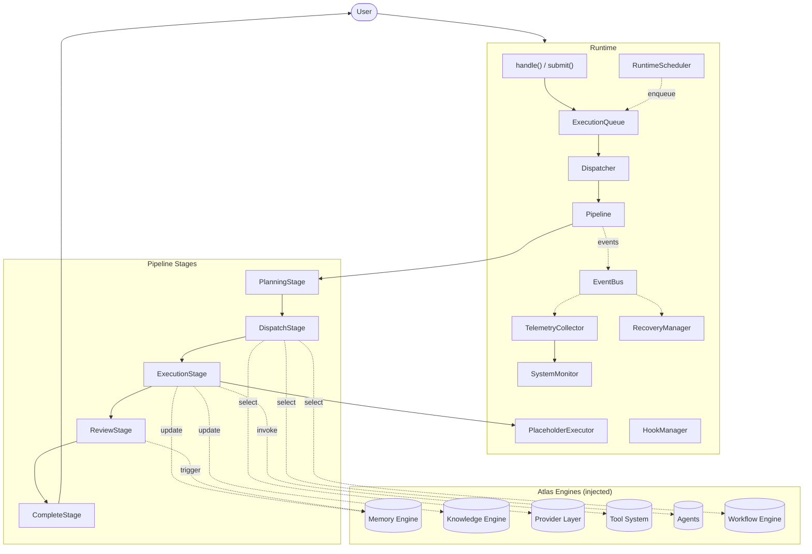

### Runtime lifecycle

Every execution moves through an explicit state machine. Transitions are validated against a fixed transition table; illegal moves raise `InvalidRuntimeTransitionError`. Terminal states cannot be left except that a `FAILED` execution can be retried (which resets the state to `PENDING`).

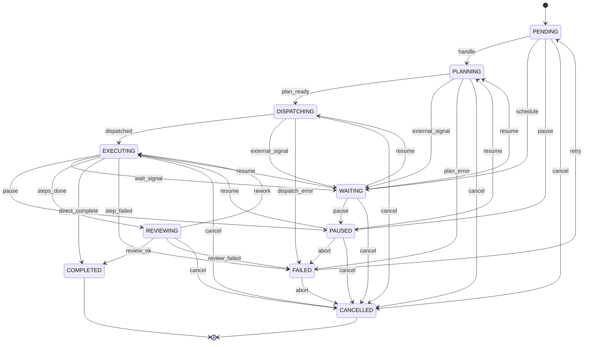

| State | Description | Terminal? |
|-------|-------------|-----------|
| `PENDING` | Execution created but not started. | No |
| `PLANNING` | Planner is decomposing the goal. | No |
| `DISPATCHING` | Dispatcher is selecting agents / providers / tools. | No |
| `EXECUTING` | Executor is running steps. | No |
| `REVIEWING` | Post-execution review / reflection is running. | No |
| `WAITING` | Execution blocked on an external signal or schedule. | No |
| `PAUSED` | Execution suspended; may be resumed. | No |
| `COMPLETED` | Execution finished successfully. | Yes |
| `FAILED` | Execution aborted with an error. Retriable. | Yes |
| `CANCELLED` | Operator cancelled the execution. | Yes |

### Execution pipeline

The pipeline is composed of five default stages, each of which is a small, replaceable callable:

```mermaid
flowchart LR
    Request[/"User request"/] --> Planning
    subgraph Planning["PlanningStage"]
        P1["Decompose goal"]
        P2["Produce ExecutionPlan"]
    end
    Planning --> Dispatch
    subgraph Dispatch["DispatchStage"]
        D1["Select agents"]
        D2["Select providers"]
        D3["Select tools"]
    end
    Dispatch --> Execution
    subgraph Execution["ExecutionStage"]
        E1["Run plan via Executor"]
        E2["Collect results"]
    end
    Execution --> Review
    subgraph Review["ReviewStage"]
        R1["Trigger Reflection"]
        R2["Update Memory"]
    end
    Review --> Complete
    subgraph Complete["CompleteStage"]
        C1["Assemble response"]
    end
    Complete --> Response[/"Final response"/]
```

1. **PlanningStage** — Decomposes the user request into an `ExecutionPlan`. The default planner produces a single `noop` step; inject a custom planner for real decomposition.
2. **DispatchStage** — Selects agents, providers, and tools. The default dispatcher is a no-op; inject a custom dispatcher to populate `context.artifacts`.
3. **ExecutionStage** — Runs the `ExecutionPlan` via the injected `BaseExecutor`. Each step emits `StepStarted` / `StepCompleted` / `StepFailed` events.
4. **ReviewStage** — Runs post-execution review / reflection. The default reviewer is a no-op; inject a custom reviewer to trigger reflection and update memory.
5. **CompleteStage** — Assembles the final response from the execution outcome.

### Component responsibilities

| Component | Responsibility |
|-----------|----------------|
| `Runtime` | Top-level orchestrator. Public API: `handle`, `submit`, `drain`, `pause`, `resume`, `cancel`, `retry`, `register_schedule`, `tick`, `health`, `metrics`, `events`. |
| `ExecutionQueue` | Priority-ordered FIFO queue of `ExecutionRequest` items. Higher priority dequeues first; FIFO within priority. Optional capacity. |
| `Dispatcher` | Pulls requests off the queue and runs each through a fresh `Pipeline`. Tracks processed / failed counts. |
| `Pipeline` | Ordered sequence of `Stage` callables. Runs hooks around every stage; short-circuits on error or `HookAbort`. |
| `PlanningStage` | Decomposes the request into an `ExecutionPlan`. Emits `PlanningStarted` / `PlanningCompleted`. |
| `DispatchStage` | Selects agents / providers / tools. Emits `DispatchStarted` / `DispatchCompleted`. |
| `ExecutionStage` | Runs the plan via the `BaseExecutor`. Stores the `ExecutionOutcome` on the context. |
| `ReviewStage` | Runs post-execution review / reflection. Emits `ReviewStarted` / `ReviewCompleted`. |
| `CompleteStage` | Assembles the final response from the execution outcome. |
| `BaseExecutor` | Abstract contract: `execute_plan(plan, execution_id, context) -> ExecutionOutcome`. |
| `PlaceholderExecutor` | Deterministic default executor with `noop`, `echo`, `fail`, `identity`, `context_read` built-ins. Custom actions injectable. |
| `EventBus` | Synchronous in-process pub/sub with topic filtering. Listeners are exception-isolated. |
| `HookManager` | Registry and dispatcher for pre/post stage hooks. Supports short-circuit and `HookAbort`. |
| `TelemetryCollector` | Subscribes to the event bus and records per-execution metrics (durations, counts, providers, tools). |
| `SystemMonitor` | Pulls telemetry and queue state to produce `HealthReport` snapshots with `healthy` / `degraded` / `unhealthy` status. |
| `RecoveryManager` | Owns retry and compensation strategy. Exponential backoff with configurable max retries and retryable error filters. |
| `RuntimeScheduler` | Triggers executions on a cadence (one_time, interval, cron). Enqueues `ExecutionRequest` items on tick. |
| `RuntimeState` | Ten-state lifecycle enum with explicit transition table. |
| `PipelineContext` | Mutable state carried through every stage: request, plan, outcome, response, state, artifacts. |

### Event flow

Every significant runtime action emits an event on the `EventBus`. The bus dispatches synchronously to every matching listener in registration order. Listeners are exception-isolated: a raising listener is logged and skipped but does not stop the dispatch to subsequent listeners.

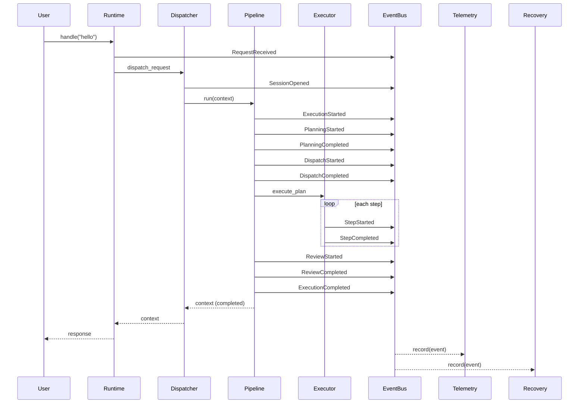

| Event | Emitted by | When |
|-------|-----------|------|
| `RequestReceived` | Dispatcher | A new request is pulled from the queue. |
| `SessionOpened` | Dispatcher | A pipeline context has been created. |
| `PlanningStarted` / `PlanningCompleted` | PlanningStage | Around the planning phase. |
| `DispatchStarted` / `DispatchCompleted` | DispatchStage | Around the dispatch phase. |
| `ExecutionStarted` | Executor / Pipeline | Before the first step runs. |
| `StepStarted` / `StepCompleted` / `StepFailed` | Executor | Around each step. |
| `ReviewStarted` / `ReviewCompleted` | ReviewStage | Around the review phase. |
| `ExecutionCompleted` / `ExecutionFailed` | Pipeline | On terminal success / failure. |
| `ExecutionCancelled` / `ExecutionPaused` / `ExecutionResumed` | Runtime | On lifecycle control calls. |
| `MemoryUpdated` / `KnowledgeUpdated` / `ReflectionTriggered` | Review / Custom | On engine updates. |
| `ProviderSelected` / `ToolInvoked` | Dispatch / Custom | On resource selection. |

### Recovery flow

When an execution fails, the `RecoveryManager` decides what to do next. The decision is based on the failure, the number of attempts so far, and the configured `RecoveryPolicy`.

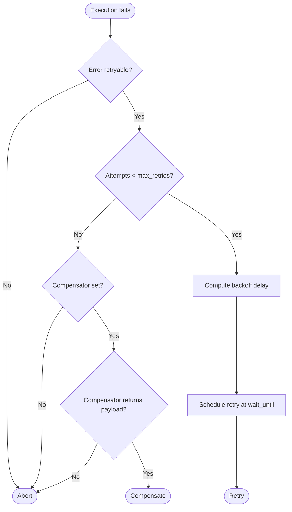

The default policy uses exponential backoff: `delay = min(base * 2^(attempt-1), max_delay)`. A compensator callable can be injected to provide fallback behaviour when retries are exhausted (e.g. fall back to a different provider, return a cached response, invoke a degraded-mode handler).

### Execution examples

**Minimal end-to-end execution:**

```python
from atlas.runtime import Runtime

rt = Runtime()
ctx = rt.handle("hello world")
assert ctx.state.value == "completed"
assert ctx.response is not None
```

**Submitting and draining:**

```python
rt = Runtime()
rt.submit("first")
rt.submit("second")
results = rt.drain()
assert len(results) == 2
```

**Subscribing to events:**

```python
from atlas.runtime import Runtime, StepCompleted

rt = Runtime()
steps = []
rt.bus.subscribe(StepCompleted, steps.append)
rt.handle("hello")
assert len(steps) >= 1
```

**Scheduled execution:**

```python
from datetime import datetime, timedelta, UTC
from atlas.runtime import Runtime, ScheduledTask, ScheduleKind

rt = Runtime()
run_at = datetime(2026, 1, 1, 12, 0, tzinfo=UTC)
rt.register_schedule(ScheduledTask(
    id="daily_ping",
    request="ping",
    kind=ScheduleKind.ONE_TIME,
    run_at=run_at,
))
results = rt.tick(now=run_at + timedelta(minutes=1))
assert len(results) == 1
```

**Health monitoring:**

```python
rt = Runtime()
rt.handle("hello")
health = rt.health()
assert health["status"] == "healthy"
assert health["completed_executions"] >= 1
```

**Custom executor action (dependency injection):**

```python
from atlas.runtime import Runtime, PlaceholderExecutor

def greet(params, context):
    return f"Hello, {params['name']}!"

rt = Runtime(executor=PlaceholderExecutor(actions={"greet": greet}))
```

See [`docs/runtime_engine.md`](docs/runtime_engine.md) for the full architecture document, including the dependency graph, every event type, and the complete recovery policy reference.


## Atlas Tool Layer

The Tool Layer is the controlled gateway through which agents invoke external capabilities. It is built on a three-tier architecture: **tools** (what agents call) sit on top of **services** (domain logic) which are connected to the outside world by **adapters** (transports / MCP connectors). Every call passes through a permission gate before reaching the underlying service.

### Architecture

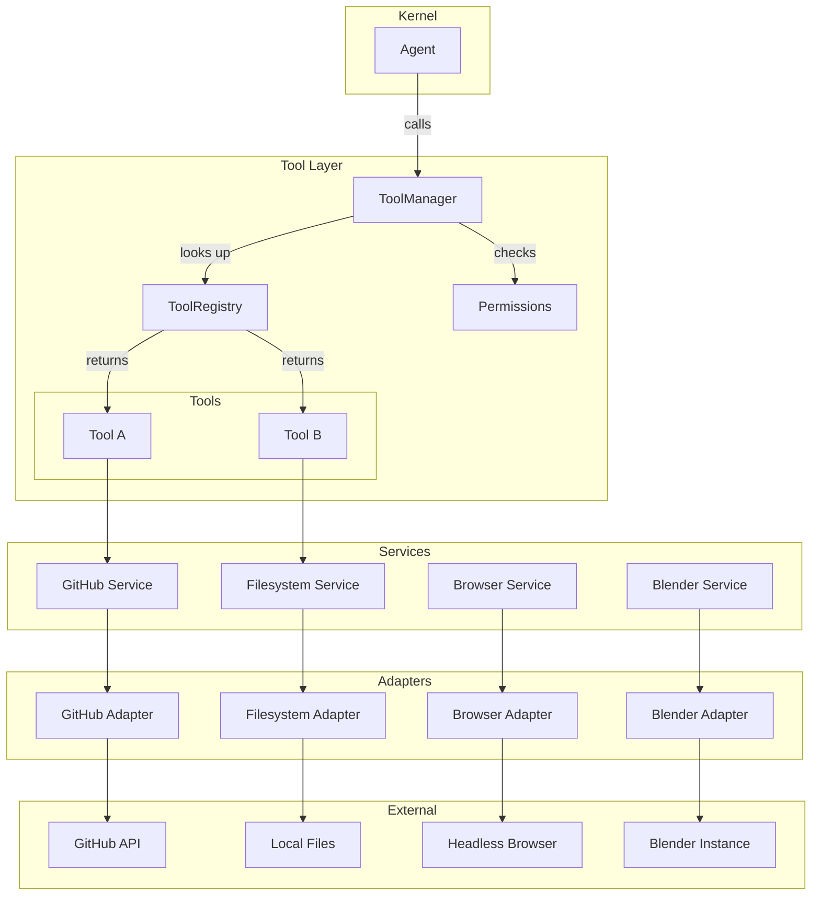

### Component responsibility table

| Component | Responsibility |
|-----------|----------------|
| `BaseTool` | Abstract contract every concrete tool implements (`name`, `execute`). |
| `ToolResult` | Structured result carrying `success`, `output`, `error`, and `metadata`. |
| `ToolRegistry` | Catalog of registered tools; lookup by name; duplicate prevention. |
| `ToolManager` | Dispatch gateway; enforces permission checks before every invocation. |
| `Permissions` | `DENY` / `USE` / `CONFIGURE` / `ADMIN` model with per-tool grants. |
| `BaseService` | Abstract domain-logic wrapper (`connect`, `disconnect`, `is_connected`). |
| `BaseAdapter` | Abstract transport connector bridging a service to an external system. |

### Execution flow

1. **Agent calls a tool by name** through the `ToolManager`.
2. **Manager checks the `Permissions` model** — if the caller lacks the required level, a `ToolResult.fail` is returned immediately.
3. **Manager looks up the tool in the `ToolRegistry`** — if the tool is not registered, a `ToolResult.fail` is returned.
4. **Tool executes** against its `BaseService`, which holds the domain logic.
5. **Service communicates through its `BaseAdapter`** to the external system (GitHub API, filesystem, browser, Blender) or an MCP server.
6. **`ToolResult` flows back** through the manager to the agent and ultimately the Kernel.

Every stage returns a `ToolResult`, so the pipeline is uniform whether the outcome is success, permission denial, unknown tool, or an unexpected exception.


## Atlas Memory Engine

The Memory Engine gives Atlas five specialised memory stores — each modelled after a distinct cognitive function — orchestrated by a single `MemoryEngine`. Every store implements the `BaseMemory` contract and can optionally be backed by a swappable `MemoryStorage` persistence layer. The engine provides a high-level `remember` / `recall` / `forget` API so the Kernel never needs to know which store it is addressing.

### Memory hierarchy

| Store | Analogy | Retention | Purpose |
|-------|---------|-----------|---------|
| **Working** | Scratchpad | Session-scoped, evicts at capacity | Holds the immediate context for the current task. |
| **Episodic** | Journal | Permanent, append-first | Chronological log of conversations, events, and daily entries. |
| **Semantic** | Encyclopedia | Permanent | Long-term facts, domain knowledge, and reference material. |
| **Procedural** | Playbook | Permanent | Workflows, methods, and step-by-step procedures. |
| **Reflection** | Mirror | Permanent, newest-first | Self-assessments, lessons learned, and improvement notes. |

### Architecture

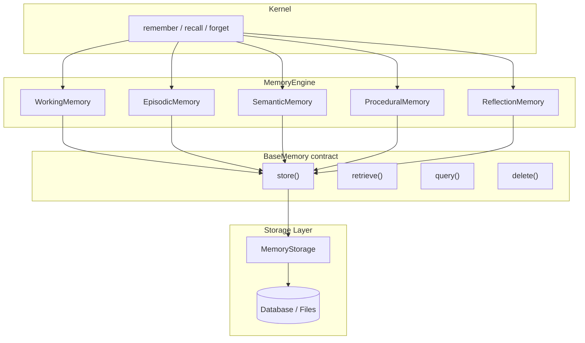

### Component table

| Component | Responsibility |
|-----------|----------------|
| `MemoryEngine` | High-level orchestrator owning all five stores; exposes `remember`, `recall`, `forget`. |
| `BaseMemory` | Abstract contract (`store`, `retrieve`, `query`, `delete`) every store implements. |
| `WorkingMemory` | Fast, bounded scratch space with automatic eviction at capacity. |
| `EpisodicMemory` | Append-only chronological log with `recent()` for newest-first access. |
| `SemanticMemory` | Long-term knowledge store (tag and text search; future vector embedding support). |
| `ProceduralMemory` | Procedure and workflow repository (tag and text search). |
| `ReflectionMemory` | Self-assessment store with `lessons()` helper for retrospective queries. |
| `MemoryEntry` | Dataclass: `id`, `category`, `content`, `source`, `tags`, `priority`, `timestamp`. |
| `MemoryQuery` | Structured query: `text`, `tags`, `category`, `since`, `until`, `limit`. |
| `MemoryStorage` | Abstract persistence backend (swappable: SQLite, filesystem, PostgreSQL, etc.). |

### Execution lifecycle

1. **Kernel calls `engine.remember(content, category, tags)`** — the engine delegates to the appropriate store.
2. **Store creates a `MemoryEntry`** with a unique id, timestamp, and category.
3. **If a `MemoryStorage` is configured**, the entry is also persisted to the storage backend.
4. **On recall**, the engine queries the specified store (or all stores) and returns matching `MemoryEntry` objects ordered by timestamp.
5. **On forget**, the engine removes the entry from the store and from storage.

Every store can operate purely in-memory when no storage backend is injected, making the system immediately testable and usable without external dependencies.


## Atlas Knowledge Engine

The Knowledge Engine is Atlas's document intelligence pipeline. It ingests raw documents, parses them into clean text, splits them into chunks, generates embeddings, indexes them in a vector store, and retrieves the most relevant chunks for any given query. Every stage is dependency-injected so the engine can be upgraded (e.g. HashingEmbedder → OpenAI, InMemoryVectorStore → Chroma) without changing pipeline code.

### Architecture

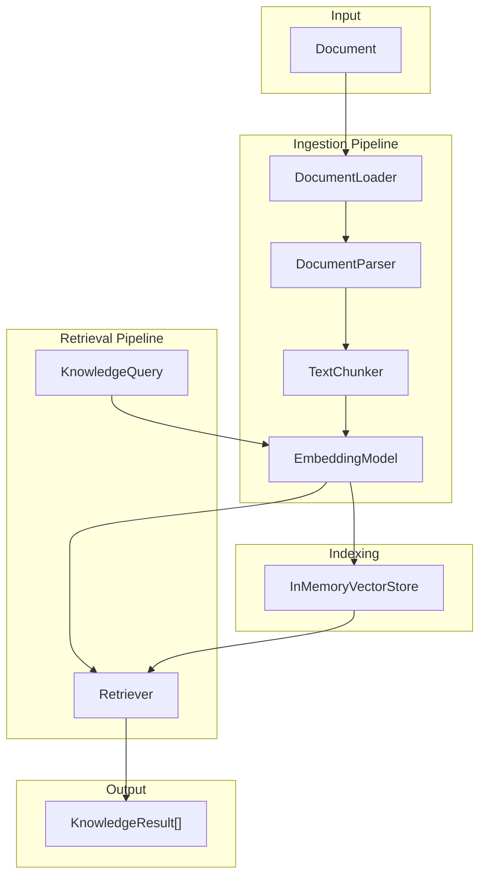

### Component table

| Component | Responsibility |
|-----------|----------------|
| `KnowledgeEngine` | Top-level orchestrator. Public API: `ingest()`, `search()`, `remove()`, `count()`. |
| `DocumentLoader` | Reads files (TXT, Markdown) or raw text → `KnowledgeDocument`. |
| `DocumentParser` | Extracts clean text from documents (strips Markdown noise). |
| `TextChunker` | Splits documents into overlapping `KnowledgeChunk` objects. |
| `EmbeddingModel` | Abstract contract for embedding text → vectors. |
| `HashingEmbedder` | Deterministic placeholder embedder for testing. |
| `InMemoryVectorStore` | Brute-force cosine similarity search over chunk embeddings. |
| `InMemoryKnowledgeStore` | Concrete store holding documents, chunks, and embeddings. |
| `Retriever` | Query → Embed → Vector Search → Tag/Score Filter → Top-K. |
| `KnowledgeStorage` | Abstract persistence backend (swappable). |

### Execution lifecycle

**Ingestion:**
1. **Load** — `DocumentLoader` reads a file or accepts raw text, producing a `KnowledgeDocument`.
2. **Parse** — `DocumentParser` extracts clean text, stripping formatting noise.
3. **Chunk** — `TextChunker` splits the text into overlapping chunks of configurable size.
4. **Embed** — `EmbeddingModel` converts each chunk into a vector.
5. **Index** — `InMemoryVectorStore` stores the embeddings for retrieval.

**Retrieval:**
1. **Query** — A `KnowledgeQuery` with text, optional tags, and `top_k`.
2. **Embed** — The query text is embedded into the same vector space as the chunks.
3. **Search** — Cosine similarity finds the closest chunks in the vector store.
4. **Filter** — Results are filtered by required tags and minimum score.
5. **Return** — Up to `top_k` `KnowledgeResult` objects, each pairing a chunk with its parent document and a relevance score.

### Future backends

The `InMemoryVectorStore` is the default for testing and small datasets. It can be replaced with production-grade backends that implement the same interface:

- **Chroma** — local vector database with built-in embedding support
- **FAISS** — Facebook's efficient similarity search library
- **Qdrant** — high-performance vector search engine
- **Milvus** — scalable vector database for production workloads


## Atlas Workflow Engine

The Workflow Engine is Atlas's provider-agnostic orchestration framework. It lets you define reusable workflows as immutable dataclasses, register them, validate them, execute them as runs with full lifecycle control (start / pause / resume / retry / cancel), schedule them on a cadence, and replay any run's history snapshot-by-snapshot. Every dependency — executor, scheduler, history, validator, registry, templates — is injected through abstract base classes with deterministic placeholder defaults, so the engine works out-of-the-box with zero external resources and can be upgraded component-by-component without touching orchestration code.

### Architecture

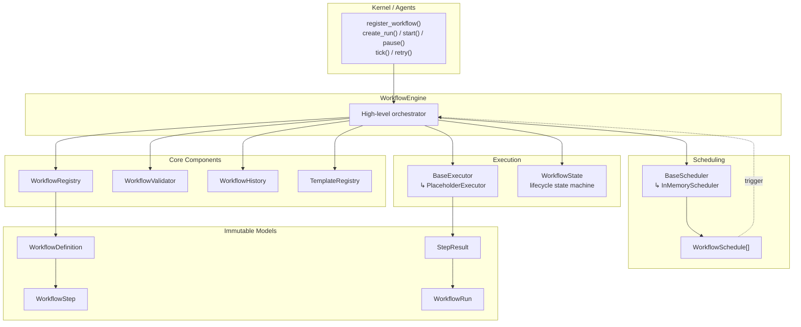

### Workflow lifecycle

Every workflow run moves through an explicit state machine. Transitions are validated against a fixed transition table; illegal moves raise `InvalidStateTransitionError`. Terminal states cannot be left except that a `FAILED` run can be retried (which produces a *new* run in the `PENDING` state with `parent_run_id` pointing back to the original).

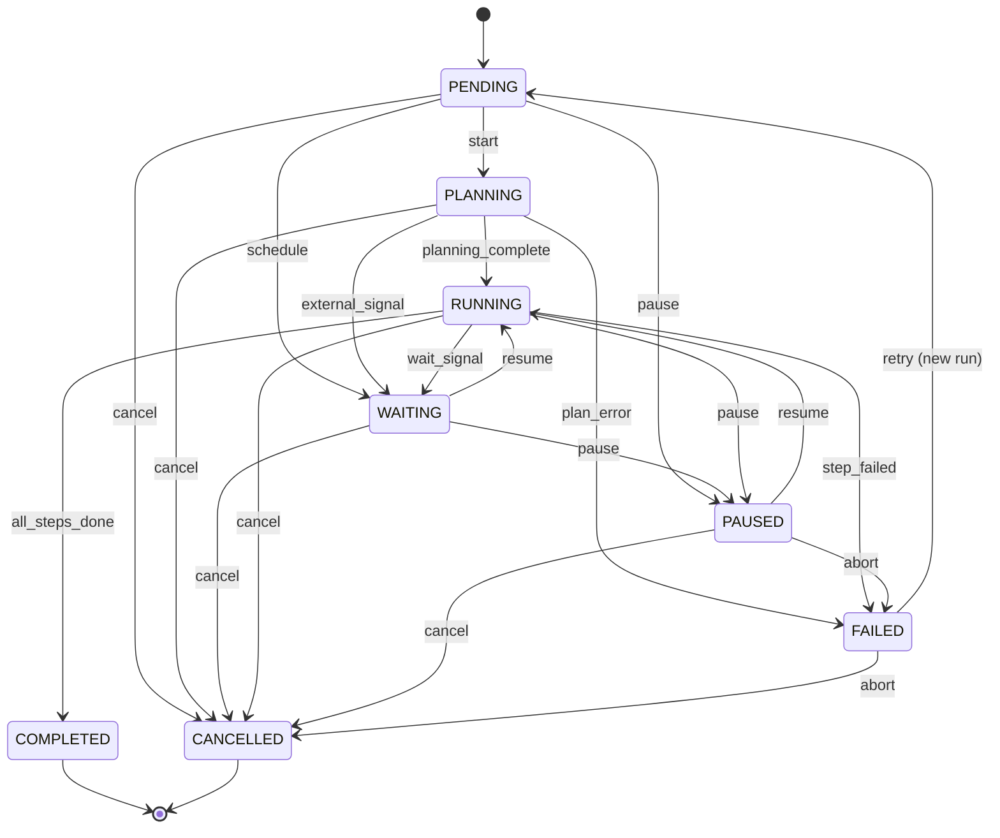

| State | Description | Terminal? |
|-------|-------------|-----------|
| `PENDING` | Run created but not started. | No |
| `PLANNING` | Engine is preparing execution. | No |
| `WAITING` | Run is blocked on an external signal or scheduled time. | No |
| `RUNNING` | Run is actively executing steps. | No |
| `PAUSED` | Execution suspended; may be resumed. | No |
| `COMPLETED` | All steps finished successfully. | Yes |
| `FAILED` | A required step failed. Retriable. | Yes |
| `CANCELLED` | Operator cancelled the run. | Yes |

### Component table

| Component | Responsibility |
|-----------|----------------|
| `WorkflowEngine` | Top-level orchestrator. Owns registry, executor, scheduler, history, validator, and templates. Public API: `register_workflow`, `create_run`, `start`, `pause`, `resume`, `retry`, `cancel`, `tick`, `register_schedule`, `instantiate_template`. |
| `WorkflowState` | Eight-state lifecycle enum (`pending`, `planning`, `waiting`, `running`, `paused`, `completed`, `failed`, `cancelled`). |
| `WorkflowStep` | Immutable dataclass: `id`, `name`, `action`, `params`, `depends_on`, `optional`. |
| `WorkflowDefinition` | Immutable workflow definition: `id`, `name`, `version`, `steps`, `inputs`, `outputs`, `metadata`. |
| `WorkflowRun` | Immutable run snapshot. Tracks state, inputs, step results, transitions, timing, attempts, and parent run. Updated via `dataclasses.replace`. |
| `StepResult` | Outcome of a single step: `step_id`, `success`, `output`, `error`, `started_at`, `completed_at`. |
| `WorkflowSchedule` | Schedule that triggers a workflow: `kind` (one_time / interval / cron), `next_run_at`, `inputs`, `enabled`. |
| `StateTransition` | Recorded state change: `from_state`, `to_state`, `timestamp`, `reason`. |
| `BaseExecutor` | Abstract contract: `execute_step(step, context) -> StepResult`. |
| `PlaceholderExecutor` | Deterministic default executor with built-in `noop`, `echo`, `fail`, `wait`, `sleep` actions. Custom actions injectable. |
| `BaseScheduler` | Abstract contract: `register`, `unregister`, `get`, `all`, `due`, `mark_run`. |
| `InMemoryScheduler` | Deterministic in-memory scheduler supporting one_time, interval, and (placeholder) cron triggers. |
| `WorkflowValidator` | Validates definitions: non-empty ids, unique step ids, dependency integrity, cycle detection. |
| `WorkflowRegistry` | In-memory catalog of registered definitions. Duplicate detection via `ValueError`. |
| `WorkflowHistory` | Append-only run snapshot store. Lookup by run id, workflow id, or recency. |
| `WorkflowTemplate` | Parameterised factory: `builder(params) -> WorkflowDefinition`. |
| `TemplateRegistry` | Catalog of registered templates with `instantiate(id, **params)`. |
| `WaitSignal` | Marker output that triggers a `RUNNING -> WAITING` transition. |

### Dependency graph (acyclic)

The workflows package has zero circular imports. Modules form a strict DAG:

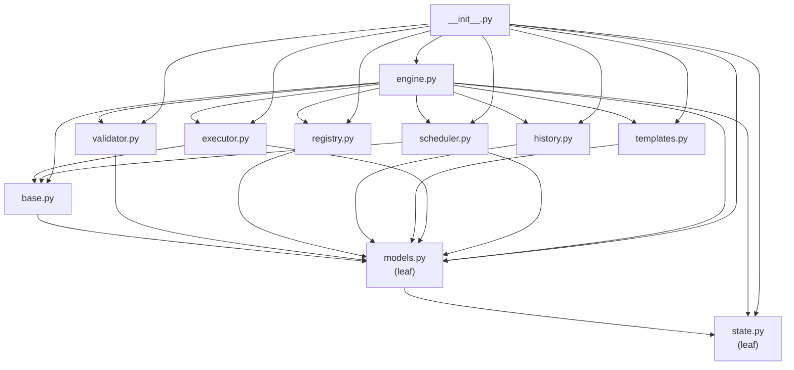

### Execution lifecycle

1. **Register** — `engine.register_workflow(definition)` validates the definition and adds it to the registry. Duplicate ids are rejected.
2. **Create run** — `engine.create_run(workflow_id, inputs)` produces a new `WorkflowRun` in the `PENDING` state, recorded in history.
3. **Start** — `engine.start(run_id)` transitions `PENDING -> PLANNING -> RUNNING` (or resumes from `PAUSED`/`WAITING`) and executes steps in dependency order. Between steps the engine checks for pause requests, `WaitSignal` outputs, and step failures.
4. **Pause / Resume** — `engine.pause(run_id)` transitions to `PAUSED` (or sets a pause-request flag if currently `RUNNING`). `engine.resume(run_id)` restarts execution from the next step.
5. **Retry** — `engine.retry(run_id)` creates a *new* run with `parent_run_id` pointing at the failed original. The new run inherits inputs and increments `attempts`.
6. **Cancel** — `engine.cancel(run_id)` transitions any non-terminal run to `CANCELLED`.
7. **Schedule** — `engine.register_schedule(schedule)` registers a cadence. `engine.tick(now)` fires every due schedule, creates a run, starts it, and advances the schedule's `next_run_at`.

Every state change produces a new immutable `WorkflowRun` snapshot recorded in `WorkflowHistory`. The full trajectory of any run can be replayed via `history.trajectory(run_id)`.

### Execution examples

**Minimal end-to-end run:**

```python
from atlas.workflows import (
    WorkflowEngine, WorkflowDefinition, WorkflowStep,
)

engine = WorkflowEngine()

definition = WorkflowDefinition(
    id="hello_world",
    name="Hello World",
    steps=[
        WorkflowStep(id="greet", name="Greet", action="noop"),
        WorkflowStep(id="echo", name="Echo", action="echo",
                     params={"msg": "hello"}, depends_on=["greet"]),
    ],
)
engine.register_workflow(definition)

run = engine.create_run("hello_world")
run = engine.start(run.id)
assert run.state.value == "completed"
assert set(run.step_results) == {"greet", "echo"}
```

**Pause mid-execution:**

```python
run = engine.create_run("hello_world")
run = engine.start(run.id, max_steps=1)   # one step, then PAUSED
assert run.state.value == "paused"
run = engine.resume(run.id)                # finish remaining steps
assert run.state.value == "completed"
```

**Retry a failed run:**

```python
failing = WorkflowDefinition(
    id="failing",
    name="Failing",
    steps=[WorkflowStep(id="boom", name="Boom", action="fail",
                        params={"message": "kaboom"})],
)
engine.register_workflow(failing)

run = engine.create_run("failing")
run = engine.start(run.id)
assert run.state.value == "failed"

retry = engine.retry(run.id)               # new PENDING run
assert retry.parent_run_id == run.id
assert retry.attempts == 2
```

**Scheduled execution:**

```python
from datetime import datetime, timedelta, UTC
from atlas.workflows import WorkflowSchedule, ScheduleKind

run_at = datetime(2026, 1, 1, 12, 0, tzinfo=UTC)
engine.register_schedule(WorkflowSchedule(
    id="daily_ping",
    workflow_id="hello_world",
    kind=ScheduleKind.ONE_TIME,
    run_at=run_at,
))

started = engine.tick(now=run_at + timedelta(minutes=1))
assert len(started) == 1
assert started[0].state.value == "completed"
```

**Reusable template:**

```python
from atlas.workflows import linear_template

template = linear_template(
    template_id="ping_chain",
    name="Ping Chain",
    actions=[("a", "noop"), ("b", "noop"), ("c", "noop")],
)
engine.templates.register(template)

definition = engine.instantiate_template("ping_chain")
run = engine.start(engine.create_run(definition.id).id)
assert run.state.value == "completed"
```

**Custom executor (dependency injection):**

```python
from atlas.workflows import WorkflowEngine, PlaceholderExecutor

def add(params, context):
    return params["x"] + params["y"]

def multiply(params, context):
    return context[params["source"]] * params["factor"]

executor = PlaceholderExecutor(actions={"add": add, "mul": multiply})
engine = WorkflowEngine(executor=executor)
```

Any concrete `BaseExecutor` — calling a tool, an LLM provider, a remote service — can be injected the same way without changing engine code.


## Atlas Provider Layer

The Provider Layer abstracts every LLM behind a single interface so Atlas can dynamically switch between providers without changing business logic. Each provider implements the `BaseProvider` contract; the `ProviderManager` exposes a high-level API (`generate`, `chat`, `complete`) that routes to the right provider via the `ProviderRouter` and `ProviderRegistry`.

### Provider abstraction

Every provider — whether a cloud giant (OpenAI, Anthropic) or a local runtime (Ollama, LM Studio) — implements the same four methods: `generate`, `stream`, `health`, `available_models`. This means Atlas's business logic is **provider-agnostic**: the Kernel never knows or cares which model produced a response. Swapping providers is a config change, not a code change.

### Architecture

```mermaid
flowchart TB
    subgraph Kernel["Kernel / Agents"]
        Call["generate() / chat() / complete()"]
    end

    subgraph Manager["ProviderManager"]
        Facade["High-level API"]
    end

    subgraph Routing["Routing"]
        Router["ProviderRouter"]
        Registry["ProviderRegistry"]
    end

    subgraph Providers["Provider Layer"]
        ZAI["ZAI<br/>built-in"]
        OAI["OpenAI"]
        ANT["Anthropic"]
        GEM["Gemini"]
        GRQ["Groq"]
        NVI["NVIDIA NIM"]
        ORT["OpenRouter"]
        OLL["Ollama<br/>local"]
        LMS["LM Studio<br/>local"]
    end

    Call --> Facade
    Facade --> Router
    Router --> Registry
    Router --> ZAI
    Router --> OAI
    Router --> ANT
    Router --> GEM
    Router --> GRQ
    Router --> NVI
    Router --> ORT
    Router --> OLL
    Router --> LMS
```

### Component table

| Component | Responsibility |
|-----------|----------------|
| `ProviderManager` | High-level facade. Exposes `generate`, `chat`, `complete`, `health`, `list_models`. Depends only on the Router. |
| `ProviderRouter` | Selects the correct provider. Strategies: `auto`, `manual`, `fallback`, `round_robin`. Filters by availability, priority, capabilities. |
| `ProviderRegistry` | Catalog of providers. Supports `register`, `unregister`, `get`, `contains`, `names`, `default`. Duplicate detection via `ValueError`. |
| `BaseProvider` | Abstract contract every provider implements: `generate`, `stream`, `health`, `available_models`, `name`. |
| `ProviderInfo` | Static metadata: name, display name, base URL, priority, cost, capabilities. |
| `ProviderCapability` | Declares streaming, tools, images, system-prompt support. |
| `ProviderRequest` | Immutable request: prompt, messages, model, temperature, max_tokens, tools, images, streaming, metadata, UUID, timestamp. |
| `ProviderResponse` | Immutable response: text, model, provider, finish_reason, usage, metadata, UUID, timestamp. |

### Routing

The router supports four strategies, all of which respect availability and capability requirements:

- **`auto`** — picks the available provider with the lowest `priority` number. Default strategy.
- **`manual`** — uses an explicitly named provider; returns `None` if unavailable.
- **`fallback`** — tries a list of provider names in order, returning the first available one.
- **`round_robin`** — rotates through eligible providers, distributing load evenly.

**Fallback example:** if the default provider goes down, the manager automatically routes to the next available provider in the registry — the caller sees no error. This is what makes Atlas resilient: a provider outage degrades gracefully rather than failing the request.

### Future local AI

Two providers — **Ollama** and **LM Studio** — are designed for fully local execution. They run models on the user's own hardware with zero per-token cost and no data leaving the machine. The Provider Layer treats them identically to cloud providers, so Atlas can operate in a **fully air-gapped mode** by registering only local providers. This is foundational to Atlas's commitment to operator sovereignty: the choice of where intelligence runs belongs to the operator, not the platform.


## Getting Started

1. **Read the identity.** Start with [`atlas/core/Identity.md`](atlas/core/Identity.md) to understand who Atlas is.
2. **Read the principles.** Then [`atlas/core/Principles.md`](atlas/core/Principles.md) to understand how Atlas operates.
3. **Load the configuration.** Review [`atlas/configs/atlas.yaml`](atlas/configs/atlas.yaml) for system-wide settings.
4. **Explore the layers.** Walk through `memory/`, `knowledge/`, `workflows/`, and `tools/` to see how Atlas is equipped.


## Design Philosophy

Atlas is built on three convictions:

1. **Continuity is a feature, not a luxury.** An AI that forgets is an AI that cannot grow. Memory is first-class.
2. **Governance precedes capability.** Power without principles is risk. Every tool and workflow is bounded by defined rules.
3. **Structure enables intelligence.** A well-organized environment lets an AI act with precision. Chaos at the foundation produces chaos at the output.


## Status

This repository contains the foundational architecture. Capabilities are added incrementally as the system matures.

---

*Atlas AI Operating System — giving AI a place to think, remember, and act.*
