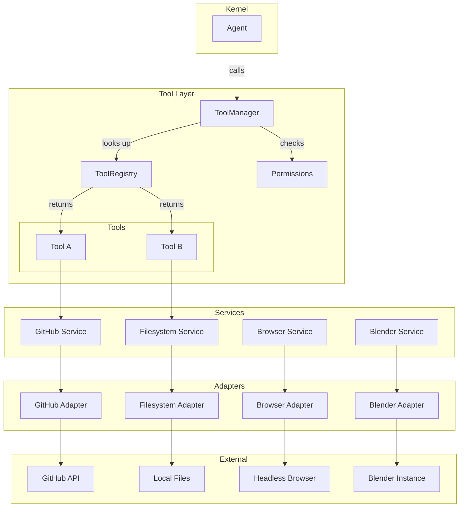
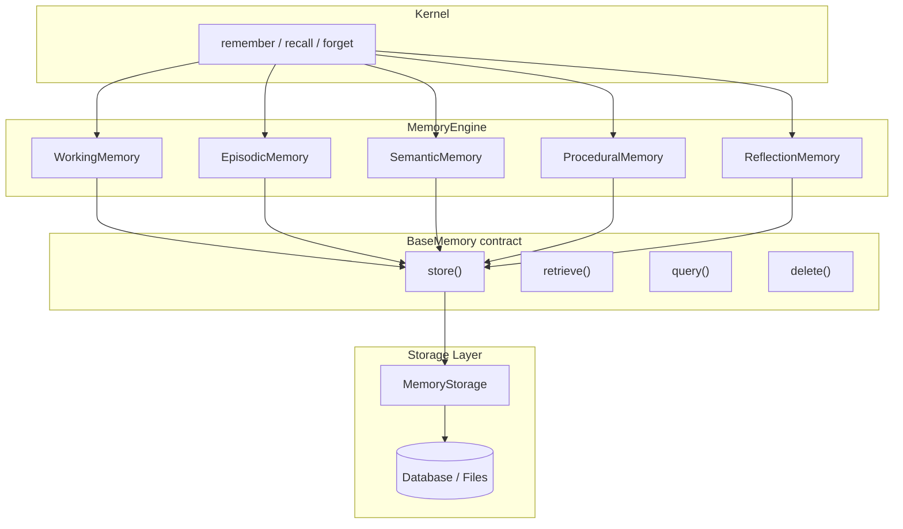
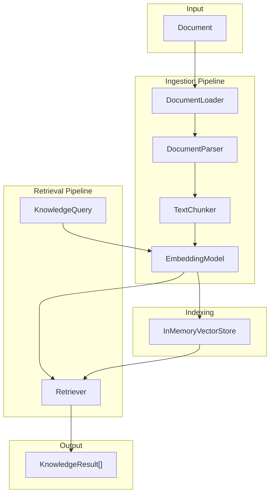
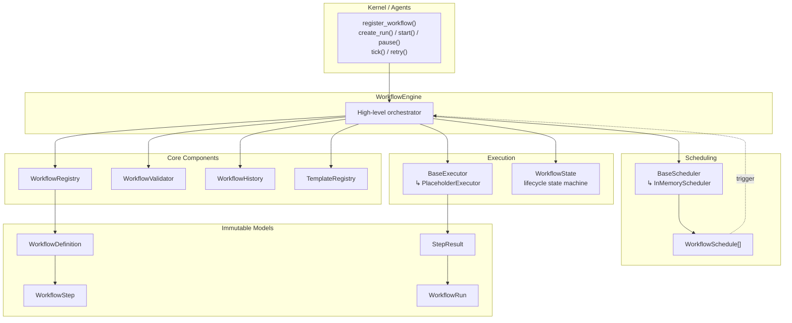
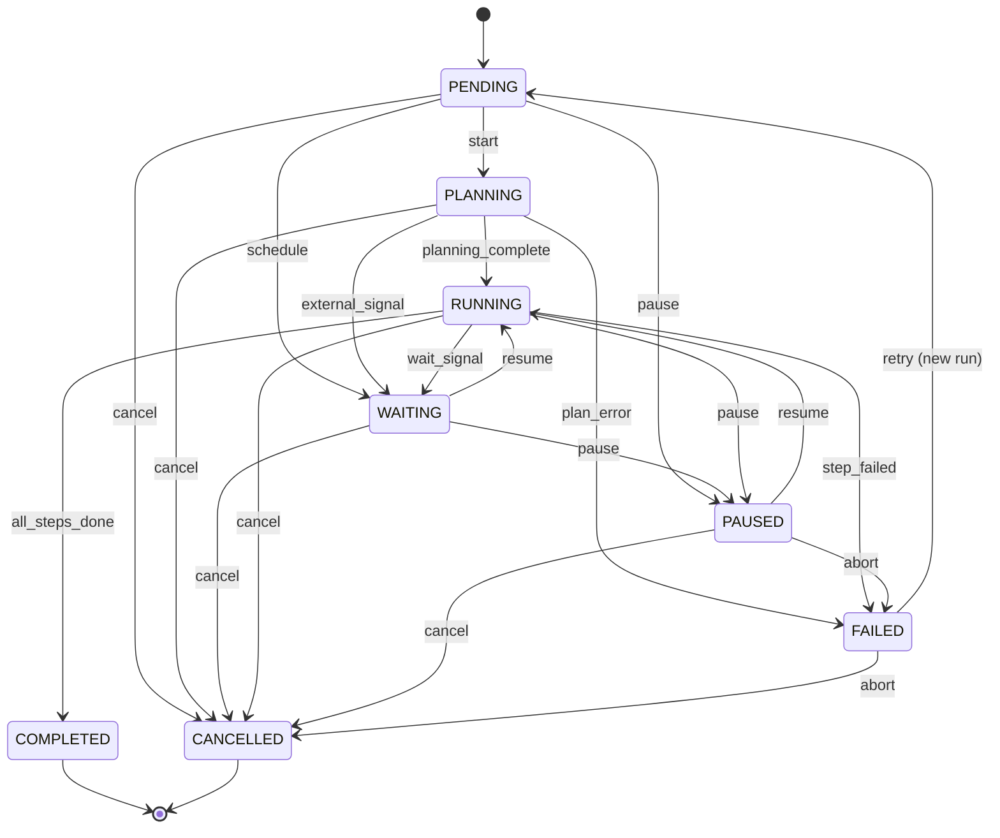
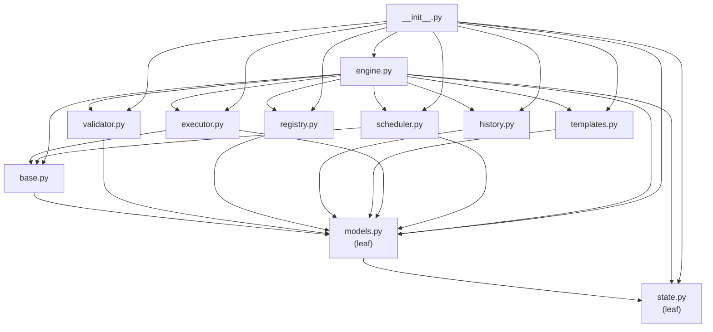
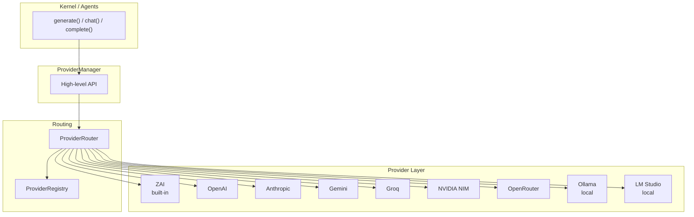

# Atlas AI Operating System

**Atlas** is an AI Operating System — a structured framework that gives an artificial intelligence a persistent identity, a governed set of principles, organized memory, curated knowledge, reusable workflows, and a controlled library of tools.

Atlas is not a single model or a chatbot. It is the *operating layer* through which an AI agent perceives, remembers, reasons, and acts with continuity across sessions and tasks.

---

## Purpose

Most AI interactions are stateless: each conversation begins from nothing, and everything learned is forgotten when the session ends. Atlas solves this by providing:

- **Identity** — a stable sense of who Atlas is and how it operates.
- **Principles** — the rules and values that govern every decision.
- **Memory** — a structured record of past work, decisions, and context.
- **Knowledge** — a curated, retrievable library of reference material.
- **Workflows** — repeatable processes for common tasks.
- **Tools** — a controlled set of capabilities Atlas can invoke.

Together, these form a coherent operating environment in which an AI can work with the consistency, accountability, and depth of a real system.


## Repository Structure

```
atlas/
├── core/          # Kernel architecture + identity & principles
│   ├── kernel.py      # Orchestrates every request end-to-end
│   ├── planner.py     # Converts goals into executable tasks
│   ├── router.py      # Selects the correct agent for each task
│   ├── state.py       # Represents the current execution state
│   ├── context.py     # Bundles request + memory + knowledge + config
│   └── session.py     # Tracks one execution from start to finish
├── agents/        # Agent definitions and role configurations
├── providers/     # Provider Layer (LLM abstraction + routing + 9 providers)
│   ├── manager.py     # High-level facade: generate/chat/complete/health
│   ├── router.py      # Selects provider (auto/manual/fallback/round_robin)
│   ├── registry.py    # Catalog of providers with duplicate detection
│   ├── base.py        # Abstract BaseProvider contract
│   ├── models.py      # ProviderRequest, ProviderResponse, ProviderInfo
│   ├── openai.py      # OpenAI placeholder
│   ├── anthropic.py   # Anthropic placeholder
│   ├── gemini.py      # Google Gemini placeholder
│   ├── groq.py        # Groq placeholder
│   ├── nvidia.py      # NVIDIA NIM placeholder
│   ├── openrouter.py  # OpenRouter placeholder
│   ├── ollama.py      # Ollama (local) placeholder
│   ├── lmstudio.py    # LM Studio (local) placeholder
│   └── zai.py         # ZAI (built-in) placeholder
├── memory/        # Memory Engine (5 stores + engine + storage interface)
│   ├── engine.py      # Orchestrates all memory stores
│   ├── base.py        # Abstract BaseMemory contract
│   ├── models.py      # MemoryEntry, MemoryQuery, MemoryCategory, MemoryPriority
│   ├── storage.py     # Abstract persistence backend interface
│   ├── working.py     # Short-lived task-scoped scratch space
│   ├── episodic.py    # Chronological log of past experiences
│   ├── semantic.py    # Long-term knowledge and factual recall
│   ├── procedural.py  # Procedures, workflows, and methods
│   └── reflection.py  # Self-assessment and meta-cognition
├── knowledge/     # Knowledge Engine (ingest, chunk, embed, retrieve)
│   ├── engine.py      # Orchestrates ingestion & retrieval pipeline
│   ├── base.py        # Abstract KnowledgeStore contract
│   ├── models.py      # KnowledgeDocument, KnowledgeChunk, KnowledgeQuery, KnowledgeResult
│   ├── storage.py     # Abstract persistence backend interface
│   ├── store.py       # InMemoryKnowledgeStore (concrete)
│   ├── loader.py      # Document loader (TXT, Markdown, PDF placeholder)
│   ├── parser.py      # Text extractor (plain, Markdown, future PDF/HTML)
│   ├── chunker.py     # Text chunker with configurable size & overlap
│   ├── embeddings.py  # Embedding model + HashingEmbedder placeholder
│   ├── vectorstore.py # InMemoryVectorStore (brute-force cosine search)
│   └── retriever.py   # Query → Embed → Search → Top-K pipeline
├── workflows/     # Workflow Engine (definitions, runs, scheduling, templates)
│   ├── engine.py      # Orchestrates registration, runs, schedules, and templates
│   ├── base.py        # Abstract BaseExecutor and BaseScheduler contracts
│   ├── models.py      # WorkflowStep, WorkflowDefinition, WorkflowRun, WorkflowSchedule
│   ├── state.py       # WorkflowState lifecycle enum and transition table
│   ├── validator.py   # Definition validation with cycle detection
│   ├── registry.py    # Workflow definition catalog with duplicate detection
│   ├── history.py     # Append-only run snapshot store
│   ├── executor.py    # PlaceholderExecutor with deterministic built-in actions
│   ├── scheduler.py   # InMemoryScheduler (one_time / interval / cron)
│   └── templates.py   # Reusable workflow templates and TemplateRegistry
├── prompts/       # Reusable prompt templates
├── tools/         # Tool System (registry, manager, permissions, adapters, services)
│   ├── base.py        # Abstract BaseTool contract
│   ├── registry.py    # Tool catalog with lookup by name
│   ├── manager.py     # Permission-gated dispatch gateway
│   ├── permissions.py # DENY/USE/CONFIGURE/ADMIN permission model
│   ├── result.py      # ToolResult dataclass (success/error/metadata)
│   ├── adapters/      # Connectors to external systems
│   │   ├── github.py      # GitHub API adapter
│   │   ├── filesystem.py  # Filesystem adapter
│   │   ├── browser.py     # Browser automation adapter
│   │   └── blender.py     # Blender 3D adapter
│   └── services/      # Domain logic wrappers
│       ├── github.py      # GitHub domain service
│       ├── filesystem.py  # Filesystem domain service
│       ├── browser.py     # Browser domain service
│       └── blender.py     # Blender domain service
└── configs/       # System configuration files

docs/              # Architecture and design documentation
tests/             # Validation and behavioral tests
```


## Architecture Overview

Atlas is built around a **Kernel** that orchestrates every request through a clean, stage-based pipeline. Each component has a single responsibility, and a shared **Context** object flows through the system so no component reaches into global state.

### The request pipeline

A user request enters the system and is routed through the following stages:

1. **Kernel** — the orchestrator. It receives the raw request, builds a `Context`, opens a `Session`, and drives the pipeline.
2. **Planner** — decomposes the goal into an ordered list of executable `Task` objects.
3. **Router** — examines each task and selects the agent best suited to execute it.
4. **Agent** — carries out the assigned task using its specialized capabilities.
5. **Tool Manager** — the controlled gateway through which agents invoke external capabilities (filesystem, web, code execution, etc.).
6. **MCP Servers** — the external services that fulfill tool calls (Model Context Protocol servers, APIs, databases, etc.).

Two cross-cutting concerns support every stage:
- **Context** — bundles the user request, configuration, memory, and knowledge handles into one object passed through the system.
- **State** — tracks the lifecycle phase of the request (`pending → planning → routing → executing → reviewing → completed`).

### Pipeline diagram


### Kernel components at a glance

| Component | Responsibility |
|-----------|----------------|
| `Kernel` | Orchestrates every request from intake to completion. |
| `Planner` | Converts a goal into a sequence of executable `Task` objects. |
| `Router` | Chooses the correct agent for each task. |
| `State` | Represents the current execution phase and history. |
| `Context` | Carries request + memory + knowledge + config through the pipeline. |
| `Session` | Tracks one execution from start to finish. |


## Atlas Tool Layer

The Tool Layer is the controlled gateway through which agents invoke external capabilities. It is built on a three-tier architecture: **tools** (what agents call) sit on top of **services** (domain logic) which are connected to the outside world by **adapters** (transports / MCP connectors). Every call passes through a permission gate before reaching the underlying service.

### Architecture



### Component responsibility table

| Component | Responsibility |
|-----------|----------------|
| `BaseTool` | Abstract contract every concrete tool implements (`name`, `execute`). |
| `ToolResult` | Structured result carrying `success`, `output`, `error`, and `metadata`. |
| `ToolRegistry` | Catalog of registered tools; lookup by name; duplicate prevention. |
| `ToolManager` | Dispatch gateway; enforces permission checks before every invocation. |
| `Permissions` | `DENY` / `USE` / `CONFIGURE` / `ADMIN` model with per-tool grants. |
| `BaseService` | Abstract domain-logic wrapper (`connect`, `disconnect`, `is_connected`). |
| `BaseAdapter` | Abstract transport connector bridging a service to an external system. |

### Execution flow

1. **Agent calls a tool by name** through the `ToolManager`.
2. **Manager checks the `Permissions` model** — if the caller lacks the required level, a `ToolResult.fail` is returned immediately.
3. **Manager looks up the tool in the `ToolRegistry`** — if the tool is not registered, a `ToolResult.fail` is returned.
4. **Tool executes** against its `BaseService`, which holds the domain logic.
5. **Service communicates through its `BaseAdapter`** to the external system (GitHub API, filesystem, browser, Blender) or an MCP server.
6. **`ToolResult` flows back** through the manager to the agent and ultimately the Kernel.

Every stage returns a `ToolResult`, so the pipeline is uniform whether the outcome is success, permission denial, unknown tool, or an unexpected exception.


## Atlas Memory Engine

The Memory Engine gives Atlas five specialised memory stores — each modelled after a distinct cognitive function — orchestrated by a single `MemoryEngine`. Every store implements the `BaseMemory` contract and can optionally be backed by a swappable `MemoryStorage` persistence layer. The engine provides a high-level `remember` / `recall` / `forget` API so the Kernel never needs to know which store it is addressing.

### Memory hierarchy

| Store | Analogy | Retention | Purpose |
|-------|---------|-----------|---------|
| **Working** | Scratchpad | Session-scoped, evicts at capacity | Holds the immediate context for the current task. |
| **Episodic** | Journal | Permanent, append-first | Chronological log of conversations, events, and daily entries. |
| **Semantic** | Encyclopedia | Permanent | Long-term facts, domain knowledge, and reference material. |
| **Procedural** | Playbook | Permanent | Workflows, methods, and step-by-step procedures. |
| **Reflection** | Mirror | Permanent, newest-first | Self-assessments, lessons learned, and improvement notes. |

### Architecture



### Component table

| Component | Responsibility |
|-----------|----------------|
| `MemoryEngine` | High-level orchestrator owning all five stores; exposes `remember`, `recall`, `forget`. |
| `BaseMemory` | Abstract contract (`store`, `retrieve`, `query`, `delete`) every store implements. |
| `WorkingMemory` | Fast, bounded scratch space with automatic eviction at capacity. |
| `EpisodicMemory` | Append-only chronological log with `recent()` for newest-first access. |
| `SemanticMemory` | Long-term knowledge store (tag and text search; future vector embedding support). |
| `ProceduralMemory` | Procedure and workflow repository (tag and text search). |
| `ReflectionMemory` | Self-assessment store with `lessons()` helper for retrospective queries. |
| `MemoryEntry` | Dataclass: `id`, `category`, `content`, `source`, `tags`, `priority`, `timestamp`. |
| `MemoryQuery` | Structured query: `text`, `tags`, `category`, `since`, `until`, `limit`. |
| `MemoryStorage` | Abstract persistence backend (swappable: SQLite, filesystem, PostgreSQL, etc.). |

### Execution lifecycle

1. **Kernel calls `engine.remember(content, category, tags)`** — the engine delegates to the appropriate store.
2. **Store creates a `MemoryEntry`** with a unique id, timestamp, and category.
3. **If a `MemoryStorage` is configured**, the entry is also persisted to the storage backend.
4. **On recall**, the engine queries the specified store (or all stores) and returns matching `MemoryEntry` objects ordered by timestamp.
5. **On forget**, the engine removes the entry from the store and from storage.

Every store can operate purely in-memory when no storage backend is injected, making the system immediately testable and usable without external dependencies.


## Atlas Knowledge Engine

The Knowledge Engine is Atlas's document intelligence pipeline. It ingests raw documents, parses them into clean text, splits them into chunks, generates embeddings, indexes them in a vector store, and retrieves the most relevant chunks for any given query. Every stage is dependency-injected so the engine can be upgraded (e.g. HashingEmbedder → OpenAI, InMemoryVectorStore → Chroma) without changing pipeline code.

### Architecture



### Component table

| Component | Responsibility |
|-----------|----------------|
| `KnowledgeEngine` | Top-level orchestrator. Public API: `ingest()`, `search()`, `remove()`, `count()`. |
| `DocumentLoader` | Reads files (TXT, Markdown) or raw text → `KnowledgeDocument`. |
| `DocumentParser` | Extracts clean text from documents (strips Markdown noise). |
| `TextChunker` | Splits documents into overlapping `KnowledgeChunk` objects. |
| `EmbeddingModel` | Abstract contract for embedding text → vectors. |
| `HashingEmbedder` | Deterministic placeholder embedder for testing. |
| `InMemoryVectorStore` | Brute-force cosine similarity search over chunk embeddings. |
| `InMemoryKnowledgeStore` | Concrete store holding documents, chunks, and embeddings. |
| `Retriever` | Query → Embed → Vector Search → Tag/Score Filter → Top-K. |
| `KnowledgeStorage` | Abstract persistence backend (swappable). |

### Execution lifecycle

**Ingestion:**
1. **Load** — `DocumentLoader` reads a file or accepts raw text, producing a `KnowledgeDocument`.
2. **Parse** — `DocumentParser` extracts clean text, stripping formatting noise.
3. **Chunk** — `TextChunker` splits the text into overlapping chunks of configurable size.
4. **Embed** — `EmbeddingModel` converts each chunk into a vector.
5. **Index** — `InMemoryVectorStore` stores the embeddings for retrieval.

**Retrieval:**
1. **Query** — A `KnowledgeQuery` with text, optional tags, and `top_k`.
2. **Embed** — The query text is embedded into the same vector space as the chunks.
3. **Search** — Cosine similarity finds the closest chunks in the vector store.
4. **Filter** — Results are filtered by required tags and minimum score.
5. **Return** — Up to `top_k` `KnowledgeResult` objects, each pairing a chunk with its parent document and a relevance score.

### Future backends

The `InMemoryVectorStore` is the default for testing and small datasets. It can be replaced with production-grade backends that implement the same interface:

- **Chroma** — local vector database with built-in embedding support
- **FAISS** — Facebook's efficient similarity search library
- **Qdrant** — high-performance vector search engine
- **Milvus** — scalable vector database for production workloads


## Atlas Workflow Engine

The Workflow Engine is Atlas's provider-agnostic orchestration framework. It lets you define reusable workflows as immutable dataclasses, register them, validate them, execute them as runs with full lifecycle control (start / pause / resume / retry / cancel), schedule them on a cadence, and replay any run's history snapshot-by-snapshot. Every dependency — executor, scheduler, history, validator, registry, templates — is injected through abstract base classes with deterministic placeholder defaults, so the engine works out-of-the-box with zero external resources and can be upgraded component-by-component without touching orchestration code.

### Architecture



### Workflow lifecycle

Every workflow run moves through an explicit state machine. Transitions are validated against a fixed transition table; illegal moves raise `InvalidStateTransitionError`. Terminal states cannot be left except that a `FAILED` run can be retried (which produces a *new* run in the `PENDING` state with `parent_run_id` pointing back to the original).



| State | Description | Terminal? |
|-------|-------------|-----------|
| `PENDING` | Run created but not started. | No |
| `PLANNING` | Engine is preparing execution. | No |
| `WAITING` | Run is blocked on an external signal or scheduled time. | No |
| `RUNNING` | Run is actively executing steps. | No |
| `PAUSED` | Execution suspended; may be resumed. | No |
| `COMPLETED` | All steps finished successfully. | Yes |
| `FAILED` | A required step failed. Retriable. | Yes |
| `CANCELLED` | Operator cancelled the run. | Yes |

### Component table

| Component | Responsibility |
|-----------|----------------|
| `WorkflowEngine` | Top-level orchestrator. Owns registry, executor, scheduler, history, validator, and templates. Public API: `register_workflow`, `create_run`, `start`, `pause`, `resume`, `retry`, `cancel`, `tick`, `register_schedule`, `instantiate_template`. |
| `WorkflowState` | Eight-state lifecycle enum (`pending`, `planning`, `waiting`, `running`, `paused`, `completed`, `failed`, `cancelled`). |
| `WorkflowStep` | Immutable dataclass: `id`, `name`, `action`, `params`, `depends_on`, `optional`. |
| `WorkflowDefinition` | Immutable workflow definition: `id`, `name`, `version`, `steps`, `inputs`, `outputs`, `metadata`. |
| `WorkflowRun` | Immutable run snapshot. Tracks state, inputs, step results, transitions, timing, attempts, and parent run. Updated via `dataclasses.replace`. |
| `StepResult` | Outcome of a single step: `step_id`, `success`, `output`, `error`, `started_at`, `completed_at`. |
| `WorkflowSchedule` | Schedule that triggers a workflow: `kind` (one_time / interval / cron), `next_run_at`, `inputs`, `enabled`. |
| `StateTransition` | Recorded state change: `from_state`, `to_state`, `timestamp`, `reason`. |
| `BaseExecutor` | Abstract contract: `execute_step(step, context) -> StepResult`. |
| `PlaceholderExecutor` | Deterministic default executor with built-in `noop`, `echo`, `fail`, `wait`, `sleep` actions. Custom actions injectable. |
| `BaseScheduler` | Abstract contract: `register`, `unregister`, `get`, `all`, `due`, `mark_run`. |
| `InMemoryScheduler` | Deterministic in-memory scheduler supporting one_time, interval, and (placeholder) cron triggers. |
| `WorkflowValidator` | Validates definitions: non-empty ids, unique step ids, dependency integrity, cycle detection. |
| `WorkflowRegistry` | In-memory catalog of registered definitions. Duplicate detection via `ValueError`. |
| `WorkflowHistory` | Append-only run snapshot store. Lookup by run id, workflow id, or recency. |
| `WorkflowTemplate` | Parameterised factory: `builder(params) -> WorkflowDefinition`. |
| `TemplateRegistry` | Catalog of registered templates with `instantiate(id, **params)`. |
| `WaitSignal` | Marker output that triggers a `RUNNING -> WAITING` transition. |

### Dependency graph (acyclic)

The workflows package has zero circular imports. Modules form a strict DAG:



### Execution lifecycle

1. **Register** — `engine.register_workflow(definition)` validates the definition and adds it to the registry. Duplicate ids are rejected.
2. **Create run** — `engine.create_run(workflow_id, inputs)` produces a new `WorkflowRun` in the `PENDING` state, recorded in history.
3. **Start** — `engine.start(run_id)` transitions `PENDING -> PLANNING -> RUNNING` (or resumes from `PAUSED`/`WAITING`) and executes steps in dependency order. Between steps the engine checks for pause requests, `WaitSignal` outputs, and step failures.
4. **Pause / Resume** — `engine.pause(run_id)` transitions to `PAUSED` (or sets a pause-request flag if currently `RUNNING`). `engine.resume(run_id)` restarts execution from the next step.
5. **Retry** — `engine.retry(run_id)` creates a *new* run with `parent_run_id` pointing at the failed original. The new run inherits inputs and increments `attempts`.
6. **Cancel** — `engine.cancel(run_id)` transitions any non-terminal run to `CANCELLED`.
7. **Schedule** — `engine.register_schedule(schedule)` registers a cadence. `engine.tick(now)` fires every due schedule, creates a run, starts it, and advances the schedule's `next_run_at`.

Every state change produces a new immutable `WorkflowRun` snapshot recorded in `WorkflowHistory`. The full trajectory of any run can be replayed via `history.trajectory(run_id)`.

### Execution examples

**Minimal end-to-end run:**

```python
from atlas.workflows import (
    WorkflowEngine, WorkflowDefinition, WorkflowStep,
)

engine = WorkflowEngine()

definition = WorkflowDefinition(
    id="hello_world",
    name="Hello World",
    steps=[
        WorkflowStep(id="greet", name="Greet", action="noop"),
        WorkflowStep(id="echo", name="Echo", action="echo",
                     params={"msg": "hello"}, depends_on=["greet"]),
    ],
)
engine.register_workflow(definition)

run = engine.create_run("hello_world")
run = engine.start(run.id)
assert run.state.value == "completed"
assert set(run.step_results) == {"greet", "echo"}
```

**Pause mid-execution:**

```python
run = engine.create_run("hello_world")
run = engine.start(run.id, max_steps=1)   # one step, then PAUSED
assert run.state.value == "paused"
run = engine.resume(run.id)                # finish remaining steps
assert run.state.value == "completed"
```

**Retry a failed run:**

```python
failing = WorkflowDefinition(
    id="failing",
    name="Failing",
    steps=[WorkflowStep(id="boom", name="Boom", action="fail",
                        params={"message": "kaboom"})],
)
engine.register_workflow(failing)

run = engine.create_run("failing")
run = engine.start(run.id)
assert run.state.value == "failed"

retry = engine.retry(run.id)               # new PENDING run
assert retry.parent_run_id == run.id
assert retry.attempts == 2
```

**Scheduled execution:**

```python
from datetime import datetime, timedelta, UTC
from atlas.workflows import WorkflowSchedule, ScheduleKind

run_at = datetime(2026, 1, 1, 12, 0, tzinfo=UTC)
engine.register_schedule(WorkflowSchedule(
    id="daily_ping",
    workflow_id="hello_world",
    kind=ScheduleKind.ONE_TIME,
    run_at=run_at,
))

started = engine.tick(now=run_at + timedelta(minutes=1))
assert len(started) == 1
assert started[0].state.value == "completed"
```

**Reusable template:**

```python
from atlas.workflows import linear_template

template = linear_template(
    template_id="ping_chain",
    name="Ping Chain",
    actions=[("a", "noop"), ("b", "noop"), ("c", "noop")],
)
engine.templates.register(template)

definition = engine.instantiate_template("ping_chain")
run = engine.start(engine.create_run(definition.id).id)
assert run.state.value == "completed"
```

**Custom executor (dependency injection):**

```python
from atlas.workflows import WorkflowEngine, PlaceholderExecutor

def add(params, context):
    return params["x"] + params["y"]

def multiply(params, context):
    return context[params["source"]] * params["factor"]

executor = PlaceholderExecutor(actions={"add": add, "mul": multiply})
engine = WorkflowEngine(executor=executor)
```

Any concrete `BaseExecutor` — calling a tool, an LLM provider, a remote service — can be injected the same way without changing engine code.


## Atlas Provider Layer

The Provider Layer abstracts every LLM behind a single interface so Atlas can dynamically switch between providers without changing business logic. Each provider implements the `BaseProvider` contract; the `ProviderManager` exposes a high-level API (`generate`, `chat`, `complete`) that routes to the right provider via the `ProviderRouter` and `ProviderRegistry`.

### Provider abstraction

Every provider — whether a cloud giant (OpenAI, Anthropic) or a local runtime (Ollama, LM Studio) — implements the same four methods: `generate`, `stream`, `health`, `available_models`. This means Atlas's business logic is **provider-agnostic**: the Kernel never knows or cares which model produced a response. Swapping providers is a config change, not a code change.

### Architecture



### Component table

| Component | Responsibility |
|-----------|----------------|
| `ProviderManager` | High-level facade. Exposes `generate`, `chat`, `complete`, `health`, `list_models`. Depends only on the Router. |
| `ProviderRouter` | Selects the correct provider. Strategies: `auto`, `manual`, `fallback`, `round_robin`. Filters by availability, priority, capabilities. |
| `ProviderRegistry` | Catalog of providers. Supports `register`, `unregister`, `get`, `contains`, `names`, `default`. Duplicate detection via `ValueError`. |
| `BaseProvider` | Abstract contract every provider implements: `generate`, `stream`, `health`, `available_models`, `name`. |
| `ProviderInfo` | Static metadata: name, display name, base URL, priority, cost, capabilities. |
| `ProviderCapability` | Declares streaming, tools, images, system-prompt support. |
| `ProviderRequest` | Immutable request: prompt, messages, model, temperature, max_tokens, tools, images, streaming, metadata, UUID, timestamp. |
| `ProviderResponse` | Immutable response: text, model, provider, finish_reason, usage, metadata, UUID, timestamp. |

### Routing

The router supports four strategies, all of which respect availability and capability requirements:

- **`auto`** — picks the available provider with the lowest `priority` number. Default strategy.
- **`manual`** — uses an explicitly named provider; returns `None` if unavailable.
- **`fallback`** — tries a list of provider names in order, returning the first available one.
- **`round_robin`** — rotates through eligible providers, distributing load evenly.

**Fallback example:** if the default provider goes down, the manager automatically routes to the next available provider in the registry — the caller sees no error. This is what makes Atlas resilient: a provider outage degrades gracefully rather than failing the request.

### Future local AI

Two providers — **Ollama** and **LM Studio** — are designed for fully local execution. They run models on the user's own hardware with zero per-token cost and no data leaving the machine. The Provider Layer treats them identically to cloud providers, so Atlas can operate in a **fully air-gapped mode** by registering only local providers. This is foundational to Atlas's commitment to operator sovereignty: the choice of where intelligence runs belongs to the operator, not the platform.


## Getting Started

1. **Read the identity.** Start with [`atlas/core/Identity.md`](atlas/core/Identity.md) to understand who Atlas is.
2. **Read the principles.** Then [`atlas/core/Principles.md`](atlas/core/Principles.md) to understand how Atlas operates.
3. **Load the configuration.** Review [`atlas/configs/atlas.yaml`](atlas/configs/atlas.yaml) for system-wide settings.
4. **Explore the layers.** Walk through `memory/`, `knowledge/`, `workflows/`, and `tools/` to see how Atlas is equipped.


## Design Philosophy

Atlas is built on three convictions:

1. **Continuity is a feature, not a luxury.** An AI that forgets is an AI that cannot grow. Memory is first-class.
2. **Governance precedes capability.** Power without principles is risk. Every tool and workflow is bounded by defined rules.
3. **Structure enables intelligence.** A well-organized environment lets an AI act with precision. Chaos at the foundation produces chaos at the output.


## Status

This repository contains the foundational architecture. Capabilities are added incrementally as the system matures.

---

*Atlas AI Operating System — giving AI a place to think, remember, and act.*
