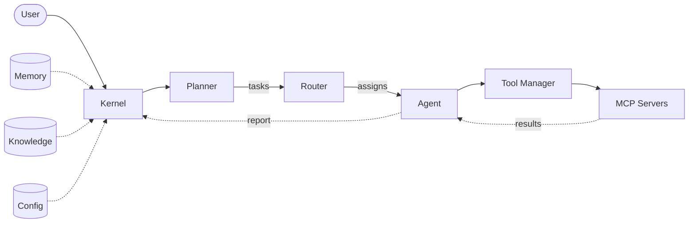

# Atlas AI Operating System

**Atlas** is an AI Operating System — a structured framework that gives an artificial intelligence a persistent identity, a governed set of principles, organized memory, curated knowledge, reusable workflows, and a controlled library of tools.

Atlas is not a single model or a chatbot. It is the *operating layer* through which an AI agent perceives, remembers, reasons, and acts with continuity across sessions and tasks.

---

## Purpose

Most AI interactions are stateless: each conversation begins from nothing, and everything learned is forgotten when the session ends. Atlas solves this by providing:

- **Identity** — a stable sense of who Atlas is and how it operates.
- **Principles** — the rules and values that govern every decision.
- **Memory** — a structured record of past work, decisions, and context.
- **Knowledge** — a curated, retrievable library of reference material.
- **Workflows** — repeatable processes for common tasks.
- **Tools** — a controlled set of capabilities Atlas can invoke.

Together, these form a coherent operating environment in which an AI can work with the consistency, accountability, and depth of a real system.


## Repository Structure

```
atlas/
├── core/          # Kernel architecture + identity & principles
│   ├── kernel.py      # Orchestrates every request end-to-end
│   ├── planner.py     # Converts goals into executable tasks
│   ├── router.py      # Selects the correct agent for each task
│   ├── state.py       # Represents the current execution state
│   ├── context.py     # Bundles request + memory + knowledge + config
│   └── session.py     # Tracks one execution from start to finish
├── agents/        # Agent definitions and role configurations
├── memory/        # Persistent memory (conversations, daily, weekly, monthly)
├── knowledge/     # Curated reference material and retrieval config
├── workflows/     # Repeatable, named processes
├── prompts/       # Reusable prompt templates
├── tools/         # Controlled tool library
└── configs/       # System configuration files

docs/              # Architecture and design documentation
tests/             # Validation and behavioral tests
```


## Architecture Overview

Atlas is built around a **Kernel** that orchestrates every request through a clean, stage-based pipeline. Each component has a single responsibility, and a shared **Context** object flows through the system so no component reaches into global state.

### The request pipeline

A user request enters the system and is routed through the following stages:

1. **Kernel** — the orchestrator. It receives the raw request, builds a `Context`, opens a `Session`, and drives the pipeline.
2. **Planner** — decomposes the goal into an ordered list of executable `Task` objects.
3. **Router** — examines each task and selects the agent best suited to execute it.
4. **Agent** — carries out the assigned task using its specialized capabilities.
5. **Tool Manager** — the controlled gateway through which agents invoke external capabilities (filesystem, web, code execution, etc.).
6. **MCP Servers** — the external services that fulfill tool calls (Model Context Protocol servers, APIs, databases, etc.).

Two cross-cutting concerns support every stage:
- **Context** — bundles the user request, configuration, memory, and knowledge handles into one object passed through the system.
- **State** — tracks the lifecycle phase of the request (`pending → planning → routing → executing → reviewing → completed`).

### Pipeline diagram



### Kernel components at a glance

| Component | Responsibility |
|-----------|----------------|
| `Kernel` | Orchestrates every request from intake to completion. |
| `Planner` | Converts a goal into a sequence of executable `Task` objects. |
| `Router` | Chooses the correct agent for each task. |
| `State` | Represents the current execution phase and history. |
| `Context` | Carries request + memory + knowledge + config through the pipeline. |
| `Session` | Tracks one execution from start to finish. |


## Getting Started

1. **Read the identity.** Start with [`atlas/core/Identity.md`](atlas/core/Identity.md) to understand who Atlas is.
2. **Read the principles.** Then [`atlas/core/Principles.md`](atlas/core/Principles.md) to understand how Atlas operates.
3. **Load the configuration.** Review [`atlas/configs/atlas.yaml`](atlas/configs/atlas.yaml) for system-wide settings.
4. **Explore the layers.** Walk through `memory/`, `knowledge/`, `workflows/`, and `tools/` to see how Atlas is equipped.


## Design Philosophy

Atlas is built on three convictions:

1. **Continuity is a feature, not a luxury.** An AI that forgets is an AI that cannot grow. Memory is first-class.
2. **Governance precedes capability.** Power without principles is risk. Every tool and workflow is bounded by defined rules.
3. **Structure enables intelligence.** A well-organized environment lets an AI act with precision. Chaos at the foundation produces chaos at the output.


## Status

This repository contains the foundational architecture. Capabilities are added incrementally as the system matures.

---

*Atlas AI Operating System — giving AI a place to think, remember, and act.*
