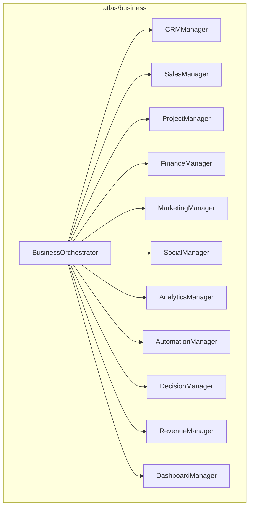
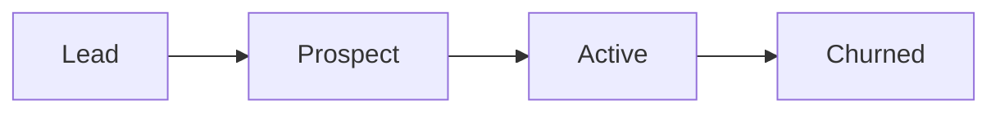
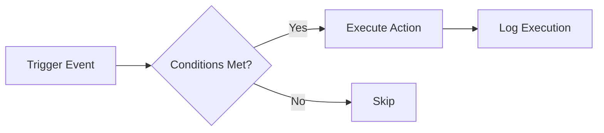

# Atlas Business Operating System (BOS)

## Overview

The `atlas/business/` package transforms Atlas into a complete Business Operating System with customer/CRM, sales, projects, calendar, meetings, communications, finance, marketing, social, SEO, analytics, automation, decision engine, revenue tracking, and executive dashboard.

## Architecture



## CRM Lifecycle



## Automation Flow



## Usage

```python
from atlas.business import BusinessOrchestrator

bo = BusinessOrchestrator()
customer = bo.customers.create("Alice", email="alice@example.com")
deal = bo.sales.create(customer.id, "Deal 1", value=10000)
bo.finance.add_transaction("income", 5000, customer_id=customer.id)
dashboard = bo.dashboard.generate()
```
