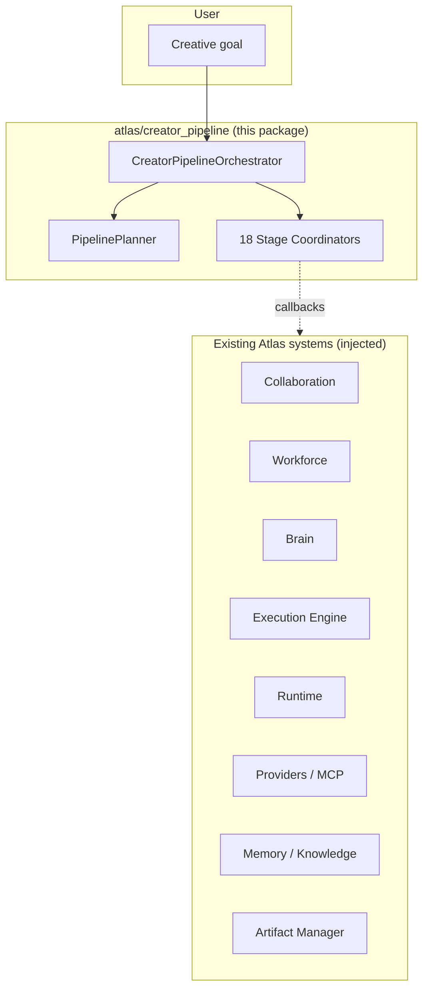
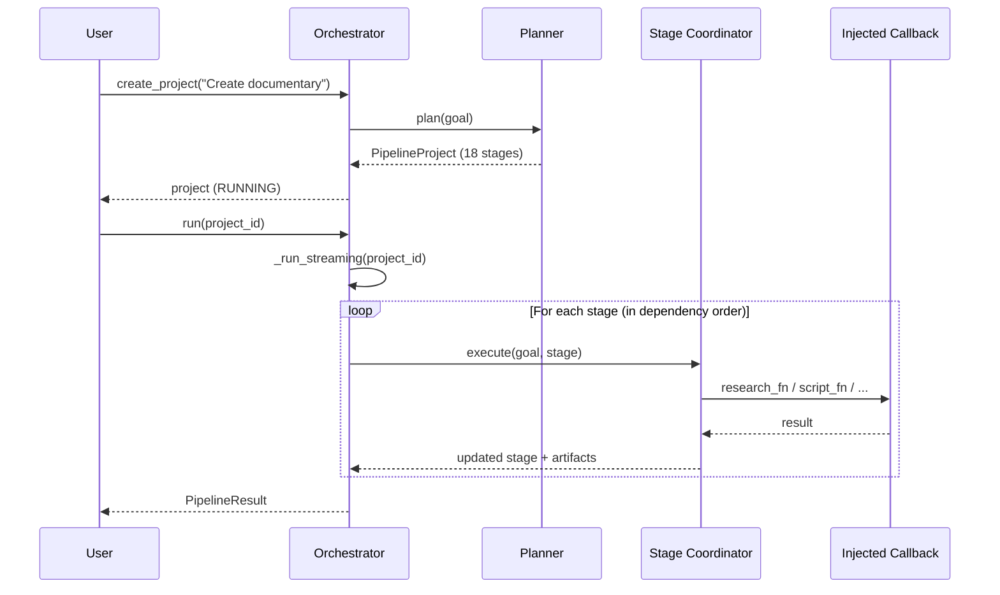
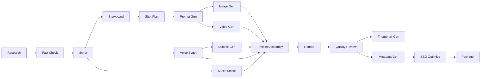
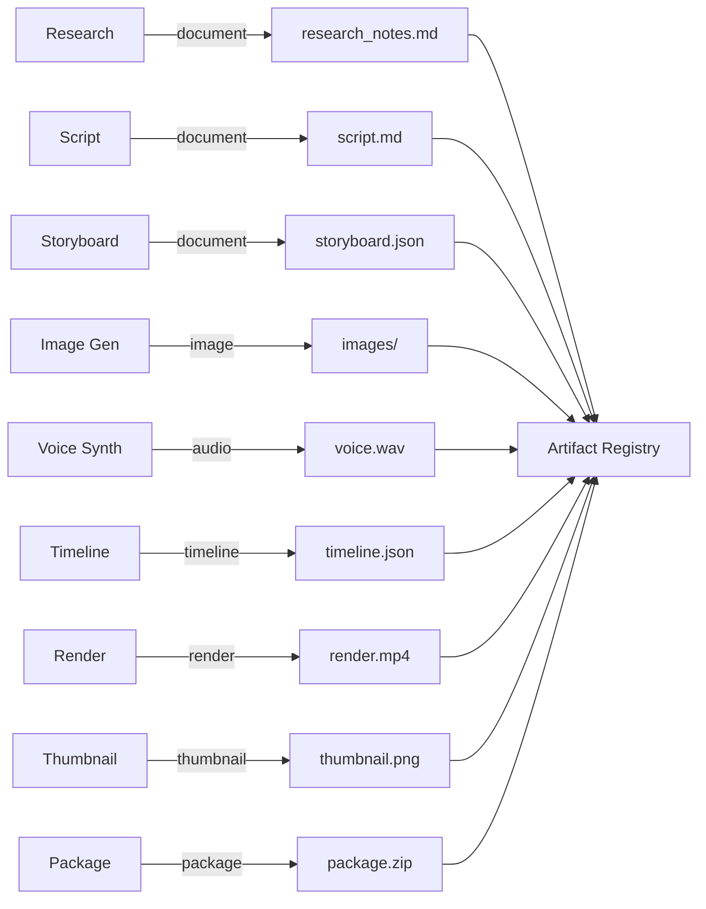
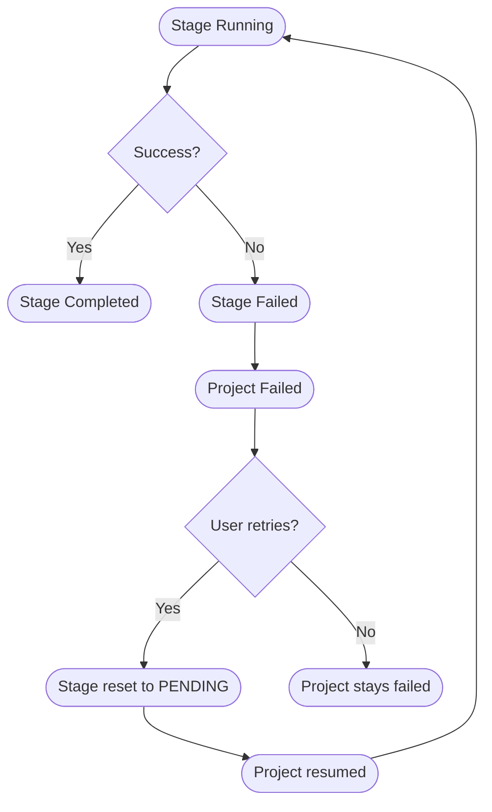

# Atlas Creator AI Pipeline

The `atlas/creator_pipeline/` package is the **autonomous content creation pipeline** that transforms ONE user goal into a complete professional media project.

## Overview

```
"Create a YouTube documentary about SpaceX."
  ↓
Research → Fact Check → Script → Storyboard → Shot Plan →
Prompt Gen → Image Gen → Video Gen → Voice Synth → Music Select →
Subtitle Gen → Timeline Assembly → Render → Quality Review →
Thumbnail Gen → Metadata Gen → SEO Optimize → Package
```

The pipeline sits ABOVE the Collaboration Engine:



## Architecture

The package is split into four layers:

* **Models** (`models.py`) — pure-Python frozen dataclasses and enums. No Atlas subsystem imports.
* **Planner** (`planner.py`) — converts a goal into a dependency-ordered stage graph.
* **Stage Coordinators** (`research.py`, `script.py`, `storyboard.py`, `assets.py`, `voice.py`, `timeline.py`, `render.py`, `review.py`, `publisher.py`) — each coordinator runs one stage via an injected callback.
* **Orchestrator** (`orchestrator.py`) — the top-level facade with `create_project`, `run`, `resume`, `cancel`, `retry`, `export`.

### Dependency injection everywhere

The pipeline NEVER imports Brain, Workforce, Collaboration, or any Atlas subsystem directly. It receives callbacks (`research_fn`, `script_fn`, `image_gen_fn`, etc.) via dependency injection:

```python
from atlas.creator_pipeline import CreatorPipelineOrchestrator

orch = CreatorPipelineOrchestrator(
    research_fn=my_brain.think,       # wire to Brain
    script_fn=my_script_writer,       # wire to Creator Studio
    image_gen_fn=my_image_generator,  # wire to MCP / Provider
    render_fn=my_render_dispatcher,   # wire to HyperFrames/Remotion
)
```

## Execution Flow



## Stage Graph

The default 18-stage pipeline with dependencies:



## Artifact Flow

Each stage produces a `PipelineArtifact` containing an `AssetReference`. Artifacts accumulate across stages and are tracked by the orchestrator:



## Recovery Flow



## Features

* **Parallel stages** — stages with no dependencies on each other run in parallel groups.
* **Dependency graph** — the planner resolves stage dependencies and topologically sorts them.
* **Resume** — `resume_project()` restarts a paused or failed project from where it left off.
* **Checkpointing** — `checkpoint()` captures a `PipelineState` snapshot; `restore()` reloads it.
* **Artifact tracking** — every stage's output is recorded as a `PipelineArtifact`.
* **Streaming events** — `run(project_id, stream=True)` yields events as a generator.
* **Failure recovery** — failed stages can be retried via `retry_stage()`.
* **Quality scoring** — stages record quality scores; the report aggregates them.
* **Cost estimation** — each stage tracks `cost_usd`; the result totals them.
* **Time estimation** — each stage tracks `duration_seconds`; the result totals them.

## Usage

```python
from atlas.creator_pipeline import CreatorPipelineOrchestrator

# Create the orchestrator (all callbacks optional — defaults are deterministic)
orch = CreatorPipelineOrchestrator()

# Create a project
project = orch.create_project("Create a YouTube documentary about SpaceX")
print(f"Project: {project.id} with {len(project.stages)} stages")

# Run the pipeline
result = orch.run(project.id)
print(f"Completed: {result.stages_completed}/{len(project.stages)} stages")
print(f"Artifacts: {result.total_assets}")

# Generate a report
report = orch.generate_report(project.id)
print(f"Quality: {report.result.quality_score:.2f}")

# Export
orch.export_project(project.id)
```

## Test coverage

The package ships **86 dedicated tests** in `tests/test_creator_pipeline.py`, covering:

* All 6 enums and 16+ frozen dataclasses.
* `PipelinePlanner` — planning, stage ordering, dependency resolution, parallel groups.
* All 9 stage coordinators (research, script, storyboard, assets, voice, timeline, render, review, publisher).
* `CreatorPipelineOrchestrator` — create, run, cancel, resume, retry, export, checkpoint, restore, compute_result, compute_metrics, generate_report.
* End-to-end integration (full YouTube documentary, streaming events, checkpointing, multiple projects, failure recovery, retry after failure).
* A no-subsystem-import test that walks the package source to verify no Atlas-subsystem imports.
