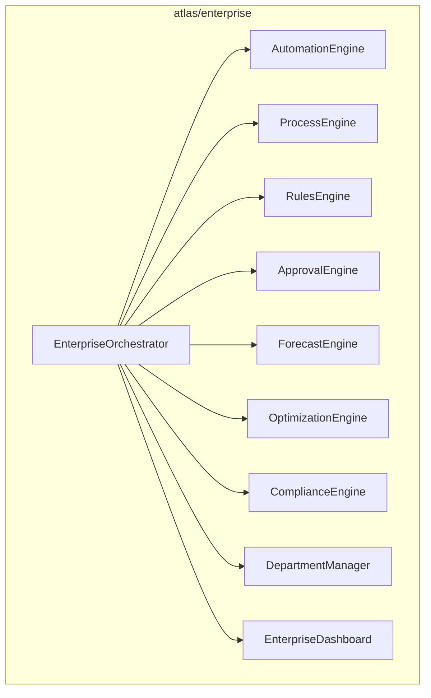
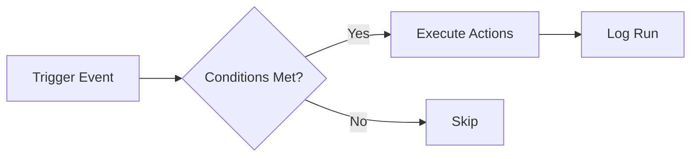
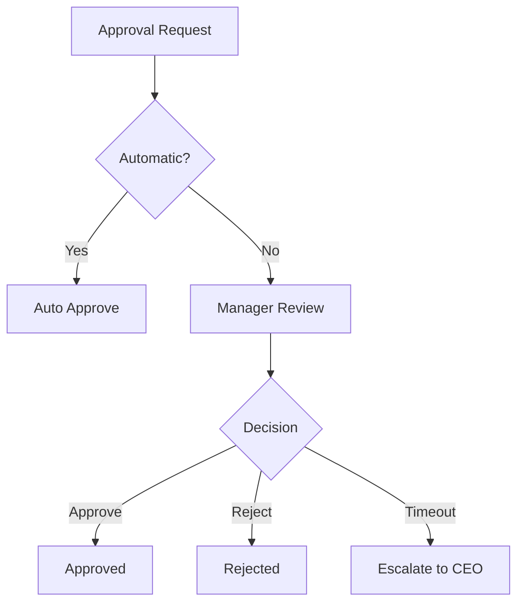

# Atlas Enterprise Automation Platform

## Overview

The `atlas/enterprise/` package sits ABOVE all existing Atlas subsystems and runs an entire company automatically through automation, processes, rules, approvals, forecasts, optimization, compliance, and department management.

## Architecture



## Automation Flow



## Approval Flow



## Usage

```python
from atlas.enterprise import EnterpriseOrchestrator

eo = EnterpriseOrchestrator()
eo.initialize()  # Creates 12 built-in departments

# Create automation
eo.automation.create("Welcome Email", trigger=AutomationTrigger(...))

# Create process
eo.processes.create_process("Sales", stages=("lead", "qualified", "won"))

# Request approval
req = eo.approval.request("Buy servers", type="manager")
eo.approval.approve(req.id, approver="CTO")

# Forecast
fc = eo.forecast.create(type="revenue")
eo.forecast.run(fc.id, historical_data=[100, 120, 140])

# Dashboard
snap = eo.dashboard.snapshot()
```
