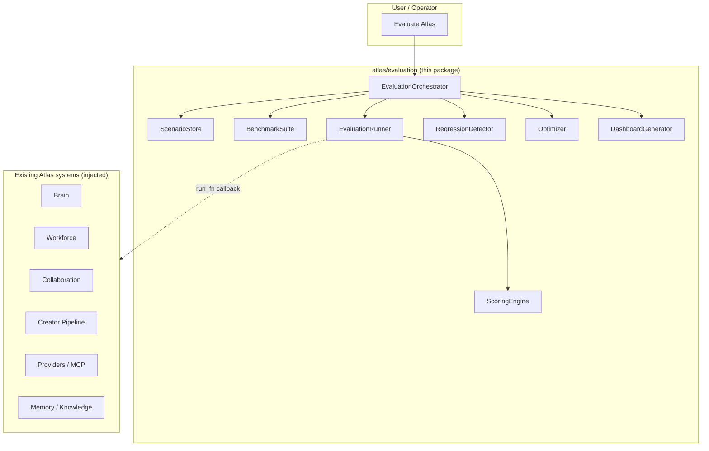
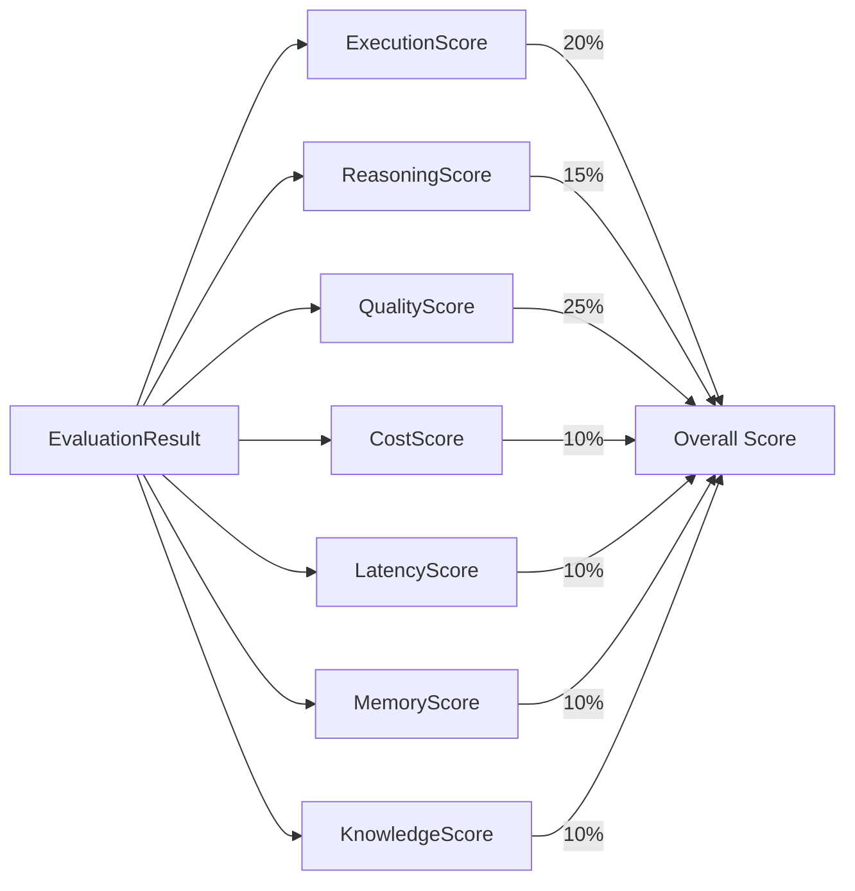
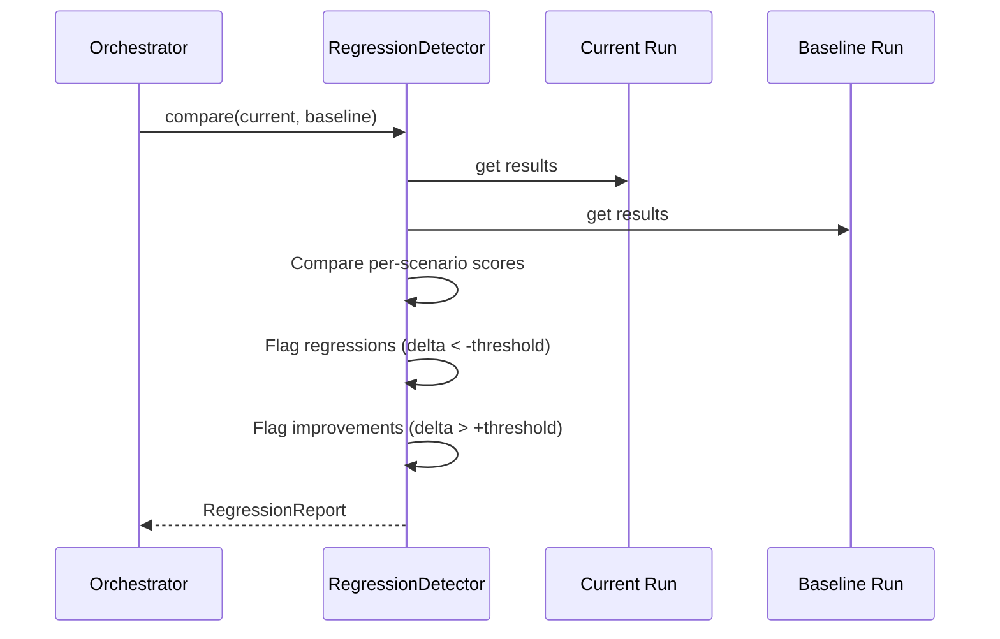
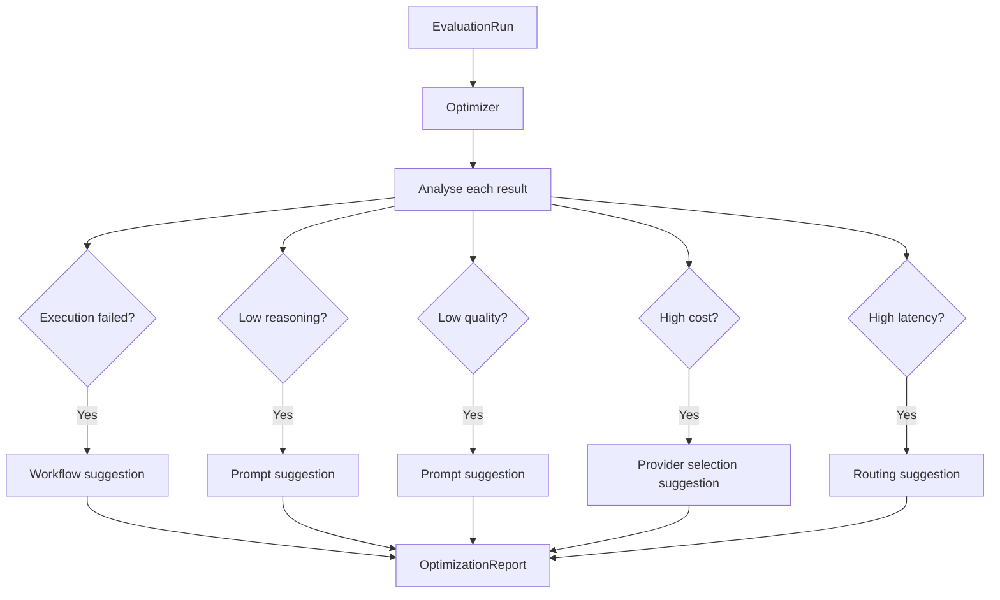

# Atlas Evaluation & Self-Improvement System

The `atlas/evaluation/` package is the **production-grade evaluation and self-improvement system** for Atlas. It sits ABOVE the Brain and Workforce, running repeatable benchmarks, scoring outputs across seven dimensions, detecting regressions between versions, and generating optimization suggestions.

## Overview



## Architecture

The package is split into layers:

* **Models** (`models.py`) — frozen dataclasses and enums. No Atlas subsystem imports.
* **Scenarios** (`scenarios.py`) — `ScenarioStore` with 10 built-in scenarios.
* **Benchmarks** (`benchmark.py`) — `BenchmarkSuite` for named scenario collections.
* **Runner** (`runner.py`) — `EvaluationRunner` executing benchmarks via injected `run_fn`.
* **Scoring** (`scoring.py`) — `ScoringEngine` producing 7-dimensional scores.
* **Regression** (`regression.py`) — `RegressionDetector` comparing runs.
* **Optimizer** (`optimizer.py`) — `Optimizer` generating `ImprovementSuggestion` instances.
* **Dashboard** (`dashboard.py`) — `DashboardGenerator` for UI-ready reports.
* **Orchestrator** (`orchestrator.py`) — `EvaluationOrchestrator` top-level facade.

## Scoring Dimensions



| Dimension | Weight | Metrics |
|-----------|--------|---------|
| Execution | 20% | success, completeness, error count, retry count |
| Reasoning | 15% | coherence, depth, accuracy, step count |
| Quality | 25% | relevance, clarity, completeness, correctness |
| Cost | 10% | tokens in/out, estimated cost, cost efficiency |
| Latency | 10% | duration, first-token time, throughput |
| Memory | 10% | entries stored/recalled, recall accuracy, integration |
| Knowledge | 10% | docs indexed/retrieved, retrieval relevance, citation accuracy |

## Built-in Scenarios

| Category | Scenario |
|----------|----------|
| Website Generation | Landing Page for SaaS |
| Research | Climate Impact of Renewables |
| Video Creation | Blockchain Explainer Animation |
| Coding | REST API for Todo App |
| Mining | Open-Pit Optimization |
| Automation | Data ETL Pipeline |
| Reasoning | Logic Puzzle |
| Collaboration | Multi-Agent Code Review |
| Knowledge | Fact Synthesis |
| Memory | Context Recall |

## Regression Detection



## Improvement Flow



## Usage

```python
from atlas.evaluation import EvaluationOrchestrator

orch = EvaluationOrchestrator()
orch.load_builtin_scenarios()
benchmark = orch.create_full_benchmark()

# Run a benchmark
run = orch.benchmark(benchmark, version="1.0.0")
print(f"Overall score: {run.overall_score:.2f}")

# Generate improvement suggestions
opt = orch.improve(run.id)
for s in opt.suggestions:
    print(f"  [{s.severity}] {s.title}: {s.recommendation}")

# Compare with a previous run
if len(orch.list_runs()) >= 2:
    report = orch.compare(current_run_id, baseline_run_id)
    if report.has_regression:
        print(f"REGRESSION DETECTED: {len(report.regressions)} regressions")

# Generate a dashboard
dash = orch.generate_dashboard(run.id)
```

## Test Coverage

106 dedicated tests in `tests/test_evaluation.py`.
