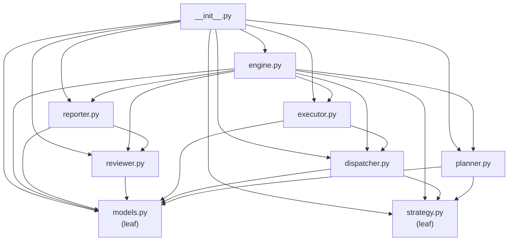

# Atlas Execution Engine

The Execution Engine is the heart of the Atlas AI Operating System. It converts a natural-language goal into an ordered, executable plan, dispatches each task to the appropriate agent / provider / tool / workflow, executes the tasks, reviews the outcomes, and produces a professional execution report.

The engine is **personal** — optimized for one operator, not SaaS, not multi-tenant. It is **provider-agnostic**, **agent-agnostic**, **tool-agnostic**, **workflow-agnostic**, **MCP-ready**, and **fully offline compatible**. Every concrete concern is dependency-injected; the defaults are deterministic placeholders that work out-of-the-box with zero external dependencies.

---

## Architecture

```mermaid
flowchart TB
    Goal([Natural Language Goal]) --> Engine

    subgraph Engine["ExecutionEngine"]
        Planner["ExecutionPlanner<br/>(goal → plan)"]
        Dispatcher["ExecutionDispatcher<br/>(plan → resolutions)"]
        Executor["ExecutionExecutor<br/>(resolutions → results)"]
        Reviewer["ExecutionReviewer<br/>(results → review)"]
        Reporter["ExecutionReporter<br/>(review → report)"]
    end

    subgraph Subsystems["Injected Subsystems (DI)"]
        Providers["ProviderManager"]
        Tools["ToolManager"]
        Workflows["WorkflowEngine"]
        Skills["SkillManager"]
        Memory["MemoryEngine"]
        Knowledge["KnowledgeEngine"]
    end

    subgraph Models["Immutable Models"]
        Plan["ExecutionPlan"]
        Task["ExecutionTask"]
        Result["ExecutionResult"]
        Report["ExecutionReport"]
        Review["ExecutionReview"]
        Context["ExecutionContext"]
    end

    Engine --> Planner
    Planner -->|ExecutionPlan| Dispatcher
    Dispatcher -->|TaskResolution[]| Executor
    Executor -->|ExecutionResult[]| Reviewer
    Reviewer -->|ExecutionReview| Reporter
    Reporter -->|ExecutionReport| Goal2([ExecutionReport])

    Executor -.->|uses| Providers
    Executor -.->|uses| Tools
    Executor -.->|uses| Workflows
    Executor -.->|uses| Skills
    Executor -.->|uses| Memory
    Executor -.->|uses| Knowledge
    Reporter -.->|reads| Memory
    Reporter -.->|reads| Knowledge

    Planner --> Plan
    Plan --> Task
    Executor --> Result
    Reviewer --> Review
    Reporter --> Report
    Engine --> Context
```

## Execution pipeline

The engine runs a fixed five-stage pipeline. Every stage is dependency-injected and replaceable.


1. **Planner** — Converts the natural-language goal into an `ExecutionPlan` (an ordered list of `ExecutionTask` items with dependencies, priority, retry policy, and optional flags).
2. **Dispatcher** — Resolves each task to a `TaskResolution` (agent, provider, tool, workflow, skill, action, params) using capability-based matching against injected registries.
3. **Executor** — Runs each task via the appropriate subsystem (tool / workflow / skill / provider / knowledge / built-in action). Honors retry policies, optional skips, and dependency failures.
4. **Reviewer** — Evaluates the results: overall status, per-task warnings, missing outputs, retry recommendation, and a 0.0–1.0 quality score.
5. **Reporter** — Assembles a professional `ExecutionReport` with execution id, duration, providers/agents/tools/workflows used, memory usage, knowledge hits, files created/modified, git commits, tool calls, MCP calls, token usage, estimated cost, warnings, errors, quality score, and retry recommendation.

## Component table

| Component | Responsibility |
|-----------|----------------|
| `ExecutionEngine` | Top-level orchestrator. Public API: `run(goal)`, `execute_goal(goal)`, `get_history()`, `status()`. Wires together the five pipeline stages. |
| `ExecutionPlanner` | Converts a goal into an `ExecutionPlan`. Deterministic placeholder recognises "create website", "research", "generate code", "deploy" templates. Future AI planning drops in here. |
| `ExecutionDispatcher` | Capability-based resolver. Queries injected agent / provider / tool / workflow / skill registries and picks the first candidate whose capabilities satisfy the task's `TaskKind`. Falls back to deterministic defaults. |
| `ExecutionExecutor` | Runs a single task at a time. Dispatches to tools / workflows / skills / providers / knowledge / built-in actions. Honors retry policies, optional skips, and dependency failures. Records every outcome to memory. |
| `ExecutionReviewer` | Evaluates execution outcomes. Produces an `ExecutionReview` with overall status, per-task warnings, missing outputs, retry recommendation, and quality score. |
| `ExecutionReporter` | Assembles the final `ExecutionReport` from the context and review. Captures providers/agents/tools/workflows used, memory usage, knowledge hits, files, git commits, token usage, cost, warnings, errors, quality score. |
| `ExecutionPlan` | Frozen dataclass: id, goal, tasks, strategy, created_at, metadata. |
| `ExecutionTask` | Frozen dataclass: id, name, kind, action, params, dependencies, priority, optional, retry_policy, metadata. |
| `ExecutionResult` | Frozen dataclass: task_id, status, output, error, timing, attempts, provider/agent/tool/workflow used, token_usage, cost. |
| `ExecutionReport` | Frozen dataclass: the full professional report (execution_id, goal, status, timing, results, metrics, summary, providers/agents/tools/workflows used, memory_usage, knowledge_hits, files_created/modified, git_commits, tool_calls, mcp_calls, token_usage, estimated_cost, warnings, errors, quality_score, retry_recommendation). |
| `ExecutionContext` | Frozen dataclass carried through the pipeline. Bundles goal, plan, results, artifacts, metadata. Updated immutably via `with_plan` / `with_result` / `with_artifact`. |
| `ExecutionMetrics` | Frozen dataclass: aggregate task counts, attempts, duration, tokens, cost, providers/tools/agents/workflows used. |
| `ExecutionSummary` | Frozen dataclass: short summary (execution_id, goal, status, duration, task counts, quality_score). |
| `ExecutionHistory` | Append-only history of `ExecutionHistoryEntry` records. Lookup by execution_id, list newest-first. |
| `ExecutionStrategy` | 8-value enum: SEQUENTIAL, PARALLEL, PRIORITY, DEPENDENCY, RETRY, FALLBACK, MANUAL, AUTOMATIC. |
| `TaskKind` | 7-value enum: RESEARCH, GENERATE, TEST, DEPLOY, GIT, REVIEW, CUSTOM. |
| `Priority` | 4-value int enum: LOW, NORMAL, HIGH, CRITICAL. |
| `RetryPolicy` | Frozen dataclass: max_attempts, backoff_seconds, max_backoff_seconds, retryable_errors. |
| `TaskResolution` | Frozen dataclass: the dispatcher's decision for one task (agent, provider, tool, workflow, skill, action, params, reason). |
| `DispatchResult` | Frozen dataclass: the dispatcher's decision for an entire plan (plan_id, resolutions, strategy). |
| `ExecutionReview` | Frozen dataclass: the reviewer's evaluation (overall_status, task_reviews, warnings, missing_outputs, retry_recommendation, quality_score). |
| `TaskReview` | Frozen dataclass: the reviewer's evaluation of one task. |

## Strategies

The `ExecutionStrategy` enum controls how the executor walks the plan:

| Strategy | Description |
|----------|-------------|
| `SEQUENTIAL` | Execute tasks one at a time, in declaration order. |
| `PARALLEL` | Execute independent tasks concurrently (placeholder — still sequential, but flagged for future thread pool). |
| `PRIORITY` | Execute tasks in priority order (highest first), respecting dependencies. |
| `DEPENDENCY` | Execute tasks in topological (dependency) order. |
| `RETRY` | Like `SEQUENTIAL` but with aggressive retry. |
| `FALLBACK` | Like `SEQUENTIAL` but with provider fallback. |
| `MANUAL` | Pause before each task and wait for operator approval. |
| `AUTOMATIC` | Run end-to-end without pausing (default). |

Strategies are orthogonal to the plan's task list: the same plan can be executed under different strategies.

## Planner templates

The deterministic placeholder planner recognises these goal templates (case-insensitive substring match):

| Goal contains | Plan produced |
|---------------|---------------|
| `"create website"` | research → generate_code → generate_assets (optional) → run_tests → git_commit → deploy |
| `"research"` | research |
| `"generate code"` / `"write code"` | research → generate_code → run_tests |
| `"deploy"` | run_tests → git_commit → deploy |
| Anything else | single custom task carrying the goal |

Every task gets a `RetryPolicy(max_attempts=3)` by default. Tasks carry dependencies, priority, and optional flags. Future AI-driven planning replaces `ExecutionPlanner.plan()` without touching the rest of the engine.

## Dispatcher capability matching

The dispatcher never hardcodes agent or provider names. Instead, it queries injected registries (any object with `all()`, `names()`, or `get(name)`) and picks the first candidate whose declared capabilities satisfy the task's `TaskKind`.

| TaskKind | Capability tags searched for |
|----------|------------------------------|
| `RESEARCH` | `research`, `search`, `knowledge` |
| `GENERATE` | `generate`, `code`, `text`, `creative` |
| `TEST` | `test`, `validate`, `run` |
| `DEPLOY` | `deploy`, `publish`, `release` |
| `GIT` | `git`, `vcs`, `commit` |
| `REVIEW` | `review`, `reflect`, `evaluate` |
| `CUSTOM` | (any candidate is acceptable) |

When no registry is injected (or no candidate matches), the dispatcher falls back to deterministic defaults (e.g. `researcher` for research, `coder` for generate, `git` for git) and records the choice in the task's resolution reason.

## Executor dispatch order

For each task, the executor tries each subsystem in order:

1. **Tool** — if the resolution selects a tool and a `ToolManager` is injected.
2. **Workflow** — if the resolution selects a workflow and a `WorkflowEngine` is injected.
3. **Skill** — if the resolution selects a skill and a `SkillManager` is injected.
4. **Provider** — if a `ProviderManager` is injected and the task looks generative.
5. **Knowledge** — for research tasks when a `KnowledgeEngine` is injected.
6. **Built-in action registry** — `noop`, `echo`, `fail`, `succeed`, `research`, `generate_code`, `generate_assets`, `run_tests`, `git_commit`, `deploy`, `execute_goal`.

This makes the executor **MCP-ready**: an MCP connector can be injected as a tool and the executor will dispatch to it without code changes.

## Dependency graph (acyclic)

The execution package has zero circular imports:



## Examples

### Minimal end-to-end

```python
from atlas.execution import ExecutionEngine

engine = ExecutionEngine()
report = engine.run("Create website for my portfolio")
print(report.status.value)        # "completed"
print(report.metrics.total_tasks)  # 6
print(report.quality_score)        # 1.0
```

### Inspecting per-task results

```python
engine = ExecutionEngine()
report = engine.run("Generate code for sorting algorithm")
for task_id, result in report.results.items():
    print(f"  {task_id}: {result.status.value} (attempts={result.attempts})")
```

### Using a specific strategy

```python
from atlas.execution import ExecutionEngine, ExecutionStrategy

engine = ExecutionEngine()
report = engine.run("Research AI", strategy=ExecutionStrategy.PARALLEL)
print(report.strategy)  # "parallel"
```

### Injecting a provider manager

```python
from atlas.execution import ExecutionEngine

class FakeResponse:
    def __init__(self, text):
        self.text = text
        self.usage = {"prompt_tokens": 10, "completion_tokens": 20}

class FakeProviderManager:
    registry = None
    def generate(self, prompt, provider=None, **kwargs):
        return FakeResponse(f"generated: {prompt[:30]}")

engine = ExecutionEngine(providers=FakeProviderManager())
report = engine.run("Generate code for app")
```

### Injecting a tool manager

```python
from atlas.execution import ExecutionEngine

class FakeToolResult:
    def __init__(self, output):
        self.success = True
        self.output = output
        self.error = None
    def is_error(self):
        return False

class FakeToolManager:
    registry = type("R", (), {"all": lambda self: [], "names": lambda self: []})()
    def execute(self, name, **kwargs):
        return FakeToolResult({"committed": True, "hash": "abc123"})

engine = ExecutionEngine(tools=FakeToolManager())
report = engine.run("Deploy to production")
```

### Inspecting history

```python
engine = ExecutionEngine()
engine.run("Research AI")
engine.run("Create website")
for entry in engine.history.list():
    print(f"  {entry.execution_id}: {entry.status.value} ({entry.goal[:40]})")
```

### Custom planner

```python
from atlas.execution import ExecutionEngine, ExecutionPlanner, ExecutionPlan, ExecutionTask

class MyPlanner(ExecutionPlanner):
    def plan(self, goal, strategy=None, **kwargs):
        return ExecutionPlan(
            goal=goal,
            tasks=[ExecutionTask(id="t1", name="Custom", action="noop")],
        )

engine = ExecutionEngine(planner=MyPlanner())
report = engine.run("anything")
```

### Custom executor action

```python
engine = ExecutionEngine()
engine.executor.register_action("my_action", lambda params, ctx: {"result": "custom"})
```

## Future roadmap

The Execution Engine is designed for incremental enhancement:

1. **AI-driven planning** — Replace `ExecutionPlanner.plan()` with an LLM-backed implementation that produces richer, goal-specific plans. The rest of the engine is unchanged.
2. **LLM-backed review** — Subclass `ExecutionReviewer` and override `review()` to call an LLM for quality scoring and retry recommendations.
3. **Parallel execution** — Implement the `PARALLEL` strategy using a thread pool for independent tasks.
4. **MCP integration** — Inject an MCP connector as a tool; the executor will dispatch to it without code changes.
5. **Persistent history** — Wrap `ExecutionHistory` in a concrete adapter that forwards to SQLite / filesystem.
6. **Operator approval** — Implement the `MANUAL` strategy with a callback that pauses before each task and waits for operator approval.
7. **Cost tracking** — Inject real provider cost-per-1k-token rates into the executor for accurate `estimated_cost` reporting.
8. **File tracking** — Wire the reporter to a filesystem watcher to automatically populate `files_created` and `files_modified`.

## Quality gates

The Execution Engine is verified by:

- **144 pytest tests** in `tests/test_execution.py` covering models, strategies, planner, dispatcher, executor, reviewer, reporter, engine, and end-to-end execution.
- **755 total tests** pass (144 execution + 148 integration + 150 runtime + 130 workflow + 183 existing).
- **Black** clean on all 124 Python files.
- **Ruff** clean on all 124 Python files.
- **Zero circular imports** verified by independent module imports.
- **Frozen dataclasses** for every immutable model.
- **Dependency injection** for every concrete concern — no hardcoded subsystem names.
- **Fully offline** — every default is deterministic; no external APIs are called.
