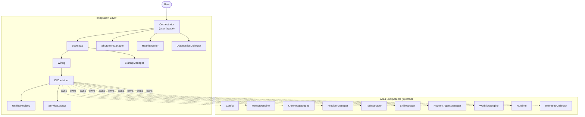
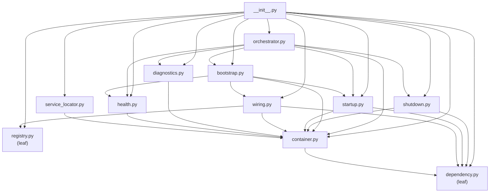
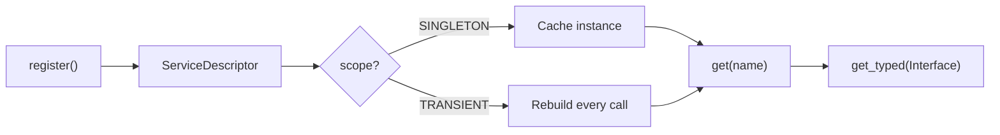
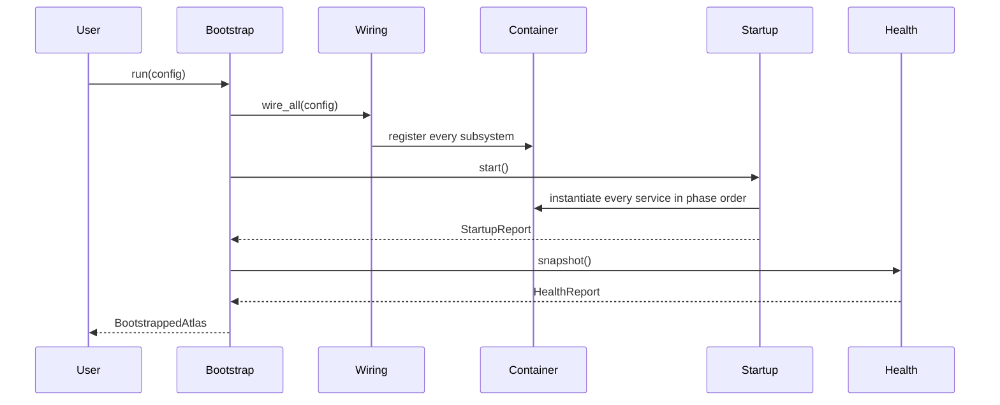
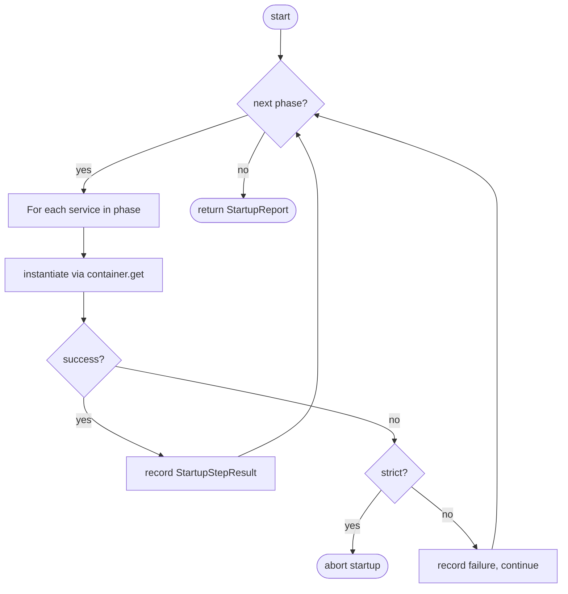
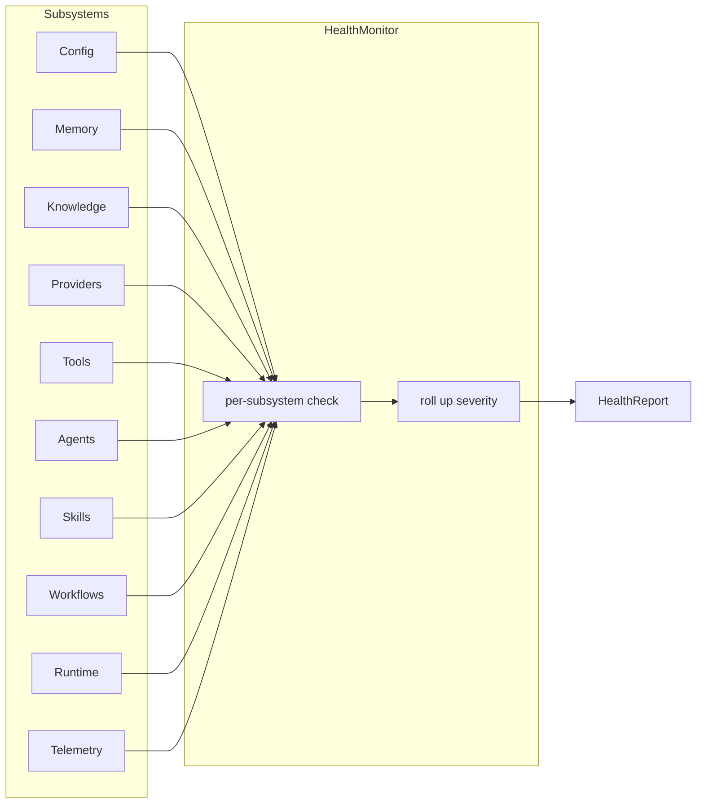

# Atlas Integration Layer

The Integration Layer is the dependency wiring heart that connects every Atlas subsystem into one coherent AI Operating System. It owns a dependency injection container, ordered startup and shutdown managers, a unified health monitor, a diagnostics collector, a unified registry, and a single user-facing orchestrator façade.

The Integration Layer **does not implement business logic**. Its sole purpose is:

- Dependency wiring
- Lifecycle management
- Startup and shutdown orchestration
- Dependency injection
- Configuration loading
- Subsystem orchestration

It is **provider-agnostic**, **tool-agnostic**, **agent-agnostic**, **workflow-agnostic**, and **runtime-agnostic**. It is designed so future modules (Dashboard, MCP Layer, Desktop App, Social Media Automation, Vision, Voice, Blender, Surpac, QGIS, AutoCAD, Remotion, Hyperframes, Ollama) plug in without modifying existing code.

---

## Architecture



## Dependency graph (acyclic)

The Integration Layer has zero circular imports. Modules form a strict acyclic dependency graph:



## Container architecture

The `DIContainer` is the single place where every Atlas subsystem is constructed. Services are registered as `ServiceDescriptor` records (name + factory + scope + phase). Resolution is lazy by default: a service is not constructed until the first time it is requested.



The container supports two lookup styles:

- **By name** — `container.get("memory")` returns the service registered under that exact name.
- **By interface** — `container.get_typed(SomeClass)` returns any service whose descriptor declares `SomeClass` in its `interfaces` tuple.

Singletons are cached on first resolution; transients are rebuilt every time. Circular dependencies are detected and raise `CircularDependencyError`.

### Service lifecycle phases

Every service belongs to a `LifecyclePhase`. The startup manager walks phases in canonical order; the shutdown manager walks them in reverse.

| Phase | Description |
|-------|-------------|
| `CONFIG` | Configuration loading. |
| `LOGGER` | Root logger initialization. |
| `MEMORY` | Memory engine construction. |
| `KNOWLEDGE` | Knowledge engine construction. |
| `PROVIDERS` | Provider registration (9 built-ins). |
| `TOOLS` | Tool manager construction. |
| `SKILLS` | Skill manager construction. |
| `AGENTS` | Agent manager / router construction. |
| `WORKFLOWS` | Workflow engine construction. |
| `RUNTIME` | Runtime engine construction. |
| `TELEMETRY` | Telemetry collector wiring. |
| `DASHBOARD` | Dashboard hooks (future). |
| `HEALTH` | Health monitor + unified registry. |
| `READY` | Atlas is fully running. |

## Boot sequence

The `Bootstrap` turns a configuration into a fully-running Atlas instance:



1. **Load configuration** — `Config` is loaded from a path, a dict, or the default `atlas.yaml`.
2. **Build container** — A fresh `DIContainer` is created.
3. **Wire dependencies** — `Wiring.wire_all()` registers every Atlas subsystem with a stable name, factory, scope, and phase.
4. **Register providers** — All 9 built-in providers (ZAI, OpenAI, Anthropic, Gemini, Groq, NVIDIA, OpenRouter, Ollama, LM Studio) are registered with the `ProviderManager`.
5. **Register agents / tools / workflows / skills** — Each subsystem's registry is constructed (empty by default; ready for runtime population).
6. **Initialize memory / knowledge / runtime / telemetry** — Every subsystem is instantiated in canonical phase order.
7. **Perform health checks** — `HealthMonitor.snapshot()` produces the initial `HealthReport`.
8. **Return bootstrapped Atlas** — A `BootstrappedAtlas` bundle holding the container, startup report, and health report.

## Startup sequence

The `StartupManager` walks every registered service in canonical `LifecyclePhase` order and force-instantiates each one. This guarantees that:

- Every singleton is constructed exactly once.
- The construction order matches the dependency order.
- Any service that fails to construct is reported and either aborts the startup (`strict=True`) or is skipped (`strict=False`).



Canonical startup order:

```
Config → Logger → Memory → Knowledge → Providers → Tools → Skills →
Agents → Workflows → Runtime → Telemetry → Dashboard → Health → Ready
```

## Shutdown sequence

The `ShutdownManager` walks every initialized service in reverse canonical order and invokes its `shutdown()` method if it has one. Services that do not implement `shutdown()` are skipped silently.

```mermaid
flowchart TB
    Start([shutdown]) --> Loop{next phase?}
    Loop -->|yes| ForEach[For each initialized service in reverse phase]
    ForEach --> HasShutdown{has shutdown()?}
    HasShutdown -->|no| Skip[record skipped]
    HasShutdown -->|yes| Invoke[invoke shutdown]
    Invoke --> Success{success?}
    Success -->|yes| Record[record ShutdownStepResult]
    Success -->|no| Strict{strict?}
    Strict -->|yes| Abort([abort shutdown])
    Strict -->|no| RecordFail[record failure, continue]
    Record --> Loop
    Skip --> Loop
    RecordFail --> Loop
    Loop -->|no| Clear[clear container] --> Done([return ShutdownReport])
```

Canonical shutdown order (reverse of startup, excluding `READY`):

```
Health → Dashboard → Telemetry → Runtime → Workflows → Agents → Skills →
Tools → Providers → Knowledge → Memory → Logger → Config
```

## Health system

The `HealthMonitor` aggregates per-subsystem health signals into a single `HealthReport`. Each subsystem contributes a `SubsystemHealth` record with a `name`, `status`, `detail`, and `metrics`. The overall status rolls up: if any subsystem is `unhealthy` the overall is `unhealthy`; if any is `degraded` the overall is `degraded`; otherwise it is `healthy`.



Example health report:

```
config       healthy   loaded
memory       healthy   5 stores
knowledge    healthy   0 documents
providers    healthy   9 online
tools        degraded  0 loaded
agents       degraded  0 ready
skills       degraded  0 installed
workflows    healthy   ready
runtime      healthy   running
telemetry    healthy   0 executions observed
overall      degraded
```

| Status | Meaning |
|--------|---------|
| `healthy` | Subsystem is fully operational. |
| `degraded` | Subsystem is running but not fully populated (e.g. zero tools registered). |
| `unhealthy` | Subsystem failed to start or its health check raised. |
| `unknown` | Subsystem is not registered in the container. |

## Diagnostics

The `DiagnosticsCollector` produces a single `DiagnosticsReport` snapshot that captures everything an operator needs to understand the state of the running Atlas instance:

- **Startup time** and **uptime**
- **Loaded providers / tools / skills / workflows / agents** (counts and names)
- **Memory statistics** (per-store counts)
- **Knowledge statistics** (document count, recent document ids)
- **Runtime statistics** (queue depth, live executions, health snapshot)
- **Configuration summary** (top-level key types, not values — to avoid leaking secrets)
- **Container inventory** (registered vs. initialized services)

Diagnostics are read-only. The collector never mutates any subsystem.

## Unified registry

The `UnifiedRegistry` is a read-only facade over the per-subsystem registries (`ProviderRegistry`, `ToolRegistry`, `WorkflowRegistry`, etc.). It does not own any state — it delegates to the registries that the container has wired into it. Lookups are supported by name (string) or by kind (`"providers"`, `"tools"`, `"workflows"`, `"agents"`, `"skills"`).

```python
registry = container.get("registry")
registry.count("providers")     # 9
registry.names("tools")         # ["filesystem", "github", ...]
registry.get("providers", "zai")  # ZAIProvider instance
registry.summary()              # {"providers": 9, "tools": 28, ...}
```

## Subsystem wiring

The `Wiring` class is the single place that knows how to construct every Atlas subsystem. Each `register_*` method adds one or more `ServiceDescriptor` records to the container. The `wire_all()` convenience method registers every subsystem with sensible deterministic defaults.

| Service name | Phase | Factory produces |
|--------------|-------|------------------|
| `config` | `CONFIG` | `Config` (from path / dict / default) |
| `logger` | `LOGGER` | Root `atlas` logger |
| `memory` | `MEMORY` | `MemoryEngine` (in-memory storage) |
| `knowledge` | `KNOWLEDGE` | `KnowledgeEngine` (hashing embedder, in-memory vector store) |
| `providers` | `PROVIDERS` | `ProviderManager` with 9 built-in providers |
| `tools` | `TOOLS` | `ToolManager` (empty registry) |
| `skills` | `SKILLS` | `SkillManager` (empty registry) |
| `agents` | `AGENTS` | `Router` (empty) |
| `workflows` | `WORKFLOWS` | `WorkflowEngine` (placeholder executor) |
| `runtime` | `RUNTIME` | `Runtime` (single execution entry point) |
| `telemetry` | `TELEMETRY` | `TelemetryCollector` (pulled from runtime) |
| `health` | `HEALTH` | `HealthMonitor` |
| `registry` | `HEALTH` | `UnifiedRegistry` facade |
| `diagnostics` | `HEALTH` | `DiagnosticsCollector` |
| `locator` | `READY` | `ServiceLocator` |

## Examples

### Minimal end-to-end

```python
from atlas.integration import Orchestrator

orch = Orchestrator()
orch.initialize()
ctx = orch.run("hello world")
print(ctx.state.value)    # "completed"
print(ctx.response)       # "noop"
orch.stop()
```

### Inspecting health

```python
orch = Orchestrator()
orch.initialize()
report = orch.health()
print(report.overall.value)          # "degraded" (no tools/agents registered)
for name, sub in report.subsystems.items():
    print(f"  {name:12s} {sub.status.value:10s} {sub.detail}")
orch.stop()
```

### Inspecting diagnostics

```python
orch = Orchestrator()
orch.initialize()
diag = orch.diagnostics()
print(f"Providers: {diag.providers}")
print(f"Tools:     {diag.tools}")
print(f"Uptime:    {diag.uptime_seconds:.1f}s")
print(f"Startup:   {diag.startup_time_seconds:.3f}s")
orch.stop()
```

### Using the unified registry

```python
orch = Orchestrator()
orch.initialize()
registry = orch.container.get("registry")
print(registry.count("providers"))     # 9
print(registry.names("providers"))     # ["anthropic", "gemini", ...]
print(registry.get("providers", "zai"))  # <ZAIProvider ...>
orch.stop()
```

### Using the service locator

```python
orch = Orchestrator()
orch.initialize()
locator = orch.container.get("locator")
runtime = locator.runtime
memory = locator.memory
providers = locator.providers
orch.stop()
```

### Restarting

```python
orch = Orchestrator()
orch.initialize()
# ... use Atlas ...
orch.restart()  # stop + fresh bootstrap
# ... use Atlas ...
orch.stop()
```

### Custom wiring

```python
from atlas.integration import DIContainer, Wiring, StartupManager

container = DIContainer()
wiring = Wiring(container)
wiring.register_config({"system": {"name": "Custom"}})
wiring.register_memory()
wiring.register_runtime()
# ... register only the subsystems you need ...

StartupManager(container).start()
runtime = container.get("runtime")
ctx = runtime.handle("hello")
```

## Future extensions

The Integration Layer is designed to be extended without modification:

- **Dashboard** — Register a dashboard service in the `DASHBOARD` phase; the startup/shutdown managers will pick it up automatically.
- **MCP Layer** — Register MCP server connectors as tools via the existing `ToolManager`.
- **Desktop App / Social Media Automation / Vision / Voice / Blender / Surpac / QGIS / AutoCAD / Remotion / Hyperframes** — Each can register as a tool, an agent, or a workflow without touching the Integration Layer.
- **Ollama / local providers** — Already registered by `Wiring.register_providers()`; adding more providers is a one-line change in the wiring.
- **Custom subsystems** — Register a `ServiceDescriptor` with the appropriate `LifecyclePhase` and the startup/shutdown managers will handle it automatically.

## Quality gates

The Integration Layer is verified by:

- **148 pytest tests** in `tests/test_integration.py` covering the DI container, dependency descriptors, the unified registry, the service locator, health monitoring, diagnostics, the wiring registrar, startup, shutdown, bootstrap, and the top-level orchestrator.
- **611 total tests** pass (148 integration + 150 runtime + 130 workflow + 183 existing).
- **Black** clean on all 102 Python files.
- **Ruff** clean on all 102 Python files.
- **Zero circular imports** verified by independent module imports.
- **Frozen dataclasses** for every immutable model (`ServiceDescriptor`, `SubsystemHealth`, `HealthReport`, `StartupStepResult`, `StartupReport`, `ShutdownStepResult`, `ShutdownReport`, `BootstrappedAtlas`, `DiagnosticsReport`).
- **Dependency injection** for every concrete concern — no singleton abuse, no global state.
- **SOLID principles**: each module has a single responsibility, every subsystem depends on abstractions, and the Integration Layer is open for extension but closed for modification.
