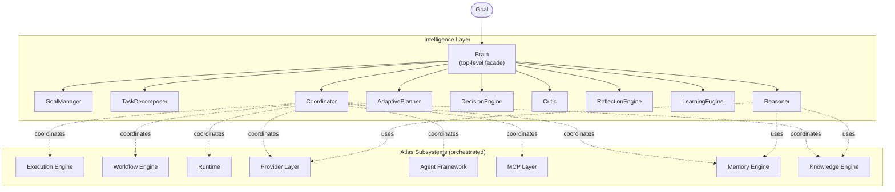
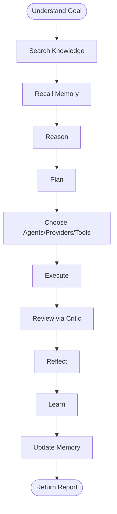
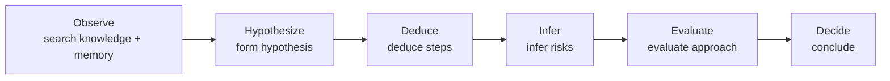
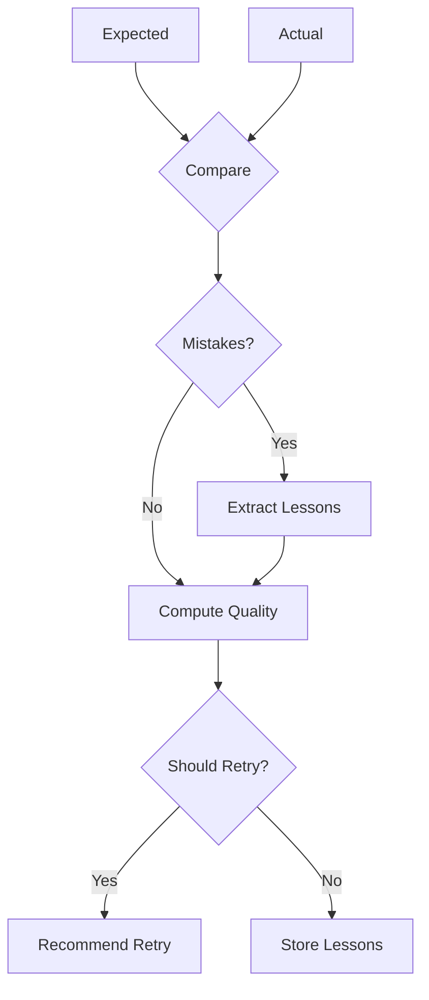
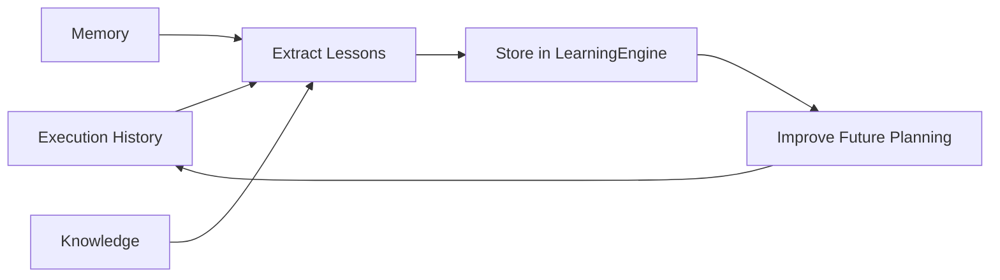
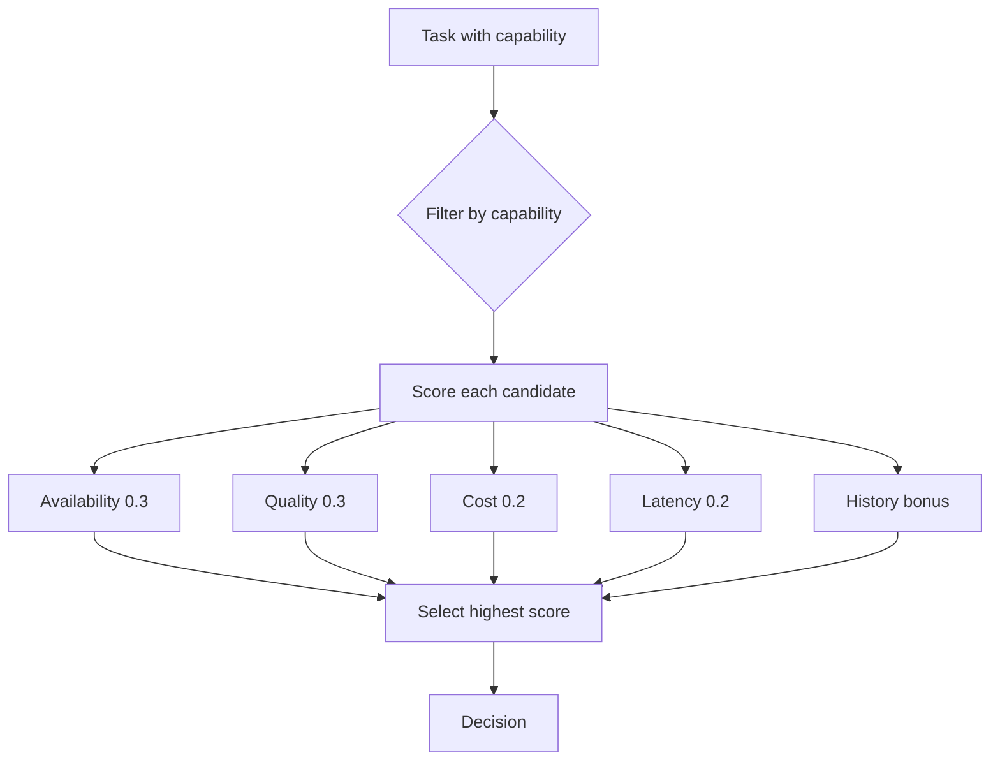
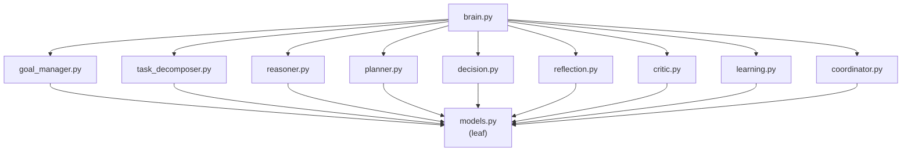

# Atlas Intelligence Layer

The Intelligence Layer is the brain that connects ALL existing Atlas subsystems together. It does NOT duplicate their functionality — it orchestrates them through a single :class:`Brain` facade with one public method: :meth:`Brain.think`.

---

## Architecture



## Thinking pipeline

The :meth:`Brain.think` method runs a 12-stage pipeline:



1. **Understand Goal** — Create a :class:`Goal` in the :class:`GoalManager`.
2. **Search Knowledge** — Query the knowledge engine for relevant facts.
3. **Recall Memory** — Query the memory engine for past experiences.
4. **Reason** — Build a :class:`ReasoningChain` with 6 steps (observe, hypothesize, deduce, infer, evaluate, decide).
5. **Plan** — Generate an :class:`AdaptivePlan` with ordered tasks.
6. **Choose** — Use the :class:`DecisionEngine` to select candidates for each task.
7. **Execute** — Run the plan via the :class:`Coordinator`.
8. **Review** — The :class:`Critic` reviews the output (warnings, confidence, quality).
9. **Reflect** — The :class:`ReflectionEngine` compares expected vs actual and extracts :class:`Lesson` items.
10. **Learn** — The :class:`LearningEngine` stores lessons for future use.
11. **Update Memory** — Write the outcome to the memory engine.
12. **Return Report** — Return an :class:`ExecutionOutcome`.

## Reasoning pipeline



## Reflection loop



## Learning loop



## Decision tree



## Dependency graph (acyclic)



## Component table

| Component | Responsibility |
|-----------|----------------|
| `Brain` | Top-level facade. Public API: `think(goal)`, `think_many(goals)`, `status()`. Runs the 12-stage thinking pipeline. |
| `GoalManager` | Tracks multiple concurrent goals with lifecycle (create, start, pause, resume, cancel, complete, fail). Priority updates. Dependency tracking. History. |
| `TaskDecomposer` | Recursively breaks complex goals into sub-goals. Pattern-based (website, research, code, deploy, analyze). |
| `Reasoner` | Builds reasoning chains using Knowledge, Memory, and Provider. 6-step pattern: observe → hypothesize → deduce → infer → evaluate → decide. |
| `AdaptivePlanner` | Generates adaptive plans that can split, merge, remove, insert, and reorder tasks during execution. |
| `DecisionEngine` | Capability-based selection of providers, agents, tools, workflows, and MCP connectors. Scores by availability, quality, cost, latency, and history. |
| `Critic` | Reviews outputs. Produces warnings, confidence, and quality score. |
| `ReflectionEngine` | Compares expected vs actual. Detects mistakes. Extracts lessons. Recommends retry. |
| `LearningEngine` | Stores and retrieves lessons. Writes to memory. Produces learning summaries. |
| `Coordinator` | Coordinates Execution Engine, Workflow Engine, Runtime, Provider Layer, Agent Framework, MCP, Memory, and Knowledge. |
| `Goal` | Frozen: id, description, scope, priority, status, parent_id, dependencies, timing, metadata. |
| `ReasoningChain` | Frozen: steps, conclusion, overall_confidence. |
| `AdaptivePlan` | Frozen: tasks, adjustments, version. |
| `Decision` | Frozen: selected, kind, reason, alternatives, score. |
| `Reflection` | Frozen: expected, actual, mistakes, lessons, quality_score, should_retry. |
| `Lesson` | Frozen: content, category, source, confidence. |
| `ExecutionOutcome` | Frozen: goal_id, status, result, reasoning, plan, decisions, critique, reflection, lessons, timing. |

## Examples

### Minimal: think about a goal

```python
from atlas.intelligence import Brain

brain = Brain()
outcome = brain.think("Create a website for my portfolio")
print(outcome.status.value)     # "completed"
print(outcome.success)          # True
print(len(outcome.plan.tasks))  # 5
print(len(brain.learning))      # lessons learned
```

### Think about multiple goals

```python
brain = Brain()
outcomes = brain.think_many([
    "Research quantum computing",
    "Implement sorting algorithm",
    "Deploy to production",
])
print(len(outcomes))  # 3
```

### Inspect the reasoning chain

```python
brain = Brain()
outcome = brain.think("test goal")
for step in outcome.reasoning.steps:
    print(f"  {step.step_type.value}: {step.content[:60]}")
```

### Use the goal manager directly

```python
from atlas.intelligence import GoalManager, GoalPriority, GoalScope

gm = GoalManager()
g = gm.create("Important task", priority=GoalPriority.HIGH, scope=GoalScope.LONG_TERM)
gm.start(g.id)
gm.pause(g.id)
gm.resume(g.id)
gm.complete(g.id, result={"done": True})
```

### Adaptive plan adjustments

```python
from atlas.intelligence import AdaptivePlanner, IntelligenceTask

planner = AdaptivePlanner()
plan = planner.plan("g1", "Create website")
print(f"Initial: {len(plan.tasks)} tasks, version {plan.version}")

# Split the first task
plan = planner.split(plan, plan.tasks[0].id, ["sub1", "sub2"])
print(f"After split: {len(plan.tasks)} tasks, version {plan.version}")

# Remove a task
plan = planner.remove(plan, plan.tasks[0].id)
print(f"After remove: {len(plan.tasks)} tasks, version {plan.version}")
```

### Decision engine

```python
from atlas.intelligence import DecisionEngine, DecisionCandidate

engine = DecisionEngine()
candidates = [
    DecisionCandidate(name="ollama", kind="provider", capabilities=("generate",), quality=0.8, cost=0.0, latency_ms=300),
    DecisionCandidate(name="openai", kind="provider", capabilities=("generate",), quality=0.9, cost=10.0, latency_ms=400),
]
decision = engine.decide("generate", candidates)
print(f"Selected: {decision.selected} (score={decision.score:.2f})")
```

## Quality gates

- **202 pytest tests** in `tests/test_intelligence.py` covering models, goal management, task decomposition, reasoning, planning, decision making, reflection, critic, learning, coordinator, brain pipeline, and failure handling.
- **1575 total tests** pass.
- **Black** clean.
- **Ruff** clean.
- **Zero circular imports** verified.
- **Frozen dataclasses** for every model.
- **Dependency injection** throughout.
- **Fully offline** (deterministic defaults).
