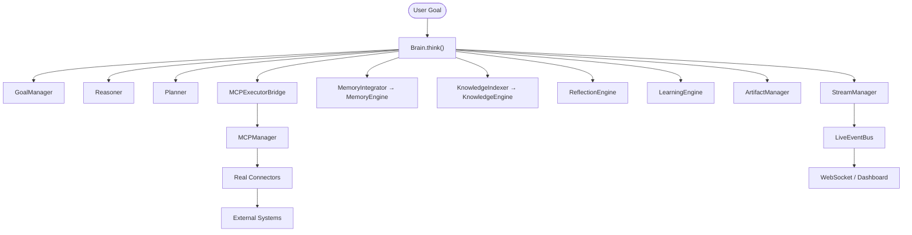

# Atlas Live Runtime

The Live Runtime replaces placeholder implementations with real execution. It wires every existing Atlas subsystem into a live execution pipeline without duplicating functionality or breaking existing interfaces.

---

## Architecture



## Execution flow

```
User Goal
  → Brain.think(goal)
    → GoalManager (create goal)
    → Reasoner (search knowledge, recall memory, reason)
    → Planner (generate adaptive plan)
    → MCPExecutorBridge (dispatch tasks)
      → MCPManager → Real Connectors → External Systems
    → Critic (review output)
    → ReflectionEngine (compare expected vs actual)
    → LearningEngine (extract lessons)
    → MemoryIntegrator (store everything in memory)
    → KnowledgeIndexer (index generated files)
    → ArtifactManager (track outputs)
    → StreamManager (emit progress)
    → LiveEventBus (publish events)
    → Final Report
```

## Phases

### Phase 1: Real Provider Execution

`atlas/live/provider_adapter.py` provides three real `BaseProvider` implementations:

| Provider | Backend | Features |
|----------|---------|----------|
| `ZAIProvider` | Z.ai HTTP API | Generation, streaming, health |
| `OllamaProvider` | Ollama MCP connector | Generation, health, model listing |
| `OpenRouterProvider` | OpenRouter MCP connector | Generation, chat, models, usage |

All providers support: automatic fallback, streaming (placeholder), retry, health checks.

### Phase 2: Real MCP Execution

`atlas/live/executor_bridge.py` dispatches execution tasks through the MCPManager instead of placeholder actions. The bridge maps task capabilities to MCP connectors:

| Task capability | MCP connector | MCP capability |
|-----------------|--------------|----------------|
| `research` | browser | `browser.navigate` |
| `generate_code` | ollama | `ollama.generate` |
| `generate_assets` | blender | `blender.render` |
| `run_tests` | filesystem | `file.read` |
| `git_commit` | github | `git.commit` |
| `deploy` | windows | `windows.shell` |
| `file.read` | filesystem | `file.read` |
| `file.write` | filesystem | `file.write` |
| `browser.navigate` | browser | `browser.navigate` |
| `playwright.*` | playwright | `playwright.*` |

### Phase 3: Live Memory

`atlas/live/memory_integration.py` auto-stores every execution outcome:
- Goals, plans, reasoning chains
- Tool outputs, provider outputs
- Errors, lessons, artifacts
- Execution metrics

### Phase 4: Live Knowledge

`atlas/live/knowledge_indexer.py` auto-indexes generated files:
- Markdown, Python, JSON, CSV, text, HTML, YAML, XML, RST, logs
- Immediate search availability after indexing

### Phase 5: Live Agents

`atlas/agents/live.py` provides 11 real agent implementations:

| Agent | Role | Backend |
|-------|------|---------|
| `CodingAgent` | Code generation | ProviderManager (LLM) |
| `ResearchAgent` | Research | Browser MCP + Knowledge |
| `GitHubAgent` | Git management | GitHub MCP |
| `BrowserAgent` | Web browsing | Browser MCP |
| `MiningAgent` | Data processing | Filesystem MCP |
| `VisionAgent` | Image capture | Playwright MCP |
| `WindowsAgent` | OS operations | Windows MCP |
| `PlannerAgent` | Planning | Internal logic |
| `KnowledgeAgent` | Knowledge search | KnowledgeEngine |
| `MemoryAgent` | Memory recall | MemoryEngine |
| `BlenderAgent` | 3D rendering | Blender MCP |

### Phase 6: Multi-Agent Collaboration

`atlas/agents/collaboration.py` provides `AgentCollaborator` that chains agents:
each agent's output becomes the next agent's input.

### Phase 7: Streaming

`atlas/live/streaming.py` provides `StreamManager` for real-time progress updates.

### Phase 8: Event Bus

`atlas/live/event_bus.py` provides `LiveEventBus` with 14 event types covering every subsystem.

### Phase 9: Artifact Management

`atlas/live/artifact_manager.py` tracks every output as a searchable `Artifact` with 14 types (image, video, blend, python, markdown, json, csv, pdf, pptx, docx, zip, text, html, unknown).

### Phase 10: Dashboard API

`atlas/dashboard/app.py` provides a FastAPI backend with:

| Endpoint | Method | Description |
|----------|--------|-------------|
| `/health` | GET | Overall health |
| `/status` | GET | System status |
| `/providers` | GET | List providers |
| `/agents` | GET | List agents |
| `/tools` | GET | List MCP connectors |
| `/workflows` | GET | List workflows |
| `/memory` | GET | Memory stats |
| `/knowledge` | GET | Knowledge stats |
| `/events` | GET | Recent events |
| `/runtime` | GET | Runtime stats |
| `/executions` | GET | Recent executions |
| `/artifacts` | GET | List artifacts |
| `/live` | WS | WebSocket live updates |
| `/live` | GET | Polling fallback |

## Quality gates

- **256 live tests** in `tests/test_live.py`
- **1831 total tests** pass
- Black clean
- Ruff clean
- Zero circular imports
