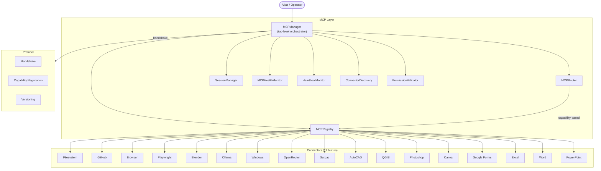
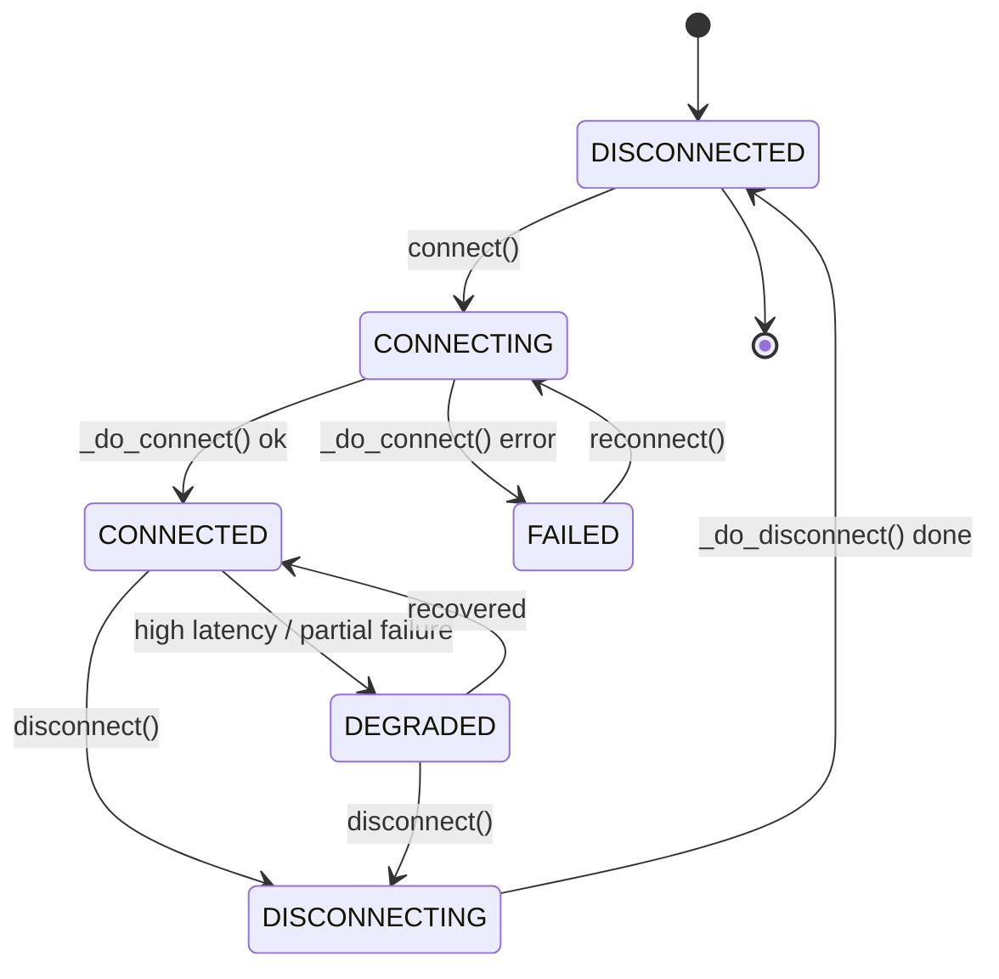
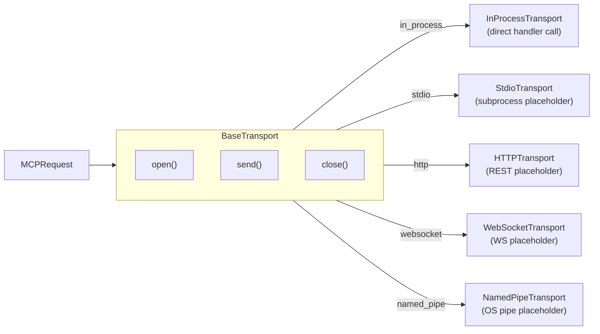
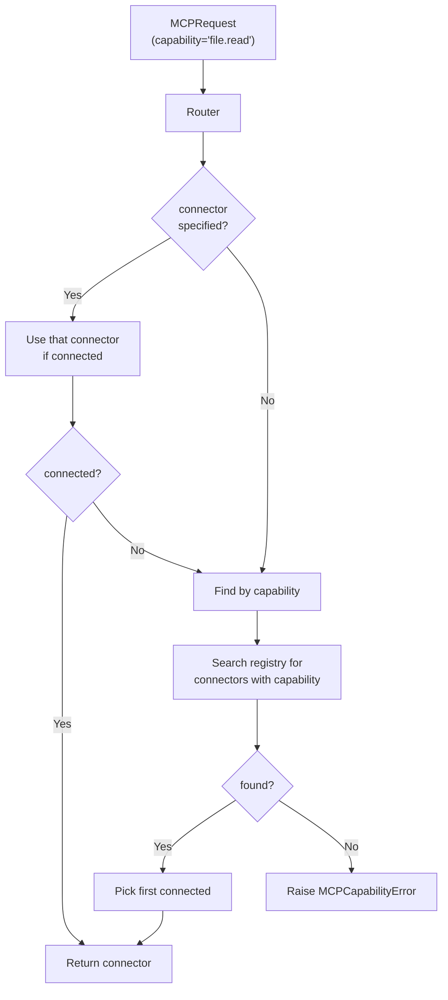
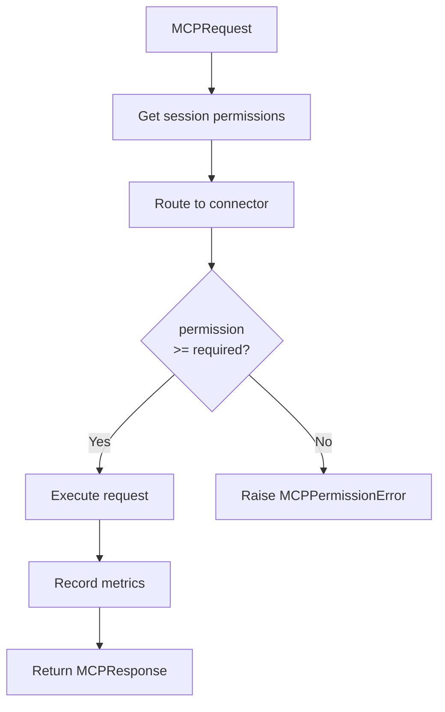
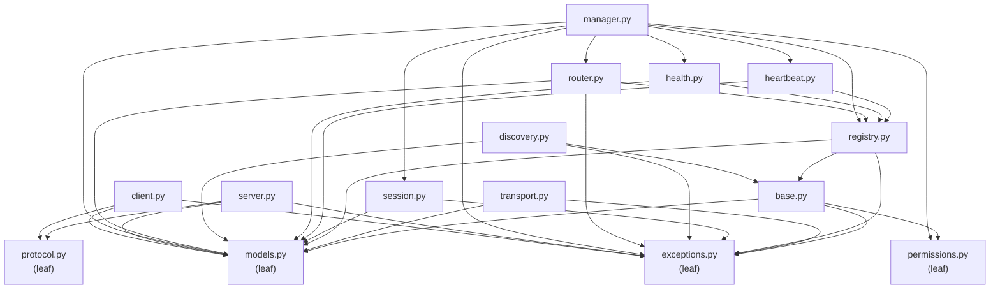

# Atlas MCP Layer

The MCP (Model Context Protocol) Layer is the universal communication backbone of the Atlas AI Operating System. It exposes a single, capability-based API through which Atlas can talk to filesystems, browsers, GitHub, Blender, Ollama, Windows, OpenRouter, Surpac, AutoCAD, QGIS, Photoshop, Canva, Google Forms, Excel, Word, and PowerPoint — and any future connector — without changing the architecture.

The layer is **personal** (one operator, not SaaS, not multi-tenant), **offline-first** (every default is deterministic), **provider-agnostic**, **tool-agnostic**, **agent-agnostic**, **workflow-agnostic**, and **runtime-agnostic**. Every concrete concern is dependency-injected.

---

## Architecture



## Connector lifecycle

Every connector follows the same lifecycle, driven by `BaseConnector`:



1. **`connect(transport)`** — base class sets status to `CONNECTING`, calls `_do_connect()`, transitions to `CONNECTED` on success or `FAILED` on error.
2. **`health()`** — base class calls `_do_health()`, reconciles the snapshot with the base-class status.
3. **`execute(request)`** — base class checks connection, calls `_do_execute()`, wraps errors in `MCPResponse`.
4. **`disconnect()`** — base class sets status to `DISCONNECTING`, calls `_do_disconnect()`, transitions to `DISCONNECTED`.

## Transport architecture

The MCP Layer supports five transport kinds. No real networking is performed — every transport is in-process and synchronous. The abstraction exists so future real transports can be slotted in without changing the connector contract.



| Transport | Kind | Use case |
|-----------|------|----------|
| `InProcessTransport` | `in_process` | Testing, in-process connectors (default). |
| `StdioTransport` | `stdio` | Local subprocess communication (future). |
| `HTTPTransport` | `http` | REST API calls (future). |
| `WebSocketTransport` | `websocket` | Real-time bidirectional (future). |
| `NamedPipeTransport` | `named_pipe` | OS named pipes (Windows / Unix sockets). |

## Capability routing

The `MCPRouter` routes every `MCPRequest` to the right connector using **capability-based selection** — no hardcoded connector names.



## Permission flow

Every request passes through the `PermissionValidator` before it reaches a connector.



| Permission level | Numeric | Capabilities |
|------------------|---------|--------------|
| `NONE` | 0 | None |
| `READ` | 10 | Read-only capabilities |
| `WRITE` | 20 | Read + write capabilities |
| `EXECUTE` | 30 | Read + write + execute capabilities |
| `ADMIN` | 100 | Every capability, including management |

Custom permissions can be registered via `PermissionRegistry.register(name, level)`.

## Health monitoring

The `MCPHealthMonitor` aggregates per-connector health into a single roll-up:

| Roll-up | Condition |
|---------|-----------|
| `HEALTHY` | Every connector connected. |
| `WARNING` | At least one connector degraded; none offline. |
| `CRITICAL` | At least one connector offline. |
| `OFFLINE` | Every connector offline. |
| `UNKNOWN` | No connectors registered. |

The `HeartbeatMonitor` periodically probes every connector and records latency samples. If a connector's latency exceeds `latency_critical_ms` or it fails to respond, `recommend_reconnect()` returns `True`.

## Dependency graph (acyclic)



## Connector table

| Connector | Capabilities | Default transport | Required permission |
|-----------|-------------|-------------------|---------------------|
| `FilesystemConnector` | file.read, file.write, file.list, file.delete | in_process | READ |
| `GitHubConnector` | repo.list, repo.get, issue.list/create, pr.create, git.commit/push | http | READ |
| `BrowserConnector` | browser.navigate/click/extract/screenshot/fill | websocket | EXECUTE |
| `PlaywrightConnector` | playwright.launch/goto/click/type/pdf/screenshot/evaluate | stdio | EXECUTE |
| `BlenderConnector` | blender.scene.new, object.add/transform, material.apply, render, export | named_pipe | EXECUTE |
| `OllamaConnector` | ollama.generate/chat/embed/models/pull | http | READ |
| `WindowsConnector` | windows.app.open/close, shell, registry.get/set, clipboard | named_pipe | EXECUTE |
| `OpenRouterConnector` | openrouter.generate/chat/models | http | READ |
| `SurpacConnector` | surpac.blockmodel.load/query, drillhole.import, surface/section.create, export | named_pipe | EXECUTE |
| `AutoCADConnector` | autocad.drawing.new/open, layer.create, entity/dimension.add, block.insert, export | named_pipe | EXECUTE |
| `QGISConnector` | qgis.project.new, layer.add/style, analysis.buffer/overlay, map.export, plugin.run | named_pipe | EXECUTE |
| `PhotoshopConnector` | photoshop.doc.new/open, layer.add, filter.apply, adjustment, export | named_pipe | EXECUTE |
| `CanvaConnector` | canva.design.create, template.list, element.add, text.add, export | http | READ |
| `GoogleFormsConnector` | forms.create/list, question.add, responses.list, response.count | http | READ |
| `ExcelConnector` | excel.workbook.new/open, sheet.add, cell.get/set, formula.set, export | named_pipe | READ |
| `WordConnector` | word.doc.new/open, paragraph.add, heading.add, style.apply, table.add, export | named_pipe | READ |
| `PowerPointConnector` | ppt.presentation.new/open, slide.add, text/image.add, template.apply, export | named_pipe | READ |

## Examples

### Register all 17 connectors

```python
from atlas.mcp import MCPManager, instantiate_all

manager = MCPManager()
for connector in instantiate_all():
    manager.register_connector(connector)

print(f"Registered {len(manager.list_connectors())} connectors")
print(f"Overall health: {manager.overall_health().value}")
```

### Execute a request

```python
from atlas.mcp import MCPManager, FilesystemConnector

manager = MCPManager()
manager.register_connector(FilesystemConnector())
session = manager.open_session("filesystem", permissions=["read"])
response = manager.execute_capability(
    "file.read",
    {"path": "/tmp/test.txt"},
    connector="filesystem",
    session_id=session.id,
)
print(response.success, response.output)
```

### Use a specific connector

```python
from atlas.mcp import MCPManager, OllamaConnector

manager = MCPManager()
manager.register_connector(OllamaConnector())
session = manager.open_session("ollama", permissions=["read"])
response = manager.execute_capability(
    "ollama.generate",
    {"prompt": "Hello, world!", "model": "llama3"},
    connector="ollama",
    session_id=session.id,
)
print(response.output["response"])
```

### Server / client handshake

```python
from atlas.mcp import MCPServerInstance, MCPClientInstance, MCPCapability, MCPRequest, MCPResponse

def handler(req: MCPRequest) -> MCPResponse:
    return MCPResponse(request_id=req.id, success=True, output="ok")

server = MCPServerInstance(
    name="my-server",
    capabilities=(MCPCapability(name="test.cap"),),
    handler=handler,
)
server.start()

client = MCPClientInstance(name="my-client", server=server)
client.connect(capabilities=["test.cap"])
response = client.call("test.cap", {"param": 1})
print(response.success, response.output)
```

### Health monitoring

```python
from atlas.mcp import MCPManager, instantiate_all

manager = MCPManager()
for c in instantiate_all():
    manager.register_connector(c)

health = manager.health()
for name, h in health.items():
    print(f"  {name}: {h.level.value} ({h.latency_ms}ms)")
print(f"Overall: {manager.overall_health().value}")
```

### Heartbeat & reconnect

```python
manager = MCPManager()
for c in instantiate_all():
    manager.register_connector(c)

needs_reconnect = manager.heartbeat()
print(f"Needs reconnect: {needs_reconnect}")

# Disconnect one and reconnect
manager.get_connector("filesystem").disconnect()
results = manager.reconnect_all()
print(f"Reconnected: {results}")
```

## Future connector roadmap

The MCP Layer is designed so future connectors plug in without modifying existing code. To add a new connector:

1. Create a new file in `atlas/mcp/connectors/` (e.g. `slack.py`).
2. Define a class that inherits `BaseConnector`.
3. Implement `_do_connect`, `_do_disconnect`, `_do_health`, `_do_execute`.
4. Add the class to `atlas/mcp/connectors/__init__.py`.

Planned future connectors:

- **Slack** — messaging automation
- **Notion** — note / database automation
- **Linear** — issue tracking
- **Figma** — design automation
- **VS Code** — editor automation
- **Terminal** — shell automation
- **Database** — SQL query execution
- **Kubernetes** — cluster management
- **Docker** — container management
- **AWS / GCP / Azure** — cloud provider automation

## Quality gates

The MCP Layer is verified by:

- **347 pytest tests** in `tests/test_mcp.py` covering models, protocol, permissions, base connector, transport, registry, session, heartbeat, health, discovery, router, manager, server, client, every connector, and end-to-end flow.
- **1102 total tests** pass (347 MCP + 144 execution + 148 integration + 150 runtime + 130 workflow + 183 existing).
- **Black** clean on all MCP files.
- **Ruff** clean on all MCP files.
- **Zero circular imports** verified by independent module imports.
- **Frozen dataclasses** for every immutable model.
- **Dependency injection** for every concrete concern.
- **Fully offline** — no external APIs called.
