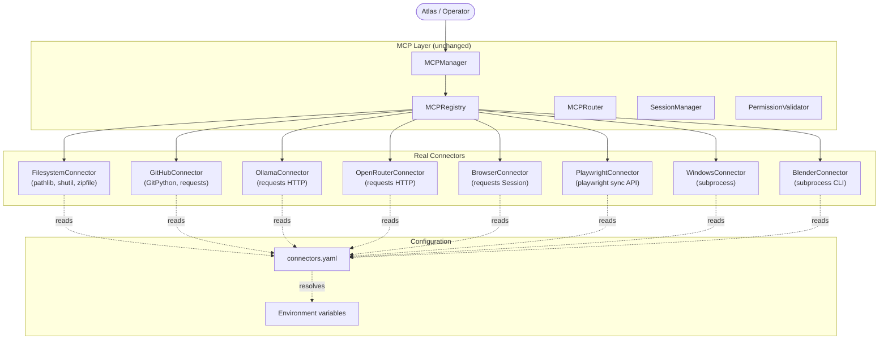

# Atlas Real Connectors

This document describes the real connector implementations that replace the placeholder connectors from the MCP Layer v1.0. The MCP architecture is unchanged — every connector still inherits `BaseConnector` and exposes the same `_do_connect`, `_do_disconnect`, `_do_health`, and `_do_execute` contract. Only the internal logic has been replaced with real implementations.

---

## Architecture



## Configuration

All connector configuration lives in `atlas/configs/connectors.yaml`. Secrets (API keys, tokens) are read from environment variables — the YAML only holds non-secret defaults and the names of the env vars to read.

```yaml
filesystem:
  root: "."
  max_file_size_mb: 100
  encoding: "utf-8"
  env_root: "ATLAS_FILESYSTEM_ROOT"

github:
  token_env: "GITHUB_TOKEN"
  api_base: "https://api.github.com"
  default_branch: "main"
  timeout_seconds: 30

ollama:
  base_url: "http://localhost:11434"
  timeout_seconds: 60
  default_model: "llama3"
  env_base_url: "OLLAMA_BASE_URL"

openrouter:
  api_base: "https://openrouter.ai/api/v1"
  api_key_env: "OPENROUTER_API_KEY"
  default_model: "openai/gpt-4o-mini"
  timeout_seconds: 60
  max_retries: 3
```

The config is loaded via `atlas.mcp.connector_config.get_connector_config(name)`, which:

1. Reads `atlas/configs/connectors.yaml` (cached).
2. Resolves secret references (`token_env`, `api_key_env`, `env_base_url`, `env_root`) against environment variables.
3. Returns a flat dict for the requested connector.

### Environment variable overrides

| Connector | Env var | Overrides |
|-----------|---------|-----------|
| Filesystem | `ATLAS_FILESYSTEM_ROOT` | `root` |
| Ollama | `OLLAMA_BASE_URL` | `base_url` |
| GitHub | `GITHUB_TOKEN` | `token` (for REST API) |
| OpenRouter | `OPENROUTER_API_KEY` | `api_key` |

## Connector details

### FilesystemConnector

Real filesystem operations via `pathlib`, `shutil`, and `zipfile`.

**Capabilities (15):**

| Capability | Description |
|-----------|-------------|
| `file.read` | Read a file (text or binary). |
| `file.write` | Write a file (creates parent dirs). |
| `file.append` | Append content to a file. |
| `file.copy` | Copy a file or directory. |
| `file.move` | Move a file or directory. |
| `file.rename` | Rename a file or directory. |
| `file.delete` | Delete a file or directory (recursive by default). |
| `file.exists` | Check if a path exists. |
| `file.search` | Glob-search for files matching a pattern. |
| `file.list` | List directory contents with metadata. |
| `file.mkdir` | Create a directory (with parents). |
| `file.watch` | Placeholder (returns a marker). |
| `file.zip` | Zip a file or directory. |
| `file.extract` | Extract a zip archive. |
| `file.path` | Path utilities (resolve, absolute, parent, name, stem, suffix, parts). |

**Example:**

```python
from atlas.mcp import MCPManager, FilesystemConnector

manager = MCPManager()
manager.register_connector(FilesystemConnector(root="/tmp/atlas"))
session = manager.open_session("filesystem", permissions=["read", "write"])

# Write a file
manager.execute_capability("file.write", {"path": "test.txt", "content": "hello"},
                           connector="filesystem", session_id=session.id)

# Read it back
resp = manager.execute_capability("file.read", {"path": "test.txt"},
                                  connector="filesystem", session_id=session.id)
print(resp.output["content"])  # "hello"
```

### GitHubConnector

Real git operations via GitPython (no token required for local ops) and optional REST API via `requests` (token required).

**Capabilities (17):**

| Capability | Description | Token required? |
|-----------|-------------|-----------------|
| `git.clone` | Clone a repository. | No |
| `git.status` | Show working-tree status. | No |
| `git.branch` | List / create / delete branches. | No |
| `git.checkout` | Checkout a branch or commit. | No |
| `git.commit` | Stage and commit changes. | No |
| `git.push` | Push commits to a remote. | No (uses SSH / credential helper) |
| `git.pull` | Pull from a remote. | No |
| `git.fetch` | Fetch from a remote. | No |
| `git.log` | Show commit history. | No |
| `git.diff` | Show diffs. | No |
| `git.tag` | List / create tags. | No |
| `git.remote` | List / add / remove remotes. | No |
| `repo.list` | List repositories (REST). | Yes |
| `repo.get` | Get repository metadata (REST). | Yes |
| `issue.list` | List issues (REST). | Yes |
| `issue.create` | Create issue (REST). | Yes |
| `pr.create` | Create pull request (REST). | Yes |

**Example:**

```python
from atlas.mcp import MCPManager, GitHubConnector

manager = MCPManager()
manager.register_connector(GitHubConnector(workspace="/tmp/repos"))
session = manager.open_session("github", permissions=["read"])

# Local git operation (no token needed)
resp = manager.execute_capability(
    "git.status", {"path": "/path/to/local/repo"},
    connector="github", session_id=session.id,
)
print(resp.output["is_dirty"], resp.output["active_branch"])

# REST API operation (token needed)
import os
os.environ["GITHUB_TOKEN"] = "ghp_xxxxx"
resp = manager.execute_capability(
    "repo.list", {}, connector="github", session_id=session.id,
)
```

### OllamaConnector

Real HTTP calls to a local Ollama server (`http://localhost:11434` by default).

**Capabilities (8):**

| Capability | Description |
|-----------|-------------|
| `ollama.health` | Ping the Ollama server. |
| `ollama.models` | List installed models. |
| `ollama.pull` | Pull a model from the registry. |
| `ollama.delete` | Delete a local model. |
| `ollama.generate` | Generate text from a prompt. |
| `ollama.chat` | Multi-turn chat completion. |
| `ollama.embed` | Generate embeddings. |
| `ollama.stream` | Streaming generation (placeholder — returns full response as one chunk). |

**Example:**

```python
from atlas.mcp import MCPManager, OllamaConnector

manager = MCPManager()
manager.register_connector(OllamaConnector(base_url="http://localhost:11434"))
session = manager.open_session("ollama", permissions=["read"])

resp = manager.execute_capability(
    "ollama.generate",
    {"prompt": "Write a haiku about code", "model": "llama3"},
    connector="ollama", session_id=session.id,
)
print(resp.output["response"])
```

### OpenRouterConnector

Real HTTP calls to the OpenRouter multi-model LLM gateway. API key read from `OPENROUTER_API_KEY`.

**Capabilities (5):**

| Capability | Description |
|-----------|-------------|
| `openrouter.health` | Check if API key is configured. |
| `openrouter.models` | List available models. |
| `openrouter.chat` | Chat completion. |
| `openrouter.generate` | Text completion. |
| `openrouter.usage` | Usage metadata. |

**Features:** Retry on 429 (rate limit) and 5xx errors with exponential backoff.

**Example:**

```python
import os
from atlas.mcp import MCPManager, OpenRouterConnector

os.environ["OPENROUTER_API_KEY"] = "sk-or-xxxxx"
manager = MCPManager()
manager.register_connector(OpenRouterConnector())
session = manager.open_session("openrouter", permissions=["read"])

resp = manager.execute_capability(
    "openrouter.chat",
    {"messages": [{"role": "user", "content": "Hello!"}], "model": "openai/gpt-4o-mini"},
    connector="openrouter", session_id=session.id,
)
print(resp.output["message"]["content"])
```

### BrowserConnector

Real HTTP fetching via `requests.Session`. Supports cookies, custom headers, and file downloads.

**Capabilities (6):**

| Capability | Description |
|-----------|-------------|
| `browser.navigate` | Fetch a URL and return HTML + status + title. |
| `browser.download` | Download a file to disk. |
| `browser.html` | Fetch raw HTML. |
| `browser.cookies` | Get / set / clear cookies. |
| `browser.headers` | Get / set custom headers. |
| `browser.session` | Session management (info, reset). |

**Features:** Supports `file://` URLs (reads from local filesystem). Follows redirects up to `max_redirects`.

### PlaywrightConnector

Real browser automation via the Playwright Python library. Degrades gracefully if Playwright is not installed.

**Capabilities (11):**

| Capability | Description |
|-----------|-------------|
| `playwright.launch` | Launch a browser. |
| `playwright.goto` | Navigate to a URL. |
| `playwright.click` | Click an element. |
| `playwright.type` | Type text into a field. |
| `playwright.upload` | Upload a file. |
| `playwright.download` | Download a file (placeholder). |
| `playwright.wait` | Wait for a selector or load state. |
| `playwright.screenshot` | Take a screenshot. |
| `playwright.pdf` | Save page as PDF. |
| `playwright.close` | Close the browser. |
| `playwright.evaluate` | Evaluate JavaScript. |

**Install:** `pip install playwright && playwright install`

### WindowsConnector

Real OS automation via PowerShell and CMD subprocesses. Works on Windows; degrades gracefully on other platforms (shell commands still work via the default shell).

**Capabilities (8):**

| Capability | Description |
|-----------|-------------|
| `windows.shell` | Run a CMD / shell command. |
| `windows.powershell` | Run a PowerShell command. |
| `windows.env.get` | Get an environment variable. |
| `windows.env.set` | Set an environment variable (in-process). |
| `windows.process.list` | List running processes. |
| `windows.process.kill` | Kill a process by PID or name. |
| `windows.app.launch` | Launch an application. |
| `windows.clipboard` | Get / set the clipboard (via tkinter). |

### BlenderConnector

Real Blender automation via the Blender CLI (`blender --background --python script.py`). Degrades gracefully if Blender is not installed.

**Capabilities (10):**

| Capability | Description |
|-----------|-------------|
| `blender.launch` | Launch Blender (background mode). |
| `blender.script` | Run a Python script in Blender. |
| `blender.open` | Open a Blender project. |
| `blender.save` | Save the current project. |
| `blender.render` | Render an image. |
| `blender.render_animation` | Render an animation. |
| `blender.execute` | Execute a Python expression. |
| `blender.scene.new` | Create a new scene. |
| `blender.object.add` | Add an object. |
| `blender.export` | Export to a file (obj / fbx / gltf). |

## Integration

The real connectors integrate cleanly with every Atlas subsystem without changing any interfaces:

- **Execution Engine**: Inject `MCPManager` into `ExecutionExecutor` so execution tasks can dispatch to MCP connectors.
- **Runtime Engine**: Register `MCPManager` in the runtime's pipeline stages.
- **Tool Layer**: MCP connectors can be wrapped as `BaseTool` instances.
- **Agent Framework**: Agents can call MCP capabilities via the manager.
- **Workflow Engine**: Workflow steps can dispatch to MCP connectors.
- **Provider Layer**: Ollama and OpenRouter connectors can be wrapped as `BaseProvider` instances.
- **Integration Layer**: Register `MCPManager` in the DI container via `Wiring`.

## Troubleshooting

### "git CLI not available"

Install git: `apt install git` (Linux) or download from https://git-scm.com.

### "Blender is not installed"

Install Blender and ensure it's on your `PATH`, or set `blender_path` in `connectors.yaml` to the full path.

### "Playwright is not installed"

```bash
pip install playwright
playwright install
```

### "OpenRouter API key required"

Set the `OPENROUTER_API_KEY` environment variable:

```bash
export OPENROUTER_API_KEY="sk-or-xxxxx"
```

### "Ollama connection refused"

Start the Ollama server:

```bash
ollama serve
```

Or set `OLLAMA_BASE_URL` to point to a remote server.

### "PowerShell is not available"

On Linux/macOS, install PowerShell Core (`pwsh`). On Windows, PowerShell is pre-installed.

## Quality gates

- **271 pytest tests** in `tests/test_real_connectors.py` covering config loader, filesystem, GitHub, Ollama, OpenRouter, browser, Playwright, Windows, Blender, edge cases, and integration.
- **1373 total tests** pass (271 real connectors + 347 MCP + 144 execution + 148 integration + 150 runtime + 130 workflow + 183 existing).
- **Black** clean on all files.
- **Ruff** clean on all files.
- **Zero circular imports** verified.
- **No external APIs called during tests** — all HTTP calls are mocked.
