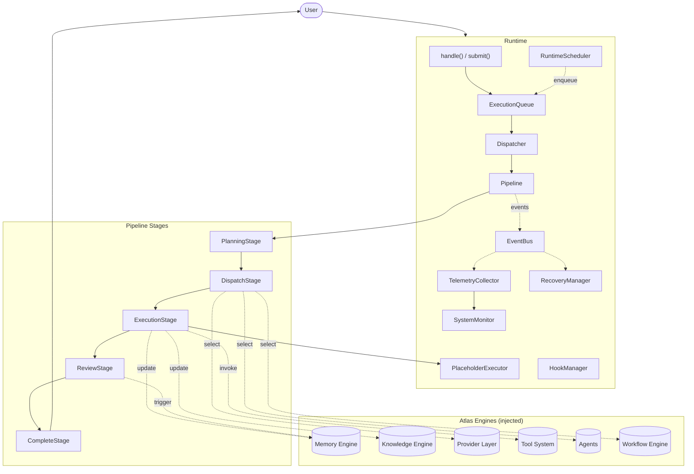
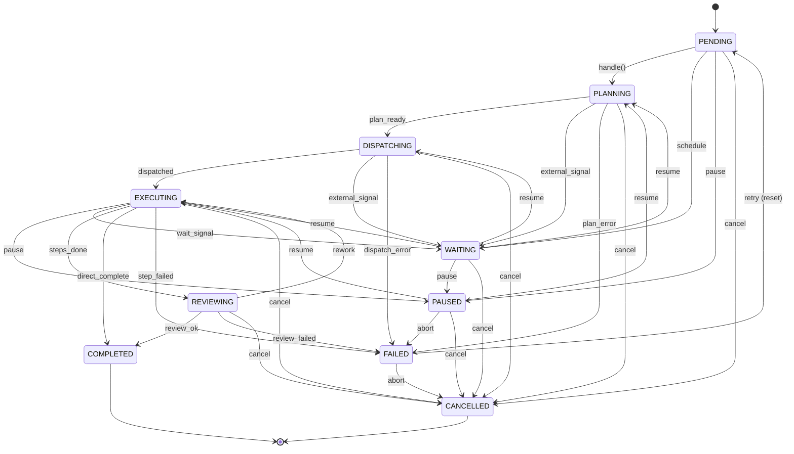
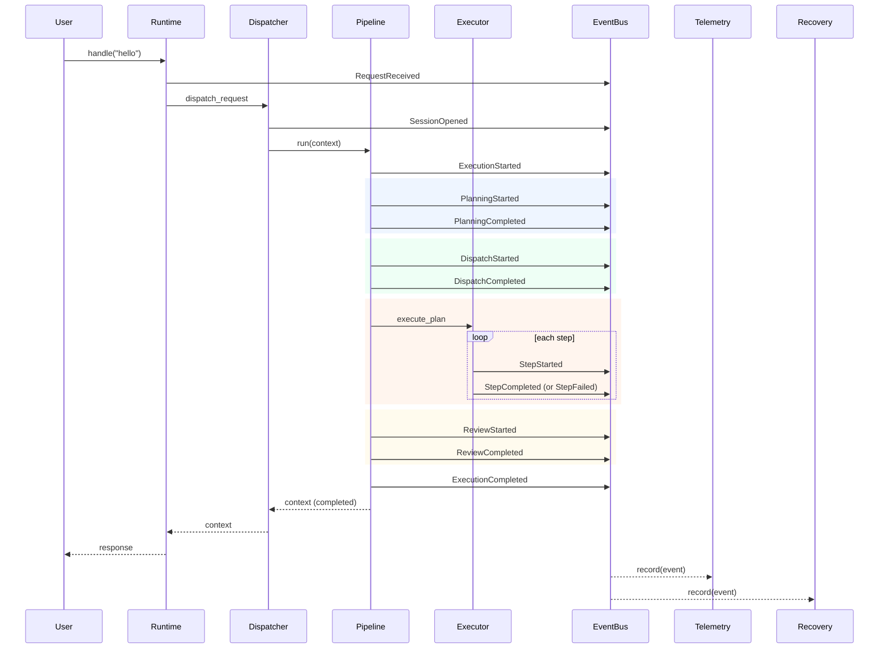
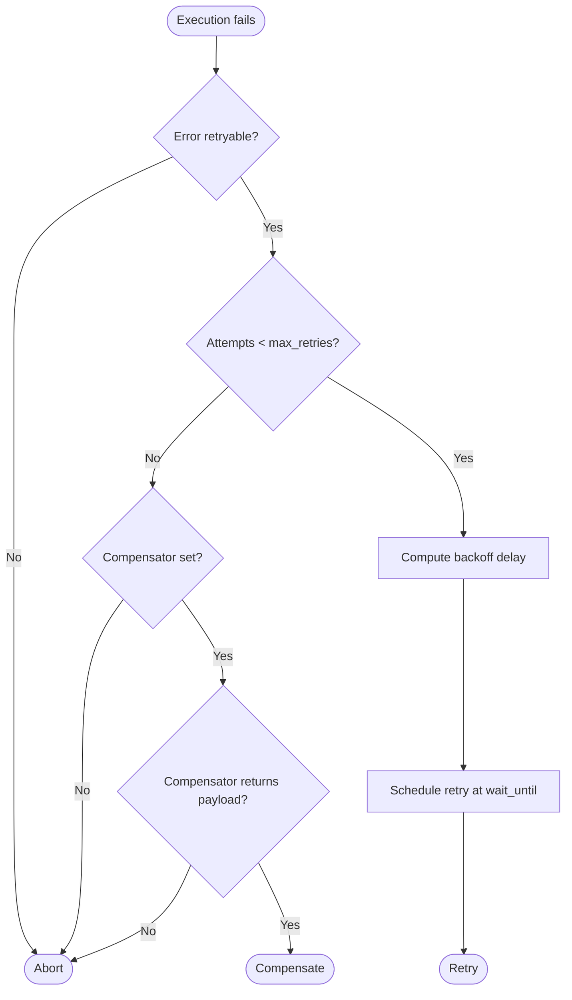
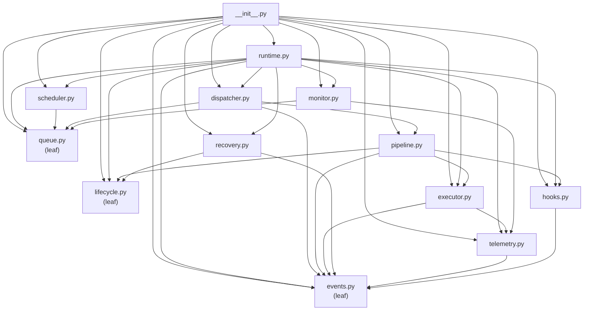

# Atlas Runtime Engine

The Atlas Runtime Engine is the execution heart of the Atlas AI Operating System. It accepts user requests, builds an execution context, opens a session, dispatches workflows and agents, executes steps, selects providers, invokes tools, emits lifecycle events, updates the Memory and Knowledge engines, triggers Reflection, and returns the final response.

The runtime is **provider-agnostic**, **tool-agnostic**, **agent-agnostic**, and **workflow-agnostic**. Every concrete concern (which LLM provider to call, which tool manager to dispatch to, which agent to invoke, which workflow engine to drive) is injected through an abstract base class. The default configuration uses deterministic in-memory placeholders so the runtime works out-of-the-box with zero external dependencies.

---

## Architecture



## Runtime lifecycle

Every execution moves through an explicit state machine. Transitions are validated against a fixed transition table; illegal moves raise `InvalidRuntimeTransitionError`. Terminal states cannot be left except that a `FAILED` execution can be retried (which resets the state to `PENDING`).



| State | Description | Terminal? |
|-------|-------------|-----------|
| `PENDING` | Execution created but not started. | No |
| `PLANNING` | Planner is decomposing the goal. | No |
| `DISPATCHING` | Dispatcher is selecting agents / providers / tools. | No |
| `EXECUTING` | Executor is running steps. | No |
| `REVIEWING` | Post-execution review / reflection is running. | No |
| `WAITING` | Execution blocked on an external signal or schedule. | No |
| `PAUSED` | Execution suspended; may be resumed. | No |
| `COMPLETED` | Execution finished successfully. | Yes |
| `FAILED` | Execution aborted with an error. Retriable. | Yes |
| `CANCELLED` | Operator cancelled the execution. | Yes |

## Execution pipeline

The pipeline is composed of five default stages, each of which is a small, replaceable callable:

```mermaid
flowchart LR
    Request[/"User request"/] --> Planning
    subgraph Planning["PlanningStage"]
        P1["Decompose goal"]
        P2["Produce ExecutionPlan"]
    end
    Planning --> Dispatch
    subgraph Dispatch["DispatchStage"]
        D1["Select agents"]
        D2["Select providers"]
        D3["Select tools"]
    end
    Dispatch --> Execution
    subgraph Execution["ExecutionStage"]
        E1["Run plan via Executor"]
        E2["Collect results"]
    end
    Execution --> Review
    subgraph Review["ReviewStage"]
        R1["Trigger Reflection"]
        R2["Update Memory"]
    end
    Review --> Complete
    subgraph Complete["CompleteStage"]
        C1["Assemble response"]
    end
    Complete --> Response[/"Final response"/]
```



1. **PlanningStage** — Decomposes the user request into an `ExecutionPlan` (a list of `ExecutionStep` items). The default planner produces a single `noop` step carrying the request; inject a custom planner for real decomposition.
2. **DispatchStage** — Selects agents, providers, and tools. The default dispatcher is a no-op; inject a custom dispatcher to populate `context.artifacts` with selected resources.
3. **ExecutionStage** — Runs the `ExecutionPlan` via the injected `BaseExecutor`. Each step emits `StepStarted` / `StepCompleted` / `StepFailed` events.
4. **ReviewStage** — Runs post-execution review / reflection. The default reviewer is a no-op; inject a custom reviewer to trigger reflection and update memory.
5. **CompleteStage** — Assembles the final response from the execution outcome. The default assembler returns the `final_output` of the execution outcome.

Each stage receives the mutable `PipelineContext` and may read from or write to it. Stages run sequentially; a stage that sets `context.error` or raises an exception short-circuits the pipeline and publishes an `ExecutionFailed` event.

## Component responsibilities

| Component | Responsibility |
|-----------|----------------|
| `Runtime` | Top-level orchestrator. Public API: `handle`, `submit`, `drain`, `pause`, `resume`, `cancel`, `retry`, `register_schedule`, `tick`, `health`, `metrics`, `events`. |
| `ExecutionQueue` | Priority-ordered FIFO queue of `ExecutionRequest` items. Higher priority dequeues first; FIFO within priority. Optional capacity. |
| `Dispatcher` | Pulls requests off the queue and runs each through a fresh `Pipeline`. Tracks processed / failed counts. |
| `Pipeline` | Ordered sequence of `Stage` callables. Runs hooks around every stage; short-circuits on error or `HookAbort`. |
| `PlanningStage` | Decomposes the request into an `ExecutionPlan`. Emits `PlanningStarted` / `PlanningCompleted`. |
| `DispatchStage` | Selects agents / providers / tools. Emits `DispatchStarted` / `DispatchCompleted`. |
| `ExecutionStage` | Runs the plan via the `BaseExecutor`. Stores the `ExecutionOutcome` on the context. |
| `ReviewStage` | Runs post-execution review / reflection. Emits `ReviewStarted` / `ReviewCompleted`. |
| `CompleteStage` | Assembles the final response from the execution outcome. |
| `BaseExecutor` | Abstract contract: `execute_plan(plan, execution_id, context) -> ExecutionOutcome`. |
| `PlaceholderExecutor` | Deterministic default executor with `noop`, `echo`, `fail`, `identity`, `context_read` built-ins. Custom actions injectable. |
| `EventBus` | Synchronous in-process pub/sub with topic filtering. Listeners are exception-isolated. |
| `HookManager` | Registry and dispatcher for pre/post stage hooks. Supports short-circuit and `HookAbort`. |
| `TelemetryCollector` | Subscribes to the event bus and records per-execution metrics (durations, counts, providers, tools). |
| `SystemMonitor` | Pulls telemetry and queue state to produce `HealthReport` snapshots with `healthy` / `degraded` / `unhealthy` status. |
| `RecoveryManager` | Owns retry and compensation strategy. Exponential backoff with configurable max retries and retryable error filters. |
| `RuntimeScheduler` | Triggers executions on a cadence (one_time, interval, cron). Enqueues `ExecutionRequest` items on tick. |
| `RuntimeState` | Ten-state lifecycle enum with explicit transition table. |
| `PipelineContext` | Mutable state carried through every stage: request, plan, outcome, response, state, artifacts. |
| `ExecutionPlan` | Frozen dataclass: ordered list of `ExecutionStep` items plus inputs and metadata. |
| `ExecutionStep` | Frozen dataclass: `id`, `action`, `params`, `optional`. |
| `ExecutionResult` | Frozen dataclass: `step_id`, `success`, `output`, `error`, timing. |
| `ExecutionOutcome` | Frozen dataclass: `success`, `results`, `final_output`, `error`. |
| `ExecutionRequest` | Frozen dataclass: `request`, `user`, `priority`, `metadata`. |
| `ScheduledTask` | Frozen dataclass: `request`, `kind`, cadence params, `next_run_at`, `enabled`. |

## Event flow

Every significant runtime action emits an event on the `EventBus`. The bus dispatches synchronously to every matching listener in registration order. Listeners are exception-isolated: a raising listener is logged and skipped but does not stop the dispatch to subsequent listeners.



### Event types

| Event | Emitted by | When |
|-------|-----------|------|
| `RequestReceived` | Dispatcher | A new request is pulled from the queue. |
| `SessionOpened` | Dispatcher | A pipeline context has been created. |
| `PlanningStarted` | PlanningStage | Before the planner runs. |
| `PlanningCompleted` | PlanningStage | After the planner produces a plan. |
| `DispatchStarted` | DispatchStage | Before dispatch decisions. |
| `DispatchCompleted` | DispatchStage | After dispatch decisions. |
| `ExecutionStarted` | Executor / Pipeline | Before the first step runs. |
| `StepStarted` | Executor | Before each step. |
| `StepCompleted` | Executor | After a successful step. |
| `StepFailed` | Executor | After a failed step. |
| `ReviewStarted` | ReviewStage | Before the review phase. |
| `ReviewCompleted` | ReviewStage | After the review phase. |
| `ExecutionCompleted` | Pipeline | When the execution finishes successfully. |
| `ExecutionFailed` | Pipeline | When the execution fails terminally. |
| `ExecutionCancelled` | Runtime | When the execution is cancelled. |
| `ExecutionPaused` | Runtime | When the execution is paused. |
| `ExecutionResumed` | Runtime | When the execution is resumed. |
| `MemoryUpdated` | Review / Custom | After the memory engine is updated. |
| `KnowledgeUpdated` | Review / Custom | After the knowledge engine is updated. |
| `ReflectionTriggered` | Review / Custom | When a reflection cycle is requested. |
| `ProviderSelected` | Dispatch / Custom | After a provider has been selected. |
| `ToolInvoked` | Execution / Custom | After a tool has been invoked. |

## Recovery flow

When an execution fails, the `RecoveryManager` decides what to do next. The decision is based on the failure, the number of attempts so far, and the configured `RecoveryPolicy`.



### Recovery policy

| Parameter | Default | Description |
|-----------|---------|-------------|
| `max_retries` | `3` | Maximum automatic retries. `0` disables retry. |
| `base_delay_seconds` | `1.0` | Initial backoff delay. Doubled on each retry. |
| `max_delay_seconds` | `30.0` | Cap on the backoff delay. |
| `retryable_errors` | `()` | If non-empty, only errors whose message contains one of these substrings are retryable. |

### Compensators

A compensator is a callable that receives the `ExecutionFailed` event and returns an optional payload dict. If the compensator returns a non-`None` payload, the recovery manager returns a `"compensate"` decision carrying the payload; otherwise it returns `"abort"`. Compensators are typically used to fall back to a different provider, return a cached response, or invoke a degraded-mode handler.

## Dependency graph (acyclic)

The runtime package has zero circular imports. Modules form a strict acyclic dependency graph:



## Usage examples

### Minimal end-to-end execution

```python
from atlas.runtime import Runtime

rt = Runtime()
ctx = rt.handle("hello world")
assert ctx.state.value == "completed"
assert ctx.response is not None
```

### Submitting and draining

```python
rt = Runtime()
rt.submit("first")
rt.submit("second")
results = rt.drain()
assert len(results) == 2
```

### Priority queue

```python
from atlas.runtime import ExecutionQueue, ExecutionRequest

q = ExecutionQueue()
q.enqueue(ExecutionRequest(request="low", priority=1))
q.enqueue(ExecutionRequest(request="high", priority=10))
assert q.dequeue().request == "high"
```

### Subscribing to events

```python
from atlas.runtime import Runtime, StepCompleted

rt = Runtime()
steps: list = []
rt.bus.subscribe(StepCompleted, steps.append)
rt.handle("hello")
assert len(steps) >= 1
```

### Custom executor action

```python
from atlas.runtime import Runtime, PlaceholderExecutor

def greet(params, context):
    return f"Hello, {params['name']}!"

rt = Runtime(executor=PlaceholderExecutor(actions={"greet": greet}))
```

### Scheduled execution

```python
from datetime import datetime, timedelta, UTC
from atlas.runtime import Runtime, ScheduledTask, ScheduleKind

rt = Runtime()
run_at = datetime(2026, 1, 1, 12, 0, tzinfo=UTC)
rt.register_schedule(ScheduledTask(
    id="daily_ping",
    request="ping",
    kind=ScheduleKind.ONE_TIME,
    run_at=run_at,
))
results = rt.tick(now=run_at + timedelta(minutes=1))
assert len(results) == 1
```

### Health monitoring

```python
rt = Runtime()
rt.handle("hello")
health = rt.health()
assert health["status"] == "healthy"
assert health["completed_executions"] >= 1
```

### Recovery with compensation

```python
from atlas.runtime import RecoveryManager, RecoveryPolicy, ExecutionFailed

def fallback(failure: ExecutionFailed):
    return {"fallback": "default response"}

rm = RecoveryManager(
    policy=RecoveryPolicy(max_retries=1),
    compensator=fallback,
)
rm.record_start("e1")
rm.decide(ExecutionFailed(execution_id="e1", error="boom"))  # retry
rm.record_start("e1")
decision = rm.decide(ExecutionFailed(execution_id="e1", error="boom"))
assert decision.action == "compensate"
```

### Custom pipeline stage

```python
from atlas.runtime import Pipeline, PipelineContext, default_pipeline, PlaceholderExecutor

def audit_stage(ctx: PipelineContext) -> None:
    ctx.artifacts["audited"] = True

pipeline = default_pipeline(executor=PlaceholderExecutor())
pipeline.add_stage(audit_stage)
```

## Quality gates

The runtime is verified by:

- **150 pytest tests** in `tests/test_runtime.py` covering the lifecycle state machine, event bus, hooks, telemetry, queue, recovery, monitor, executor, pipeline, dispatcher, scheduler, and the top-level Runtime orchestrator.
- **463 total tests** pass (150 runtime + 130 workflow + 183 existing).
- **Black** clean on all 89 Python files.
- **Ruff** clean on all 89 Python files.
- **Zero circular imports** verified by independent module imports.
- **Frozen dataclasses** for every immutable model (`ExecutionStep`, `ExecutionPlan`, `ExecutionResult`, `ExecutionOutcome`, `ExecutionRequest`, `ScheduledTask`, `RecoveryDecision`, `RecoveryPolicy`, `HealthReport`, `ExecutionMetrics`, every event type).
- **Dependency injection** for every concrete concern (executor, scheduler, bus, hooks, telemetry, monitor, recovery, queue, pipeline factory).
- **Abstract base classes** for `BaseExecutor` and `BaseTelemetryCollector`.

## Future extensions

The runtime is designed to be extended without modification:

- **Concrete executors** — Subclass `BaseExecutor` to dispatch to the Tool System, Provider Layer, or Workflow Engine.
- **Concrete telemetry** — Subclass `BaseTelemetryCollector` to forward to Prometheus, OpenTelemetry, or Datadog.
- **Concrete schedulers** — Wrap `RuntimeScheduler` to delegate to APScheduler, Celery beat, or Kubernetes CronJobs.
- **Concrete queues** — Wrap `ExecutionQueue` to delegate to Redis, Celery, or RabbitMQ.
- **Custom pipeline stages** — Add stages via `pipeline.add_stage()` or inject a custom `pipeline_factory` into the runtime.
- **Custom hooks** — Register hooks at any of the 12 supported phases to short-circuit or augment execution.
- **Custom compensators** — Inject a compensator into `RecoveryManager` for fallback behaviour when retries are exhausted.
