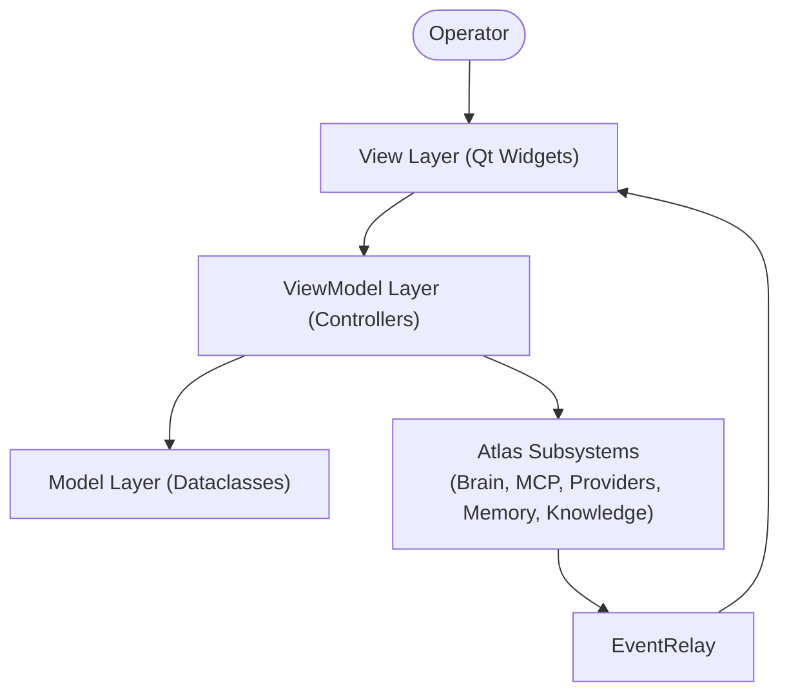
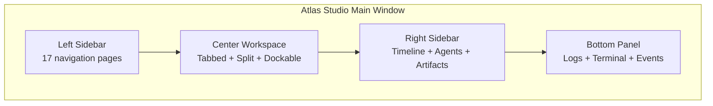

# Atlas Studio

Atlas Studio is the professional desktop application that visualizes and controls every Atlas subsystem. Built with PySide6 (Qt6), it provides a dark-themed, multi-panel, tabbed workspace with live dashboards, an embedded browser, integrated terminal, and real-time event streaming.

---

## Architecture

Atlas Studio follows strict **MVVM** (Model-View-ViewModel) architecture:

- **Model** (`atlas/studio/models/`) — Frozen dataclasses, no Qt imports, fully testable.
- **ViewModel** (`atlas/studio/controllers/`) — Business logic, no Qt imports, fully testable.
- **View** (`atlas/studio/widgets/`, `atlas/studio/pages/`, `atlas/studio/mainwindow.py`) — Qt widgets, lazy-imported, graceful degradation when PySide6 is unavailable.



## UI Layout



### Left Sidebar (17 pages)

| Category | Pages |
|----------|-------|
| Main | Chat, Projects |
| Monitoring | Agents, Providers, Memory, Knowledge, Workflows, Executions, Artifacts |
| Tools | Skills, Tools, MCP, Browser, Blender, Mining |
| System | Logs, Settings |

### Center Workspace
- Unlimited tabs
- Split view (horizontal/vertical)
- Dockable widgets
- Resizable panels

### Right Sidebar
- Execution Timeline
- Current Goal
- Running Agents
- Provider status
- Memory/Knowledge updates
- Artifacts
- Notifications

### Bottom Panel
- Logs viewer
- Terminal (QProcess)
- Python console
- Events feed
- System messages

## Navigation

The `NavigationModel` owns the ordered list of 17 pages. Pages are grouped into 4 categories:

```python
from atlas.studio.navigation import NavigationModel, NavigationCategory

nav = NavigationModel()
print(len(nav.pages()))  # 17
print(nav.categories())  # [MAIN, MONITORING, TOOLS, SYSTEM]
nav.set_current(PageId.AGENTS)
print(nav.current_page().title)  # "Agents"
```

## Workspace

The `WorkspaceModel` manages open tabs:

```python
from atlas.studio.workspace import WorkspaceModel
from atlas.studio.models import PageId

ws = WorkspaceModel()
tab = ws.open_tab(PageId.CHAT, "Chat")
ws.pin_tab(tab.id)
ws.set_active(tab.id)
ws.reorder([tab.id])
```

## Settings

All settings are stored in `atlas/configs/studio.yaml`:

```python
from atlas.studio.settings import StudioSettings

s = StudioSettings()
s.set("theme", "light")
s.set("api_keys", {"openai": "sk-xxx"})
s.save()
```

## Plugin System

Every page is pluggable. Adding a new page (e.g., Mining Studio, Video Studio, Voice Studio) requires only registering a new `PageInfo`:

```python
from atlas.studio.navigation import NavigationModel, NavigationCategory
from atlas.studio.models import PageInfo, PageId

nav = NavigationModel()
nav.add_page(PageInfo(
    id=PageId.MINING,
    title="Mining Studio",
    icon="pickaxe",
    description="Professional mining data studio",
    category=NavigationCategory.TOOLS,
    position=0,
))
```

## Controllers

10 controllers provide MVVM separation:

| Controller | Wraps |
|-----------|-------|
| `ChatController` | Brain / ProviderManager |
| `SystemController` | psutil |
| `ProviderController` | ProviderManager |
| `AgentController` | Agent registry |
| `MCPController` | MCPManager |
| `ExecutionController` | Brain / GoalManager |
| `ArtifactController` | ArtifactManager |
| `MemoryController` | MemoryEngine |
| `KnowledgeController` | KnowledgeEngine |
| `PluginController` | Plugin registry |

## Live Events

The `EventRelay` bridges the `LiveEventBus` to the Studio UI:

```python
from atlas.studio.events import EventRelay
from atlas.live import LiveEventBus

bus = LiveEventBus()
relay = EventRelay()
relay.start(bus)
# Events flow: LiveEventBus → EventRelay → Studio UI
```

## Theme

Dark professional theme via Qt stylesheet:

```python
from atlas.studio.theme import get_stylesheet
stylesheet = get_stylesheet("dark")
```

## Quality gates

- **291 pytest tests** in `tests/test_studio.py`
- **2122 total tests** pass
- Black clean
- Ruff clean
- Zero circular imports
- MVVM: Model + ViewModel layers have zero Qt imports
